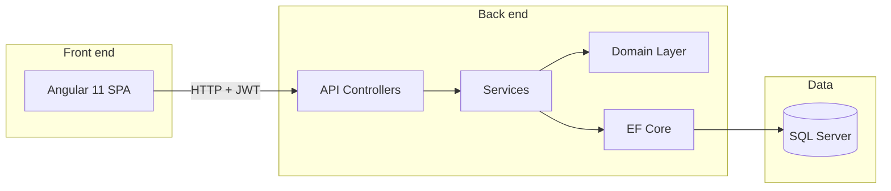

# Basic User Management

A full-stack sample application for managing users with authentication, built as a learning-friendly reference for layered .NET APIs and Angular front ends.

## What it does

- **Authenticate** with JWT bearer tokens
- **List, create, update, and delete** users through a REST API
- **Manage user profiles** including display name, date of birth, country, salary, profile picture, and linked address
- **Browse and edit users** from an Angular single-page app

## Architecture



The solution follows a classic layered layout:

| Layer | Project | Responsibility |
|-------|---------|----------------|
| API | `UserManagement.API` | HTTP endpoints, JWT auth, AutoMapper profiles |
| Domain | `UserManagement.Domain` | Entities and repository interfaces |
| Data | `UserManagement.DataAccess.EFCore` | EF Core context, repositories, migrations |

## Tech stack

| Area | Technology |
|------|------------|
| API | ASP.NET Core 3.1 |
| ORM | Entity Framework Core 5 |
| Database | Microsoft SQL Server |
| Auth | JWT Bearer tokens |
| Front end | Angular 11, Angular Material |
| Containers | Docker Compose |

## Prerequisites

- [.NET SDK 3.1+](https://dotnet.microsoft.com/download)
- [Node.js 12+](https://nodejs.org/) and npm
- [Docker](https://www.docker.com/) (for the database)
- [dotnet-ef](https://learn.microsoft.com/en-us/ef/core/cli/dotnet) global tool (for migrations)

## Getting started

### 1. Start the database

From the repository root:

```bash
docker compose up -d
```

SQL Server listens on **port 1434** on the host (mapped from container port 1433). Connection details are in `UserManagementAPI/UserManagement.API/appsettings.json`.

### 2. Apply database migrations

```bash
dotnet tool install --global dotnet-ef
cd UserManagementAPI/UserManagement.DataAccess.EFCore
dotnet ef database update --startup-project ../UserManagement.API
```

### 3. Run the API

```bash
cd UserManagementAPI/UserManagement.API
dotnet run
```

The API is available at:

- HTTP: `http://localhost:5000`
- HTTPS: `https://localhost:5001`

### 4. Run the front end

```bash
cd front-end
npm install
npm start
```

Open `http://localhost:4200` in your browser. The app is configured to call the API at `http://localhost:5000` (see `front-end/src/environments/environment.ts`).

## Default login

Authentication is intentionally simple for local development:

| Field | Value |
|-------|-------|
| Username | `admin` |
| Password | `123456789` |

After login, the JWT is attached to subsequent API requests automatically.

## API reference

Base path: `/api/v1`

### Authentication

| Method | Endpoint | Auth | Description |
|--------|----------|------|-------------|
| `POST` | `/auth/login` | No | Exchange credentials for a JWT |

**Request body:**

```json
{
  "userName": "admin",
  "password": "123456789"
}
```

**Response:**

```json
{
  "userName": "admin",
  "token": "<jwt>"
}
```

### Users

All user endpoints require a valid `Authorization: Bearer <token>` header.

| Method | Endpoint | Description |
|--------|----------|-------------|
| `GET` | `/users` | List all users |
| `GET` | `/users/{id}` | Get one user by ID |
| `POST` | `/users` | Create a user |
| `PUT` | `/users/{id}` | Update a user |
| `DELETE` | `/users/{id}` | Delete a user |

### User model

| Field | Type | Notes |
|-------|------|-------|
| `id` | int | Assigned by the database |
| `loginName` | string | Unique |
| `displayName` | string | |
| `dateOfBirth` | datetime | |
| `country` | string | |
| `isActive` | bool | |
| `salary` | float | |
| `profilePictureUrl` | string | Optional URL |
| `address` | object | Nested address (city, country, postal code, state, street) |

## Project structure

```
.
├── docker-compose.yml          # SQL Server container
├── front-end/                  # Angular SPA
│   └── src/app/
│       ├── auth/               # Login & register
│       ├── users/              # User list & editor
│       └── services/           # API client & alerts
└── UserManagementAPI/
    ├── UserManagement.API/           # Web API entry point
    ├── UserManagement.Domain/        # Entities & interfaces
    └── UserManagement.DataAccess.EFCore/  # Persistence & migrations
```

## Development notes

- **CORS** is configured for local front-end development. See `MiddlewareConfiguration/CorsOriginConfiguration.cs`.
- **Migrations** live in `UserManagement.DataAccess.EFCore/Migrations/`. Create new ones with `dotnet ef migrations add <Name> --startup-project ../UserManagement.API`.
- **Secrets**: `appsettings.json` contains a development JWT secret and database password. Replace these before deploying anywhere real.

## License

This project is provided as-is for educational and demonstration purposes.
