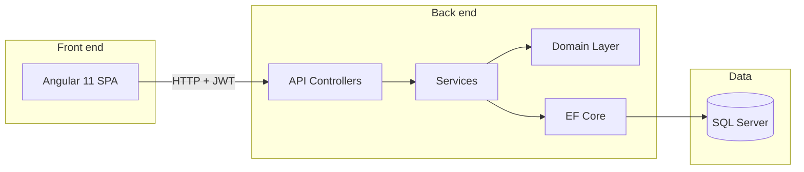

# Basic User Management

A full-stack sample application for managing users with authentication, built as a learning-friendly reference for layered .NET APIs and Angular front ends.

## Table of contents

- [What it does](#what-it-does)
- [Architecture](#architecture)
- [Tech stack](#tech-stack)
- [Prerequisites](#prerequisites)
- [Configuration reference](#configuration-reference)
- [Getting started](#getting-started)
- [Verify the stack](#verify-the-stack)
- [Default login](#default-login)
- [API reference](#api-reference)
- [Try it with curl](#try-it-with-curl)
- [Project structure](#project-structure)
- [Development notes](#development-notes)
- [Troubleshooting](#troubleshooting)
- [License](#license)

## What it does

- **Authenticate** with JWT bearer tokens
- **List, create, update, and delete** users through a REST API
- **Manage user profiles** including display name, date of birth, country, salary, profile picture, and linked address
- **Browse and edit users** from an Angular single-page app

## Architecture



The solution follows a classic layered layout:

| Layer | Project | Responsibility |
|-------|---------|----------------|
| API | `UserManagement.API` | HTTP endpoints, JWT auth, AutoMapper profiles |
| Domain | `UserManagement.Domain` | Entities and repository interfaces |
| Data | `UserManagement.DataAccess.EFCore` | EF Core context, repositories, migrations |

## Tech stack

| Area | Technology |
|------|------------|
| API | ASP.NET Core 3.1 |
| ORM | Entity Framework Core 5 |
| Database | Microsoft SQL Server |
| Auth | JWT Bearer tokens |
| Front end | Angular 11, Angular Material |
| Containers | Docker Compose |

## Prerequisites

- [.NET SDK 3.1+](https://dotnet.microsoft.com/download)
- [Node.js 12+](https://nodejs.org/) and npm
- [Docker](https://www.docker.com/) (for the database)
- [dotnet-ef](https://learn.microsoft.com/en-us/ef/core/cli/dotnet) global tool (for migrations)

## Configuration reference

These values must stay aligned across Docker, the API, and the front end when running locally.

| Setting | Location | Value (default) | Notes |
|---------|----------|-----------------|-------|
| SQL host port | `docker-compose.yml` | `1434:1433` | Host port `1434` maps to container `1433` |
| SA password | `docker-compose.yml` → `SA_PASSWORD` | See compose file | Must match the API connection string password |
| Connection string | `UserManagementAPI/UserManagement.API/appsettings.json` | `Server=127.0.0.1,1434;Database=UserManagement;...` | Update host port and password together with Docker |
| JWT signing secret | `appsettings.json` → `JwtSecret` | Development-only value | Replace before any real deployment |
| JWT lifetime | `UserManagementAPI/UserManagement.API/Helpers/JwtHelper.cs` | 7 days | Tokens expire; log in again when requests return `401` |
| API base URL | `front-end/src/environments/environment.ts` | `http://localhost:5000` | Production URL is in `environment.prod.ts` |

To point the front end at a different API host, change `apiUrl` in the environment file and rebuild or restart `ng serve`.

## Getting started

### 1. Start the database

From the repository root:

```bash
docker compose up -d
```

SQL Server listens on **port 1434** on the host (mapped from container port 1433). Connection details are in `UserManagementAPI/UserManagement.API/appsettings.json`.

### 2. Apply database migrations

```bash
dotnet tool install --global dotnet-ef
cd UserManagementAPI/UserManagement.DataAccess.EFCore
dotnet ef database update --startup-project ../UserManagement.API
```

### 3. Run the API

```bash
cd UserManagementAPI/UserManagement.API
dotnet run
```

The API is available at:

- HTTP: `http://localhost:5000`
- HTTPS: `https://localhost:5001`

### 4. Run the front end

```bash
cd front-end
npm install
npm start
```

Open `http://localhost:4200` in your browser. The app is configured to call the API at `http://localhost:5000` (see `front-end/src/environments/environment.ts`).

### Build commands

```bash
# Build the .NET solution
cd UserManagementAPI
dotnet build

# Production build of the Angular app
cd front-end
npm run build
```

Production API URL can be changed in `front-end/src/environments/environment.prod.ts`.

### Stop the database

```bash
docker compose down
```

To remove persisted data as well, add `-v` to delete the Docker volume.

## Verify the stack

After starting all services, confirm each layer is reachable:

| Check | Command or action | Expected result |
|-------|-------------------|-----------------|
| Database | `docker compose ps` | `db` container is running |
| API | `curl -s -o /dev/null -w "%{http_code}" http://localhost:5000/api/v1/users` | `401` (unauthorized without a token) |
| Front end | Open `http://localhost:4200` | Login page loads |

Or run the helper script from the repository root (requires Docker and a running API):

```bash
./scripts/verify-stack.sh
```

A `401` from the users endpoint without a token means the API is up and JWT protection is working.

## Default login

Authentication is intentionally simple for local development:

| Field | Value |
|-------|-------|
| Username | `admin` |
| Password | `123456789` |

After login, the JWT is attached to subsequent API requests automatically.

## API reference

Base path: `/api/v1`

### Authentication

| Method | Endpoint | Auth | Description |
|--------|----------|------|-------------|
| `POST` | `/auth/login` | No | Exchange credentials for a JWT |

**Request body:**

```json
{
  "userName": "admin",
  "password": "123456789"
}
```

**Response:**

```json
{
  "userName": "admin",
  "token": "<jwt>"
}
```

### Users

All user endpoints require a valid `Authorization: Bearer <token>` header.

| Method | Endpoint | Description |
|--------|----------|-------------|
| `GET` | `/users` | List all users |
| `GET` | `/users/{id}` | Get one user by ID |
| `POST` | `/users` | Create a user |
| `PUT` | `/users/{id}` | Update a user |
| `DELETE` | `/users/{id}` | Delete a user |

### HTTP status codes

| Status | When |
|--------|------|
| `200 OK` | Successful login, read, create, update, or delete |
| `401 Unauthorized` | Missing/invalid JWT on a protected route, or invalid login credentials |
| `404 Not Found` | Requested user ID does not exist (when the service throws for a missing record) |

Protected routes always require `Authorization: Bearer <token>`. Re-authenticate when a token expires (see [Configuration reference](#configuration-reference)).

### User model

| Field | Type | Notes |
|-------|------|-------|
| `id` | int | Assigned by the database |
| `loginName` | string | Unique |
| `displayName` | string | |
| `dateOfBirth` | datetime | |
| `country` | string | |
| `isActive` | bool | |
| `salary` | float | |
| `profilePictureUrl` | string | Optional URL |
| `address` | object | Nested address (see below) |

### Address model

When creating or updating a user, the nested `address` object supports:

| Field | Type | Notes |
|-------|------|-------|
| `id` | int | Assigned by the database on create |
| `city` | string | |
| `country` | string | |
| `postalCode` | string | |
| `state` | string | |
| `streetName` | string | |
| `streetNumber` | string | |

**Example create-user body:**

```json
{
  "loginName": "jdoe",
  "displayName": "Jane Doe",
  "dateOfBirth": "1990-05-15T00:00:00",
  "country": "US",
  "isActive": true,
  "salary": 75000,
  "profilePictureUrl": "https://example.com/avatar.png",
  "address": {
    "city": "Seattle",
    "country": "US",
    "postalCode": "98101",
    "state": "WA",
    "streetName": "Main St",
    "streetNumber": "100"
  }
}
```

## Try it with curl

These examples assume the API is running on `http://localhost:5000`.

**1. Log in and capture the token:**

```bash
TOKEN=$(curl -s -X POST http://localhost:5000/api/v1/auth/login \
  -H "Content-Type: application/json" \
  -d '{"userName":"admin","password":"123456789"}' \
  | grep -o '"token":"[^"]*"' | cut -d'"' -f4)
```

**2. List users:**

```bash
curl -s http://localhost:5000/api/v1/users \
  -H "Authorization: Bearer $TOKEN"
```

**3. Create a user:**

```bash
curl -s -X POST http://localhost:5000/api/v1/users \
  -H "Authorization: Bearer $TOKEN" \
  -H "Content-Type: application/json" \
  -d '{
    "loginName": "jdoe",
    "displayName": "Jane Doe",
    "dateOfBirth": "1990-05-15T00:00:00",
    "country": "US",
    "isActive": true,
    "salary": 75000,
    "address": {
      "city": "Seattle",
      "country": "US",
      "postalCode": "98101",
      "state": "WA",
      "streetName": "Main St",
      "streetNumber": "100"
    }
  }'
```

**4. Update a user (replace `{id}` with the user ID):**

```bash
curl -s -X PUT http://localhost:5000/api/v1/users/{id} \
  -H "Authorization: Bearer $TOKEN" \
  -H "Content-Type: application/json" \
  -d '{"displayName":"Jane Smith","isActive":true}'
```

**5. Delete a user:**

```bash
curl -s -X DELETE http://localhost:5000/api/v1/users/{id} \
  -H "Authorization: Bearer $TOKEN"
```

## Project structure

```
.
├── docker-compose.yml          # SQL Server container
├── scripts/
│   └── verify-stack.sh         # Smoke-check database + API locally
├── front-end/                  # Angular SPA
│   └── src/app/
│       ├── auth/               # Login & register
│       ├── users/              # User list & editor
│       └── services/           # API client & alerts
└── UserManagementAPI/
    ├── UserManagement.API/           # Web API entry point
    ├── UserManagement.Domain/        # Entities & interfaces
    └── UserManagement.DataAccess.EFCore/  # Persistence & migrations
```

## Development notes

- **CORS** is configured for local front-end development. See `MiddlewareConfiguration/CorsOriginConfiguration.cs`.
- **Migrations** live in `UserManagement.DataAccess.EFCore/Migrations/`. Create new ones with `dotnet ef migrations add <Name> --startup-project ../UserManagement.API`.
- **Secrets**: `appsettings.json` contains a development JWT secret and database password. Replace these before deploying anywhere real.
- **JWT configuration**: Tokens are signed with the `JwtSecret` value from `appsettings.json`. Issuer and audience validation are disabled for simplicity in this sample.
- **Repository pattern**: Data access goes through `IUnitOfWork` and repository interfaces in `UserManagement.Domain`, with EF Core implementations in `UserManagement.DataAccess.EFCore`.

## Troubleshooting

| Symptom | Likely cause | Fix |
|---------|--------------|-----|
| Migration fails with a connection error | SQL Server container is still starting | Wait 15–30 seconds after `docker compose up -d`, then retry `dotnet ef database update` |
| `Cannot open database "UserManagement"` | Migrations not applied | Run the migration step from [Getting started](#getting-started) |
| Port `1434` already in use | Another SQL Server instance on the host | Stop the conflicting service or change the host port in `docker-compose.yml` and update `appsettings.json` to match |
| API returns `401` on all user endpoints | Missing or expired JWT | Log in again via `/api/v1/auth/login` and include `Authorization: Bearer <token>` |
| Front end cannot reach the API | API not running or wrong URL | Confirm `dotnet run` is active and `environment.apiUrl` points to `http://localhost:5000` |
| `dotnet ef` command not found | EF Core CLI tool not installed | Run `dotnet tool install --global dotnet-ef` |

**Reset the database completely:**

```bash
docker compose down -v
docker compose up -d
# wait for SQL Server to start, then re-apply migrations
cd UserManagementAPI/UserManagement.DataAccess.EFCore
dotnet ef database update --startup-project ../UserManagement.API
```

## License

This project is provided as-is for educational and demonstration purposes.
