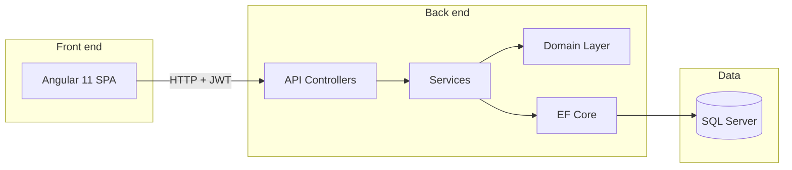
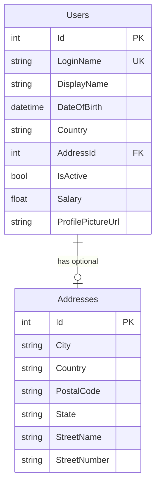

# Basic User Management

[](https://github.com/asalhallak/basic-user-management/actions/workflows/ci.yml)

A full-stack sample application for managing users with authentication, built as a learning-friendly reference for layered .NET APIs and Angular front ends.

## Table of contents

- [What it does](#what-it-does)
- [Architecture](#architecture)
- [Tech stack](#tech-stack)
- [Prerequisites](#prerequisites)
- [Configuration reference](#configuration-reference)
- [Getting started](#getting-started)
- [Makefile shortcuts](#makefile-shortcuts)
- [Verify the stack](#verify-the-stack)
- [Default login](#default-login)
- [Authentication vs user data](#authentication-vs-user-data)
- [Front-end and API integration](#front-end-and-api-integration)
- [API reference](#api-reference)
- [API examples (HTTP Client)](#api-examples-http-client)
- [Documentation index](#documentation-index)
- [Database schema](#database-schema)
- [Try it with curl](#try-it-with-curl)
- [Project structure](#project-structure)
- [Development notes](#development-notes)
- [Testing](#testing)
- [Continuous integration](#continuous-integration)
- [Troubleshooting](#troubleshooting)
- [Contributing](#contributing)
- [Security](#security)
- [License](#license)

## What it does

- **Authenticate** with JWT bearer tokens
- **List, create, update, and delete** users through a REST API
- **Manage user profiles** including display name, date of birth, country, salary, profile picture, and linked address
- **Browse and edit users** from an Angular single-page app

## Architecture



The solution follows a classic layered layout:

| Layer | Project | Responsibility |
|-------|---------|----------------|
| API | `UserManagement.API` | HTTP endpoints, JWT auth, AutoMapper profiles |
| Domain | `UserManagement.Domain` | Entities and repository interfaces |
| Data | `UserManagement.DataAccess.EFCore` | EF Core context, repositories, migrations |

## Tech stack

| Area | Technology |
|------|------------|
| API | ASP.NET Core 3.1 |
| ORM | Entity Framework Core 5 |
| Database | Microsoft SQL Server |
| Auth | JWT Bearer tokens |
| Front end | Angular 11, Angular Material |
| Containers | Docker Compose |

## Prerequisites

- [.NET SDK 3.1+](https://dotnet.microsoft.com/download)
- [Node.js 12+](https://nodejs.org/) and npm (Node **16** recommended; see `.nvmrc` and [Troubleshooting](#troubleshooting))
- [Docker](https://www.docker.com/) (for the database)
- [curl](https://curl.se/) (for smoke checks and API examples)
- [dotnet-ef](https://learn.microsoft.com/en-us/ef/core/cli/dotnet) global tool (for migrations)

Verify required tools are installed:

```bash
make check-deps
```

## Configuration reference

These values must stay aligned across Docker, the API, and the front end when running locally.

| Setting | Location | Value (default) | Notes |
|---------|----------|-----------------|-------|
| SQL host port | `docker-compose.yml` | `1434:1433` | Host port `1434` maps to container `1433` |
| SA password | `docker-compose.yml` → `SA_PASSWORD` | See compose file | Must match the API connection string password |
| Connection string | `UserManagementAPI/UserManagement.API/appsettings.json` | `Server=127.0.0.1,1434;Database=UserManagement;...` | Update host port and password together with Docker |
| JWT signing secret | `appsettings.json` → `JwtSecret` | Development-only value | Replace before any real deployment |
| JWT lifetime | `UserManagementAPI/UserManagement.API/Helpers/JwtHelper.cs` | 7 days | Tokens expire; log in again when requests return `401` |
| API base URL | `front-end/src/environments/environment.ts` | `http://localhost:5000` | Production URL is in `environment.prod.ts` |

### Ports at a glance

| Service | URL or port | Used for |
|---------|-------------|----------|
| SQL Server (host) | `127.0.0.1:1434` | Database connections from the API |
| API (HTTP) | `http://localhost:5000` | REST endpoints and Angular `apiUrl` |
| API (HTTPS) | `https://localhost:5001` | Optional TLS profile in `launchSettings.json` |
| Angular dev server | `http://localhost:4200` | Browser UI during `npm start` |

To point the front end at a different API host, change `apiUrl` in the environment file and rebuild or restart `ng serve`.

## Getting started

**Quick setup** (dependencies, database, and migrations):

```bash
make check-deps
make install
make setup
```

Then run the API and front end in separate terminals:

```bash
make run-api       # terminal 1
make run-frontend  # terminal 2
```

Or follow steps 3–4 below manually.

### 1. Start the database

From the repository root:

```bash
docker compose up -d
```

SQL Server listens on **port 1434** on the host (mapped from container port 1433). Connection details are in `UserManagementAPI/UserManagement.API/appsettings.json`.

### 2. Apply database migrations

```bash
dotnet tool install --global dotnet-ef
cd UserManagementAPI/UserManagement.DataAccess.EFCore
dotnet ef database update --startup-project ../UserManagement.API
```

### 3. Run the API

```bash
cd UserManagementAPI/UserManagement.API
dotnet run
```

The API is available at:

- HTTP: `http://localhost:5000`
- HTTPS: `https://localhost:5001`

### 4. Run the front end

```bash
cd front-end
npm install
npm start
```

Open `http://localhost:4200` in your browser. The app is configured to call the API at `http://localhost:5000` (see `front-end/src/environments/environment.ts`).

### Build commands

```bash
# Build the .NET solution
cd UserManagementAPI
dotnet build

# Production build of the Angular app
cd front-end
npm run build
```

Production API URL can be changed in `front-end/src/environments/environment.prod.ts`.

### Stop the database

```bash
docker compose down
```

To remove persisted data as well, add `-v` to delete the Docker volume.

## Makefile shortcuts

The repository root includes a `Makefile` that wraps the commands above for day-to-day development:

| Target | What it does |
|--------|----------------|
| `make help` | List all targets |
| `make check-deps` | Verify Docker, .NET, Node.js, and npm are on PATH |
| `make install` | Run `npm install`, `dotnet restore`, and install `dotnet-ef` if missing |
| `make install-ef` | Install the `dotnet-ef` global tool (required for migrations) |
| `make setup` | Start the database and apply migrations (first-time setup) |
| `make db-up` | Start the SQL Server container |
| `make db-down` | Stop the SQL Server container |
| `make db-logs` | Follow SQL Server container logs (helpful when migrations fail) |
| `make db-reset` | Wipe the database volume and re-apply migrations |
| `make migrate` | Apply EF Core migrations (retries until SQL Server is ready) |
| `make run-api` | Run the API with `dotnet run` (listens on `http://localhost:5000`) |
| `make run-frontend` | Run the Angular dev server with `npm start` (listens on `http://localhost:4200`) |
| `make build-api` | Build the .NET solution |
| `make build-frontend` | Production build of the Angular app |
| `make test-api` | Run .NET unit tests (AuthService login) |
| `make test-frontend` | Run Angular unit tests once (ChromeHeadless; matches CI) |
| `make build` | Build API and front end |
| `make ci` | Run CI-equivalent builds (`dotnet restore/build` + `npm ci` + `npm run build`) |
| `make clean` | Remove .NET `bin`/`obj` folders and the Angular `dist` output |
| `make status` | Show whether the database, API, and front end are running |
| `make verify` | Run `./scripts/verify-stack.sh` (full stack) |
| `make verify-api` | Run verify-stack with `SKIP_FRONTEND=1` (API only) |
| `make token` | Print a JWT from the running API (for curl or manual testing) |

Example local workflow:

```bash
make setup
make run-api       # terminal 1
make run-frontend  # terminal 2
make verify        # terminal 3 (after API and front end are up)
```

## Verify the stack

After starting all services, confirm each layer is reachable:

| Check | Command or action | Expected result |
|-------|-------------------|-----------------|
| Database | `docker compose ps` | `db` container is running |
| API | `curl -s -o /dev/null -w "%{http_code}" http://localhost:5000/api/v1/users` | `401` (unauthorized without a token) |
| Auth | `POST /api/v1/auth/login` with default credentials | `200` with a JWT in the response body |
| Authenticated API | `GET /api/v1/users` with the JWT from login | `200` with a JSON array (may be empty) |
| Front end | Open `http://localhost:4200` or run `./scripts/verify-stack.sh` | Login page loads (`200` from dev server) |

Or run the helper script from the repository root (requires Docker, a running API, and the Angular dev server):

```bash
./scripts/verify-stack.sh
```

The script checks the database container, confirms the API returns `401` without a token, logs in with the [default credentials](#default-login), verifies `GET /api/v1/users` succeeds with the returned JWT, and confirms the front end responds on port `4200`.

| Variable | Default | Purpose |
|----------|---------|---------|
| `API_URL` | `http://localhost:5000` | Base URL for auth and users endpoints |
| `FRONTEND_URL` | `http://localhost:4200` | Angular dev server to smoke-check |
| `AUTH_USER` | `admin` | Login username for the auth check |
| `AUTH_PASSWORD` | `123456789` | Login password for the auth check |
| `SKIP_FRONTEND` | `0` | Set to `1` to skip the front-end check (API-only workflow) |

Override defaults when needed:

```bash
API_URL=http://localhost:5000 FRONTEND_URL=http://localhost:4200 ./scripts/verify-stack.sh
```

API-only check (database + JWT + login + authenticated users, no Angular dev server):

```bash
SKIP_FRONTEND=1 ./scripts/verify-stack.sh
```

A `401` from the users endpoint without a token means the API is up and JWT protection is working.

## Default login

Authentication is intentionally simple for local development:

| Field | Value |
|-------|-------|
| Username | `admin` |
| Password | `123456789` |

After login, the JWT is attached to subsequent API requests automatically.

## Authentication vs user data

Login and user CRUD are intentionally separate in this sample:

| Concern | How it works |
|---------|--------------|
| **Login** | Hardcoded in `AuthService` (`admin` / `123456789`). Not backed by database users. |
| **User records** | Stored in SQL Server via EF Core. Created through the API or Angular UI after you are logged in. |
| **Register page** | Posts to `POST /api/v1/users`, which requires a JWT. It is not a public sign-up flow. |
| **Seed data** | Migrations create empty tables. No users are inserted automatically. |

Creating a user through the API or UI does **not** create a new login account. To add real credential-based auth, wire `AuthService.Login` to validate against stored users (or an identity provider).

## Front-end and API integration

The Angular app was adapted from a tutorial that used a local fake backend. When pointing it at the real API, keep these mismatches in mind:

| Area | Front end | API | Notes |
|------|-----------|-----|-------|
| Login payload | `{ userName, password }` in `account.service.ts` | `{ userName, password }` in `Credentials.cs` | Aligned — the login form control is still named `username` in the template. |
| User model | `username`, `firstName`, `lastName` (register form UI) | `loginName`, `displayName`, nested `address` | Register maps legacy fields to API shape on submit; user list/editor uses API fields directly. |
| Fake backend | Removed from `app.module.ts` (see `helpers/fake-backend.ts` for legacy code) | N/A | The app calls the real API exclusively; clear stale `localStorage` if you previously ran the tutorial mock. |

**Recommended steps to use the real API end-to-end:**

1. Log in with the [default credentials](#default-login) before using register or user management screens.
2. For full user records (address, salary, etc.), use **Users → Add**; the register form creates minimal records with mapped `loginName` and `displayName`.
3. If login fails after upgrading from an older clone, clear browser local storage for `http://localhost:4200` and log in again.

## API reference

Base path: `/api/v1`

### Authentication

| Method | Endpoint | Auth | Description |
|--------|----------|------|-------------|
| `POST` | `/auth/login` | No | Exchange credentials for a JWT |

**Request body:**

```json
{
  "userName": "admin",
  "password": "123456789"
}
```

**Response:**

```json
{
  "userName": "admin",
  "token": "<jwt>"
}
```

### Users

All user endpoints require a valid `Authorization: Bearer <token>` header.

| Method | Endpoint | Description |
|--------|----------|-------------|
| `GET` | `/users` | List all users |
| `GET` | `/users/{id}` | Get one user by ID |
| `POST` | `/users` | Create a user |
| `PUT` | `/users/{id}` | Update a user |
| `DELETE` | `/users/{id}` | Delete a user |

### HTTP status codes

| Status | When |
|--------|------|
| `200 OK` | Successful login, read, create, update, or delete |
| `400 Bad Request` | Missing or empty required fields on create/update (`loginName`, `displayName`) or login (`userName`, `password`) |
| `401 Unauthorized` | Missing/invalid JWT on a protected route, or invalid login credentials |
| `404 Not Found` | Requested user ID does not exist |
| `409 Conflict` | Duplicate `loginName` on create or update (see [docs/api-errors.md](docs/api-errors.md)) |

Protected routes always require `Authorization: Bearer <token>`. Re-authenticate when a token expires (see [Configuration reference](#configuration-reference)).

### User model

| Field | Type | Notes |
|-------|------|-------|
| `id` | int | Assigned by the database |
| `loginName` | string | Unique |
| `displayName` | string | |
| `dateOfBirth` | datetime | |
| `country` | string | |
| `isActive` | bool | |
| `salary` | float | |
| `profilePictureUrl` | string | Optional URL |
| `address` | object | Nested address (see below) |

### Address model

When creating or updating a user, the nested `address` object supports:

| Field | Type | Notes |
|-------|------|-------|
| `id` | int | Assigned by the database on create |
| `city` | string | |
| `country` | string | |
| `postalCode` | string | |
| `state` | string | |
| `streetName` | string | |
| `streetNumber` | string | |

**Example create-user body:**

```json
{
  "loginName": "jdoe",
  "displayName": "Jane Doe",
  "dateOfBirth": "1990-05-15T00:00:00",
  "country": "US",
  "isActive": true,
  "salary": 75000,
  "profilePictureUrl": "https://example.com/avatar.png",
  "address": {
    "city": "Seattle",
    "country": "US",
    "postalCode": "98101",
    "state": "WA",
    "streetName": "Main St",
    "streetNumber": "100"
  }
}
```

## API examples (HTTP Client)

For interactive testing in VS Code (REST Client extension) or JetBrains IDEs, use the ready-made request file:

```
docs/api-examples.http
```

The file logs in, captures the JWT from the response, and exercises every `/api/v1` endpoint. Start the API with `make run-api` before sending requests. See [docs/rest-client-guide.md](docs/rest-client-guide.md) for extension setup and variable usage.

See [docs/README.md](docs/README.md) for a full list of documentation assets, script environment variables, and quick-start pointers.

## Documentation index

Additional guides live under [`docs/`](docs/README.md):

| Resource | Purpose |
|----------|---------|
| [docs/onboarding.md](docs/onboarding.md) | New contributor path: setup, reading order, first tasks, and pre-PR checks |
| [docs/quick-start.md](docs/quick-start.md) | One-page local setup checklist |
| [docs/day-2-workflows.md](docs/day-2-workflows.md) | Daily dev loop, after `git pull`, API-only work, and local resets |
| [docs/code-map.md](docs/code-map.md) | Where to change endpoints, auth, schema, and UI |
| [docs/solution-structure.md](docs/solution-structure.md) | .NET solution layout, project references, DI registration, and Angular folders |
| [docs/database.md](docs/database.md) | SQL Server connection, migrations, sqlcmd inspection, and reset |
| [docs/domain-model.md](docs/domain-model.md) | Entity ↔ API JSON ↔ SQL column mapping for User and Address |
| [docs/api-resources.md](docs/api-resources.md) | API DTO reference: Credentials, Claims, UserResource, AddressResource, and endpoint matrix |
| [docs/repository-pattern.md](docs/repository-pattern.md) | Repository + unit-of-work pattern, GenericRepository, and CRUD persistence flow |
| [docs/automapper-mapping.md](docs/automapper-mapping.md) | AutoMapper profile: entity ↔ DTO mapping, controller usage, and extension steps |
| [docs/api-controllers.md](docs/api-controllers.md) | API controller layer: AuthController, UsersController, routing conventions, and adding endpoints |
| [docs/api-services.md](docs/api-services.md) | Application services: AuthService, UsersService, DI registration, quirks, and add-service checklist |
| [docs/api-jwt-authentication.md](docs/api-jwt-authentication.md) | API-side JWT: login flow, token signing, bearer validation, and `[Authorize]` |
| [docs/client-server-auth.md](docs/client-server-auth.md) | Client vs server auth: Angular route guards vs API JWT enforcement |
| [docs/cors-configuration.md](docs/cors-configuration.md) | CORS policy for Angular ↔ API local dev, middleware order, and production tightening |
| [docs/front-end-auth.md](docs/front-end-auth.md) | Angular JWT flow: localStorage, interceptors, and route guards |
| [docs/front-end-interceptors.md](docs/front-end-interceptors.md) | HTTP interceptor chain: JwtInterceptor, ErrorInterceptor, order, and error flow |
| [docs/front-end-login-register.md](docs/front-end-login-register.md) | AuthModule login/register UI, returnUrl flow, and register quirks |
| [docs/fake-backend.md](docs/fake-backend.md) | Tutorial fake-backend interceptor: legacy routes, storage keys, and removal |
| [docs/account-service.md](docs/account-service.md) | AccountService HTTP client: session, endpoints, component usage, and quirks |
| [docs/front-end-users.md](docs/front-end-users.md) | Users module: list, add/edit forms, CRUD flow, and known UI quirks |
| [docs/front-end-alerts.md](docs/front-end-alerts.md) | AlertService pub/sub, global alert component, and form success/error patterns |
| [docs/front-end-shell.md](docs/front-end-shell.md) | AppComponent navbar, global alert host, nested layouts, and HomeComponent quirks |
| [docs/angular-routing.md](docs/angular-routing.md) | Angular route map, lazy modules, AuthGuard, and `returnUrl` navigation |
| [docs/front-end-modules.md](docs/front-end-modules.md) | Angular NgModule layout: AppModule, lazy Auth/Users modules, shared services |
| [docs/front-end-models.md](docs/front-end-models.md) | Angular form fields vs API JSON (`loginName`, legacy register model, TypeScript types) |
| [docs/api-users-crud.md](docs/api-users-crud.md) | Per-endpoint Users CRUD walkthrough: controller, service, repository, and quirks |
| [docs/api-responses.md](docs/api-responses.md) | Example JSON response bodies for each API endpoint |
| [docs/api-request-flow.md](docs/api-request-flow.md) | HTTP middleware pipeline and layered request flow (controller → SQL) |
| [docs/ci-and-builds.md](docs/ci-and-builds.md) | GitHub Actions CI scope, `make ci` vs local builds, and common failures |
| [docs/manual-testing.md](docs/manual-testing.md) | Pre-PR checklist: builds, smoke tests, UI walkthrough, and API spot checks |
| [docs/faq.md](docs/faq.md) | Short answers to common setup, auth, and API behavior questions |
| [docs/glossary.md](docs/glossary.md) | Glossary of project terms (JWT, layers, loginName vs userName, Makefile targets) |
| [docs/improvement-ideas.md](docs/improvement-ideas.md) | Known gaps, intentional simplifications, and good first contribution ideas |
| [docs/environment-variables.md](docs/environment-variables.md) | Consolidated reference for Docker, API, Angular, script, and CI settings |
| [docs/scripts.md](docs/scripts.md) | Shell scripts reference: status vs verify, exit codes, and Makefile targets |
| [docs/api-errors.md](docs/api-errors.md) | Error statuses, constraint violations, and API edge cases |
| [docs/README.md](docs/README.md) | Index of docs, scripts, and environment variables |
| [docs/api-examples.http](docs/api-examples.http) | REST Client requests for local API testing |
| [docs/rest-client-guide.md](docs/rest-client-guide.md) | Step-by-step REST Client setup and JWT variable usage |
| [docs/vscode-setup.md](docs/vscode-setup.md) | VS Code debugging, tasks, extensions, and REST Client workflow |
| [docs/coding-standards.md](docs/coding-standards.md) | EditorConfig, Git line endings, and C#/Angular formatting expectations |
| [docs/technology-stack.md](docs/technology-stack.md) | Pinned toolchain and package versions (.NET, Angular, EF Core, Node.js, SQL Server) |

## Database schema

The database has two related tables created by the initial EF Core migration:



| Constraint | Column | Notes |
|------------|--------|-------|
| Primary key | `Users.Id`, `Addresses.Id` | Identity columns |
| Unique | `Users.LoginName` | Enforced at the database level |
| Foreign key | `Users.AddressId` → `Addresses.Id` | Optional one-to-one; `ON DELETE RESTRICT` |

Migrations live in `UserManagementAPI/UserManagement.DataAccess.EFCore/Migrations/`. Apply them with `make migrate` or the steps in [Getting started](#getting-started). For connection settings, sqlcmd inspection, and reset procedures, see [docs/database.md](docs/database.md).

## Try it with curl

These examples assume the API is running on `http://localhost:5000`.

**1. Log in and capture the token:**

```bash
TOKEN=$(./scripts/get-token.sh)
```

Or with `make`:

```bash
TOKEN=$(make token)
```

Manual alternative (no helper script):

```bash
TOKEN=$(curl -s -X POST http://localhost:5000/api/v1/auth/login \
  -H "Content-Type: application/json" \
  -d '{"userName":"admin","password":"123456789"}' \
  | grep -o '"token":"[^"]*"' | cut -d'"' -f4)
```

Override login defaults with `API_URL`, `AUTH_USER`, and `AUTH_PASSWORD` (same as [verify-stack](#verify-the-stack)).

**2. List users:**

```bash
curl -s http://localhost:5000/api/v1/users \
  -H "Authorization: Bearer $TOKEN"
```

**3. Create a user:**

```bash
curl -s -X POST http://localhost:5000/api/v1/users \
  -H "Authorization: Bearer $TOKEN" \
  -H "Content-Type: application/json" \
  -d '{
    "loginName": "jdoe",
    "displayName": "Jane Doe",
    "dateOfBirth": "1990-05-15T00:00:00",
    "country": "US",
    "isActive": true,
    "salary": 75000,
    "address": {
      "city": "Seattle",
      "country": "US",
      "postalCode": "98101",
      "state": "WA",
      "streetName": "Main St",
      "streetNumber": "100"
    }
  }'
```

**4. Update a user (replace `{id}` with the user ID):**

```bash
curl -s -X PUT http://localhost:5000/api/v1/users/{id} \
  -H "Authorization: Bearer $TOKEN" \
  -H "Content-Type: application/json" \
  -d '{"displayName":"Jane Smith","isActive":true}'
```

**5. Delete a user:**

```bash
curl -s -X DELETE http://localhost:5000/api/v1/users/{id} \
  -H "Authorization: Bearer $TOKEN"
```

## Project structure

```
.
├── .editorconfig                 # Shared editor formatting defaults
├── .gitattributes                # Line-ending normalization (LF; complements editorconfig)
├── .github/
│   ├── pull_request_template.md  # Default PR description checklist
│   └── workflows/
│       └── ci.yml              # Build verification on push/PR
├── .vscode/
│   ├── extensions.json         # Recommended editor extensions
│   ├── launch.json             # Debug the API (F5) and attach to a running process
│   ├── settings.json           # REST Client defaults for api-examples.http
│   └── tasks.json              # Makefile-backed tasks (setup, run-api, run-frontend)
├── CONTRIBUTING.md             # Contributor workflow and PR expectations
├── SECURITY.md                 # Security policy and known sample-app limitations
├── LICENSE                     # MIT license
├── .nvmrc                      # Recommended Node.js version (16, matches CI)
├── Makefile                    # Common dev commands (make help)
├── docker-compose.yml          # SQL Server container
├── docs/
│   ├── README.md               # Documentation index and script reference
│   ├── onboarding.md           # New contributor setup, reading order, and first tasks
│   ├── quick-start.md          # One-page local setup checklist
│   ├── day-2-workflows.md      # Daily loop, git pull, resets, troubleshooting flow
│   ├── code-map.md             # Where to change API, auth, schema, and UI
│   ├── solution-structure.md   # .NET projects, references, DI, and Angular layout
│   ├── database.md             # SQL Server connection, migrations, and inspection
│   ├── domain-model.md         # Entity, API resource, and database column mapping
│   ├── api-resources.md        # API DTO reference (Credentials, UserResource, etc.)
│   ├── repository-pattern.md   # Repository + unit-of-work pattern and CRUD flow
│   ├── automapper-mapping.md   # Entity ↔ DTO AutoMapper profile and controller usage
│   ├── api-controllers.md        # AuthController, UsersController, routing, and add-endpoint checklist
│   ├── api-services.md           # AuthService, UsersService, DI registration, and add-service checklist
│   ├── api-jwt-authentication.md # API JWT login, signing, validation, and protected routes
│   ├── cors-configuration.md     # CORS policy for local Angular dev and production tightening
│   ├── front-end-auth.md       # Angular JWT flow (interceptors, guards, localStorage)
│   ├── front-end-interceptors.md # HTTP interceptor chain (JWT attach, error handling)
│   ├── front-end-login-register.md # AuthModule login/register forms and returnUrl flow
│   ├── fake-backend.md         # Tutorial fake-backend interceptor and removal steps
│   ├── account-service.md      # AccountService HTTP client and session reference
│   ├── front-end-users.md      # Users module: list, add/edit, CRUD flow, UI quirks
│   ├── front-end-alerts.md     # AlertService, global alert component, form feedback
│   ├── front-end-shell.md      # AppComponent navbar, layouts, HomeComponent quirks
│   ├── angular-routing.md      # Route map, lazy modules, AuthGuard, and navigation flow
│   ├── front-end-modules.md    # AppModule vs lazy feature modules and shared services
│   ├── front-end-models.md     # Angular form fields vs API JSON (loginName, register legacy)
│   ├── api-users-crud.md       # Per-endpoint Users CRUD walkthrough and quirks
│   ├── api-responses.md        # Example JSON response bodies for API endpoints
│   ├── api-request-flow.md     # HTTP pipeline and layered request flow
│   ├── ci-and-builds.md        # GitHub Actions CI scope and local build parity
│   ├── manual-testing.md       # Pre-PR checklist and UI walkthrough
│   ├── faq.md                  # Common setup, auth, and API questions
│   ├── glossary.md             # Project terminology reference
│   ├── improvement-ideas.md    # Known gaps and good first contribution ideas
│   ├── environment-variables.md # Docker, API, Angular, script, and CI settings
│   ├── scripts.md              # Shell scripts reference (status, verify, get-token)
│   ├── api-errors.md           # Error statuses and API edge cases
│   ├── rest-client-guide.md    # REST Client extension setup and JWT variables
│   ├── vscode-setup.md         # VS Code debugging, tasks, and extension workflow
│   ├── coding-standards.md     # EditorConfig, line endings, and formatting rules
│   ├── technology-stack.md     # Pinned versions and upgrade guidance
│   └── api-examples.http       # REST Client requests for local API testing
├── scripts/
│   ├── check-deps.sh           # Verify local prerequisites
│   ├── get-token.sh            # Fetch a JWT from the local API
│   ├── status.sh               # Show whether database, API, and front end are up
│   └── verify-stack.sh         # Smoke-check database + API locally
├── front-end/                  # Angular SPA
│   └── src/app/
│       ├── auth/               # Login & register
│       ├── users/              # User list & editor
│       └── services/           # API client & alerts
└── UserManagementAPI/
    ├── UserManagement.API/           # Web API entry point
    ├── UserManagement.API.Tests/     # xUnit tests (AuthService login)
    ├── UserManagement.Domain/        # Entities & interfaces
    └── UserManagement.DataAccess.EFCore/  # Persistence & migrations
```

## Development notes

- **CORS** is configured for local front-end development. See [docs/cors-configuration.md](docs/cors-configuration.md) and `MiddlewareConfiguration/CorsOriginConfiguration.cs`.
- **Migrations** live in `UserManagement.DataAccess.EFCore/Migrations/`. Create new ones with `dotnet ef migrations add <Name> --startup-project ../UserManagement.API`.
- **Secrets**: `appsettings.json` contains a development JWT secret and database password. Replace these before deploying anywhere real.
- **JWT configuration**: Tokens are signed with the `JwtSecret` value from `appsettings.json`. Issuer and audience validation are disabled for simplicity in this sample.
- **Repository pattern**: Data access goes through `IUnitOfWork` and repository interfaces in `UserManagement.Domain`, with EF Core implementations in `UserManagement.DataAccess.EFCore`.

## Testing

Automated coverage is limited but growing: CI and `make ci` run headless Karma/Jasmine unit tests for the Angular `extractHttpErrorMessage` helper, `AccountService.login`, `AccountService.update`, `AccountService.getById`, `AccountService.getAll`, and `AccountService.delete`, plus xUnit tests for `AuthService.Login`.

| Command | Location | Status |
|---------|----------|--------|
| `dotnet test` | `UserManagementAPI/` | xUnit; includes `AuthService.Login` credential and token tests |
| `make test-api` | repository root | Same xUnit run as CI (run after `make build-api`) |
| `npm test` | `front-end/` | Karma/Jasmine; includes unit tests for `extractHttpErrorMessage`, `AccountService.login`, `AccountService.update`, `AccountService.getById`, `AccountService.getAll`, and `AccountService.delete` (run `npm test -- --watch=false --browsers=ChromeHeadless` in CI-like environments) |
| `make test-frontend` | repository root | Same headless Karma run as CI |
| `npm run lint` | `front-end/` | TSLint available |
| `npm run e2e` | `front-end/` | Protractor configured; no e2e specs present |

**Smoke testing:** Use `./scripts/verify-stack.sh` or the [Verify the stack](#verify-the-stack) checklist after starting Docker, the API, and the front end.

**Good first tests to add:**

- ~~`AuthService.Login` returns a token for valid credentials and `null` otherwise~~ Fixed — see `UserManagementAPI/UserManagement.API.Tests/AuthServiceTests.cs`
- ~~Angular `AccountService.login` maps the API response into local storage~~ Fixed — see `front-end/src/app/services/account.service.spec.ts`
- ~~Angular `AccountService.update` syncs local storage when editing the logged-in user~~ Fixed — see `front-end/src/app/services/account.service.spec.ts`
- ~~Angular `AccountService.getById` fetches a user without changing the logged-in session~~ Fixed — see `front-end/src/app/services/account.service.spec.ts`
- ~~Angular `AccountService.getAll` fetches the user list without changing the logged-in session~~ Fixed — see `front-end/src/app/services/account.service.spec.ts`
- ~~Angular `AccountService.delete` sends DELETE without changing the logged-in session~~ Fixed — see `front-end/src/app/services/account.service.spec.ts`
- `UsersController` CRUD with an in-memory database or test container

## Continuous integration

GitHub Actions runs on every push and pull request to `main`:

| Job | What it verifies |
|-----|------------------|
| `build` | `dotnet build` and `dotnet test` for the API solution, `npm run build` and headless Karma unit tests for the Angular app |

Workflow file: [`.github/workflows/ci.yml`](.github/workflows/ci.yml). The front-end job uses Node.js 16 to stay compatible with Angular 11 (newer Node versions may require `NODE_OPTIONS=--openssl-legacy-provider` for local builds).

Run the same steps locally before opening a pull request:

```bash
make ci
```

This restores and builds the API, runs API unit tests, then runs `npm ci`, a production front-end build, and headless unit tests—matching CI without starting Docker or the dev servers.

## Troubleshooting

| Symptom | Likely cause | Fix |
|---------|--------------|-----|
| Migration fails with a connection error | SQL Server container is still starting | Wait 15–30 seconds after `docker compose up -d`, then retry `dotnet ef database update`. Use `make db-logs` to watch startup progress |
| `Cannot open database "UserManagement"` | Migrations not applied | Run the migration step from [Getting started](#getting-started) |
| Port `1434` already in use | Another SQL Server instance on the host | Stop the conflicting service or change the host port in `docker-compose.yml` and update `appsettings.json` to match |
| API returns `401` on all user endpoints | Missing or expired JWT | Log in again via `/api/v1/auth/login` and include `Authorization: Bearer <token>` |
| Front end cannot reach the API | API not running or wrong URL | Confirm `dotnet run` is active and `environment.apiUrl` points to `http://localhost:5000` |
| Login works in curl but not in the UI | Stale local storage from an older tutorial run | Clear browser local storage for `http://localhost:4200` and log in again |
| Register fails with `401` | User endpoints require a JWT | Log in first; register is not a public endpoint (see [Authentication vs user data](#authentication-vs-user-data)) |
| `dotnet ef` command not found | EF Core CLI tool not installed | Run `make install-ef` or `dotnet tool install --global dotnet-ef` |
| `npm run build` fails with OpenSSL error on Node 17+ | Angular 11 Webpack incompatibility | Use Node.js 16 (as in CI), or run `NODE_OPTIONS=--openssl-legacy-provider npm run build` |

**Reset the database completely:**

```bash
make db-reset
```

Or manually:

```bash
docker compose down -v
docker compose up -d
# wait for SQL Server to start, then re-apply migrations
cd UserManagementAPI/UserManagement.DataAccess.EFCore
dotnet ef database update --startup-project ../UserManagement.API
```

## Contributing

See [CONTRIBUTING.md](CONTRIBUTING.md) for the local development workflow, verification commands, and pull request expectations.

Recommended VS Code extensions (REST Client, C#, Angular) are listed in [`.vscode/extensions.json`](.vscode/extensions.json). For debugging the API, workspace tasks, and REST Client setup, see [docs/vscode-setup.md](docs/vscode-setup.md).

## Security

This project uses hardcoded development credentials and a sample JWT secret. It is intended for local learning only.

See [SECURITY.md](SECURITY.md) for the vulnerability reporting process, known limitations, and guidance before deploying beyond `localhost`.

## License

This project is licensed under the [MIT License](LICENSE). It is provided as-is for educational and demonstration purposes.
