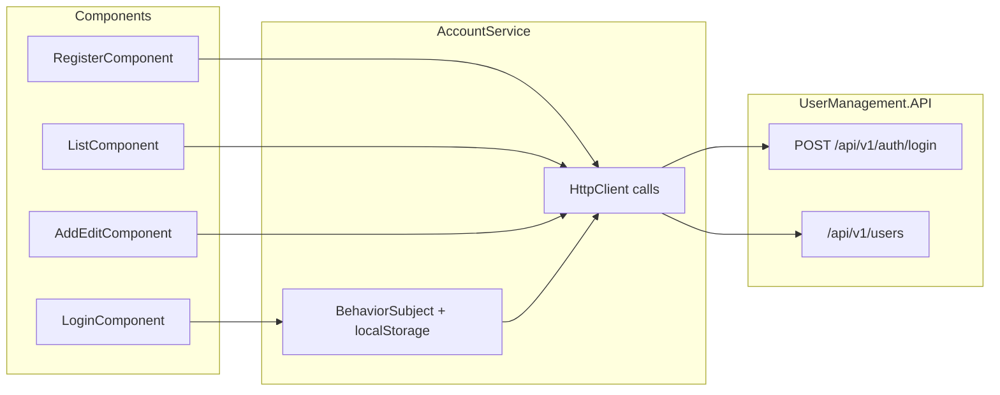

# AccountService (front-end API client)

`AccountService` is the Angular app's single HTTP client for authentication and user CRUD. It stores the logged-in session in `localStorage`, exposes a reactive `user` stream, and is consumed by auth forms, the user list/editor, and HTTP interceptors.

For JWT attachment and auto-logout behavior, see [front-end-auth.md](front-end-auth.md). For form field names vs API JSON, see [front-end-models.md](front-end-models.md).

## Overview

| Property | Value |
|----------|-------|
| File | `front-end/src/app/services/account.service.ts` |
| Registration | `providedIn: 'root'` (singleton) |
| Base URL | `environment.apiUrl` (default `http://localhost:5000`) |
| Session key | `localStorage` item `user` |

## Session management

On construction, the service reads `localStorage.getItem('user')` into a `BehaviorSubject<User>`. Missing keys start logged out; **invalid or incomplete sessions are removed** (malformed JSON, non-object values, or objects without a non-empty `token`) so a corrupted tutorial session cannot crash the app or bypass guards without a JWT. Components subscribe via `accountService.user` or read the current value with `accountService.userValue`.

| Method | Effect on session |
|--------|-------------------|
| `isLoggedIn()` | Returns `true` when `userValue.token` is a non-empty string — used by `AuthGuard`, `JwtInterceptor`, `ErrorInterceptor`, `AppComponent`, auth `LayoutComponent`, and `RegisterComponent` |
| `login()` | Writes `{ userName, token }` to `localStorage`; emits on `user` |
| `logout()` | Removes `user`; emits `null`; navigates to `/account/login` |
| `update()` | If the updated row ID matches the logged-in user's `id`, merges params into stored `user` |

The JWT interceptor calls `isLoggedIn()` before attaching headers. The error interceptor calls `logout()` when a logged-in session receives `401` or `403`.

## HTTP methods

All paths are relative to `environment.apiUrl`.

| Method | HTTP | Endpoint | Auth | Used by |
|--------|------|----------|------|---------|
| `login(userName, password)` | `POST` | `/api/v1/auth/login` | No | `LoginComponent` |
| `register(user)` | `POST` | `/api/v1/users` | Yes (JWT) | `RegisterComponent`, `AddEditComponent` (create) |
| `getAll()` | `GET` | `/api/v1/users` | Yes | `ListComponent` |
| `getById(id)` | `GET` | `/api/v1/users/{id}` | Yes | `AddEditComponent` (edit mode) |
| `update(id, params)` | `PUT` | `/api/v1/users/{id}` | Yes | `AddEditComponent` (edit mode) |
| `delete(id)` | `DELETE` | `/api/v1/users/{id}` | Yes | `ListComponent` |

### Login payload

The service sends `{ userName, password }`, matching the `Credentials` model on the API ([api-resources.md](api-resources.md)). The login form control is still named `username` in the template; `LoginComponent` passes its value as the first argument to `login()`.

### `register()` naming

Despite the method name, `register()` posts to **`POST /api/v1/users`**, not a dedicated auth register route. Both the public register form and the authenticated add-user form call this method. User records created this way do **not** become login accounts — see [README — Authentication vs user data](../README.md#authentication-vs-user-data).

## Component usage

| Component | AccountService calls | Notes |
|-----------|---------------------|-------|
| `auth/login/login.component.ts` | `login()` | Navigates home on success; errors via `AlertService` |
| `auth/register/register.component.ts` | `register()` | Legacy form fields — see [front-end-login-register.md](front-end-login-register.md) and [front-end-models.md](front-end-models.md) |
| `users/list/list.component.ts` | `getAll()`, `delete()` | Loads table on init; delete removes row on success |
| `users/add-edit/add-edit.component.ts` | `getById()`, `register()` (add), `update()` (edit) | API-aligned fields (`loginName`, `displayName`, nested `address`); alerts via `AlertService` |

## Known quirks

| Quirk | Detail | Fix / reference |
|-------|--------|-----------------|
| Method name `register` | Creates a user record, not a login account | Rename only if you refactor callers; document intent in PR |
| Register form labels | UI still shows legacy `username`, `firstName`, `lastName` labels | `RegisterComponent.onSubmit()` maps to `{ loginName, displayName, isActive: true }` before calling `register()` — see [front-end-login-register.md](front-end-login-register.md) |
| `update()` localStorage sync | Only runs when `id == userValue.id` | Login session uses `userName`/`token`, not a user row `id`, so this branch rarely fires in the sample app |
| ~~Fake backend~~ | ~~`fakeBackendProvider` intercepts legacy `/users/authenticate` routes~~ | Fixed — provider removed from `app.module.ts`; legacy code remains in `helpers/fake-backend.ts` for reference — [fake-backend.md](fake-backend.md) |
| ~~No shared error UI~~ | ~~Each component called `AlertService.error()` locally~~ | Fixed — `ErrorInterceptor` shows global error toasts — see [front-end-alerts.md](front-end-alerts.md) |

## Related files

| File | Role |
|------|------|
| `front-end/src/app/services/account.service.ts` | API client and session store |
| `front-end/src/app/models/user.ts` | TypeScript `User` interface (partial vs API) |
| `front-end/src/app/helpers/jwt.interceptor.ts` | Attaches Bearer token from `userValue` |
| `front-end/src/app/helpers/error.interceptor.ts` | Auto-logout on auth errors |
| `front-end/src/environments/environment.ts` | `apiUrl` for local development |

## Related docs

- [front-end-auth.md](front-end-auth.md) — JWT flow, interceptors, and route guards
- [front-end-interceptors.md](front-end-interceptors.md) — JwtInterceptor and ErrorInterceptor behavior
- [front-end-login-register.md](front-end-login-register.md) — login/register forms, returnUrl, and register quirks
- [front-end-models.md](front-end-models.md) — form fields vs API JSON shapes
- [front-end-users.md](front-end-users.md) — Users module list/editor components and CRUD UI flow
- [front-end-alerts.md](front-end-alerts.md) — success/error banners in forms
- [angular-routing.md](angular-routing.md) — which routes call AccountService-backed components
- [api-users-crud.md](api-users-crud.md) — back-end behavior for `/api/v1/users`
- [api-responses.md](api-responses.md) — example JSON for login and CRUD responses
- [code-map.md](code-map.md) — where to change login UI and user CRUD
