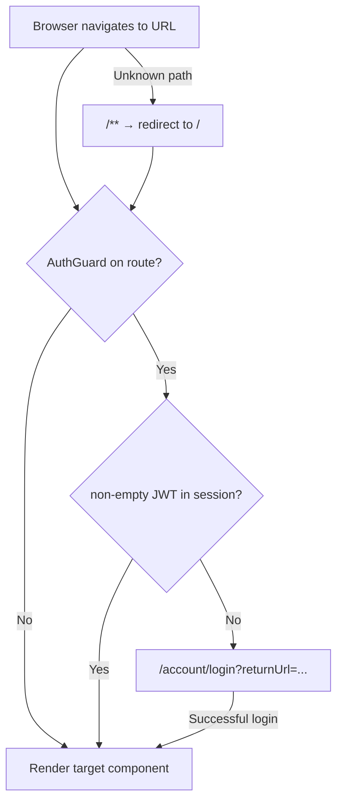

# Angular routing

How the SPA maps URLs to components, lazy-loads feature modules, and protects routes with `AuthGuard`. For JWT storage and interceptors, see [front-end-auth.md](front-end-auth.md). For form fields vs API JSON, see [front-end-models.md](front-end-models.md).

## Route map

All routes are defined under `front-end/src/app/`. The root module wires top-level paths; feature modules (`auth`, `users`) define nested routes.

| URL | Component | Auth | Module | Purpose |
|-----|-----------|------|--------|---------|
| `/` | `HomeComponent` | Yes | `AppRoutingModule` | Landing page after login |
| `/users` | `ListComponent` | Yes | `UsersModule` (lazy) | Browse users |
| `/users/add` | `AddEditComponent` | Yes | `UsersModule` (lazy) | Create a user |
| `/users/edit/:id` | `AddEditComponent` | Yes | `UsersModule` (lazy) | Edit a user by ID |
| `/account/login` | `LoginComponent` | No | `AuthModule` (lazy) | Sign in |
| `/account/register` | `RegisterComponent` | No | `AuthModule` (lazy) | Register form (posts to protected API) |
| `/**` | — | — | `AppRoutingModule` | Redirects to `/` |

Source files:

| File | Role |
|------|------|
| [`app-routing.module.ts`](../front-end/src/app/app-routing.module.ts) | Root routes, lazy module imports, wildcard redirect |
| [`auth/auth-routing.module.ts`](../front-end/src/app/auth/auth-routing.module.ts) | Login and register under `/account` |
| [`users/users-routing.module.ts`](../front-end/src/app/users/users-routing.module.ts) | List and add/edit under `/users` |
| [`helpers/auth.guard.ts`](../front-end/src/app/helpers/auth.guard.ts) | Blocks unauthenticated access to protected routes |

## Navigation flow



### Protected routes

`AuthGuard` calls `AccountService.isLoggedIn()`, which returns true only when the stored session includes a non-empty JWT (`token`). If no valid session exists, the guard redirects to `/account/login` and preserves the intended URL in a `returnUrl` query parameter:

```typescript
this.router.navigate(['/account/login'], { queryParams: { returnUrl: state.url }});
```

After a successful login, `LoginComponent` reads `returnUrl` and navigates there (default `/`):

```typescript
const returnUrl = this.route.snapshot.queryParams['returnUrl'] || '/';
this.router.navigateByUrl(returnUrl);
```

Logout (`AccountService.logout()`) clears storage and always sends the user to `/account/login`.

## Lazy-loaded feature modules

The root router loads `AuthModule` and `UsersModule` on demand instead of bundling them in the initial app load:

```typescript
const accountModule = () => import('./auth/auth.module').then(x => x.AuthModule);
const usersModule = () => import('./users/users.module').then(x => x.UsersModule);
```

| Pattern | Where | Effect |
|---------|-------|--------|
| `loadChildren: accountModule` | `app-routing.module.ts` | `/account/*` routes load `AuthModule` when first visited |
| `loadChildren: usersModule` | `app-routing.module.ts` | `/users/*` routes load `UsersModule` when first visited |
| `RouterModule.forChild(routes)` | Feature routing modules | Child routes merge under the parent path |

Both feature modules use a **layout component** with a nested `<router-outlet>` so login/register and list/add-edit share consistent page chrome without duplicating markup. The auth layout does not perform session redirects — `LoginComponent` sends signed-in users to `/` (or `returnUrl`), and `RegisterComponent` sends logged-out visitors to login. For navbar visibility, global alerts, and layout file locations, see [front-end-shell.md](front-end-shell.md).

## Wildcard redirect

Unknown paths match `{ path: '**', redirectTo: '' }` in `app-routing.module.ts`. That sends visitors to `/`, which is protected by `AuthGuard`. Unauthenticated users therefore end up on the login page with `returnUrl` set to `/`.

## Common navigation patterns

| Action | How |
|--------|-----|
| Link in a template | `<a routerLink="/users">Manage Users</a>` (see `home.component.html`) |
| Programmatic after login | `router.navigateByUrl(returnUrl)` in `LoginComponent` |
| Programmatic logout | `router.navigate(['/account/login'])` in `AccountService.logout()` |
| Edit existing user | Navigate to `/users/edit/:id` from the list component |

## Adding a new route

1. **Feature area** — Create or extend a module under `front-end/src/app/` (follow the `auth/` or `users/` layout + routing module pattern).
2. **Register in root** — Add a `loadChildren` entry (or a direct `component` route) in `app-routing.module.ts`.
3. **Protect if needed** — Add `canActivate: [AuthGuard]` for routes that require a JWT.
4. **Update docs** — Add the URL to the table in [code-map.md](code-map.md#angular-routes) and this page.

Example: a read-only `/reports` area would add a `ReportsModule`, lazy-load it from `app-routing.module.ts`, and apply `AuthGuard` if the page calls protected API endpoints.

## Related docs

- [front-end-auth.md](front-end-auth.md) — JWT storage, interceptors, and login flow
- [front-end-login-register.md](front-end-login-register.md) — login/register forms and `returnUrl` handling
- [front-end-shell.md](front-end-shell.md) — AppComponent navbar, nested layouts, and HomeComponent
- [front-end-users.md](front-end-users.md) — Users module list/editor components and CRUD UI flow
- [front-end-models.md](front-end-models.md) — Form fields vs API JSON on login/register/user screens
- [front-end-modules.md](front-end-modules.md) — AppModule, lazy Auth/Users modules, and shared services
- [code-map.md](code-map.md) — File locations for auth and user UI changes
- [improvement-ideas.md](improvement-ideas.md) — Register form field alignment and fake-backend removal
