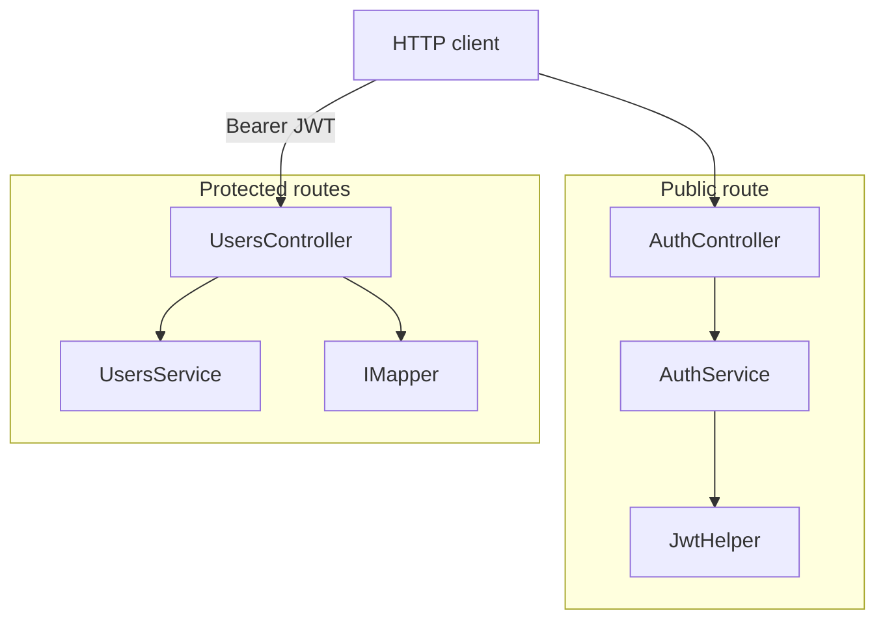

# API controllers guide

How the ASP.NET Core HTTP adapters in `Controllers/V1/` expose the REST API. Controllers stay thin: they handle routing, authorization attributes, and mapping between JSON DTOs and domain entities, then delegate to services.

For per-endpoint Users CRUD behavior, see [api-users-crud.md](api-users-crud.md). For JWT login and bearer validation, see [api-jwt-authentication.md](api-jwt-authentication.md). For middleware order before a request reaches a controller, see [api-request-flow.md](api-request-flow.md).

## Overview



| Controller | Route prefix | Auth | Service | Purpose |
|------------|--------------|------|---------|---------|
| `AuthController` | `/api/v1/auth` | No | `AuthService` | Exchange credentials for a JWT |
| `UsersController` | `/api/v1/users` | Yes (`[Authorize]`) | `UsersService` + `IMapper` | User CRUD |

Source files:

| File | Namespace |
|------|-----------|
| [`AuthController.cs`](../UserManagementAPI/UserManagement.API/Controllers/V1/AuthController.cs) | `UserManagementAPI.Controllers.V1` |
| [`UsersController.cs`](../UserManagementAPI/UserManagement.API/Controllers/V1/UsersController.cs) | `UserManagementAPI.Controllers.V1` |

## Conventions

All V1 controllers share these patterns:

| Attribute / pattern | Where | Purpose |
|---------------------|-------|---------|
| `[Route("api/v1/...")]` | Class level | Versioned base path for every action |
| `[ApiController]` | Class level | Automatic model validation, binding source inference, problem details |
| Constructor injection | Class level | Services and `IMapper` resolved from DI in `Startup.cs` |
| `[FromBody]` | Action parameters | Deserialize JSON request bodies into resource DTOs |
| `IActionResult` return type | Actions | Return `Ok(...)`, `Unauthorized()`, etc. with appropriate status codes |

Controllers do **not** call EF Core or repositories directly. Business logic and persistence live in `Services/` and `DataAccess.EFCore/`.

## AuthController

**File:** `UserManagementAPI/UserManagement.API/Controllers/V1/AuthController.cs`

| Method | Route | Action | Request body | Responses |
|--------|-------|--------|--------------|-----------|
| `POST` | `/api/v1/auth/login` | `Login` | `Credentials` (`userName`, `password`) | `200` + `Claims` (token) or `401` |

```csharp
[Route("api/v1/auth")]
[ApiController]
public class AuthController : ControllerBase
{
    [HttpPost("login")]
    public IActionResult Login([FromBody] Credentials credentials)
    {
        var res = _auth.Login(credentials);
        if (res != null) return Ok(res);
        return Unauthorized();
    }
}
```

There is no `[Authorize]` on this controller — login must be reachable without a token. Credential validation is hardcoded in `AuthService` for local development; see [api-jwt-authentication.md](api-jwt-authentication.md) and [README — Authentication vs user data](../README.md#authentication-vs-user-data).

## UsersController

**File:** `UserManagementAPI/UserManagement.API/Controllers/V1/UsersController.cs`

Class-level `[Authorize]` protects every action. Requests without a valid JWT are rejected by bearer middleware before the action runs.

| Method | Route | Action | Request body | Response |
|--------|-------|--------|--------------|----------|
| `GET` | `/api/v1/users` | `Get()` | — | `200` — array of `UserResource` |
| `GET` | `/api/v1/users/{id}` | `Get(int id)` | — | `200` — `UserResource`; `404` when missing |
| `POST` | `/api/v1/users` | `Add` | `UserResource` | `200` — mapped `UserResource` |
| `PUT` | `/api/v1/users/{id}` | `Update` | `UserResource` | `200` — empty body; `404` when missing |
| `DELETE` | `/api/v1/users/{id}` | `Delete` | — | `200` — empty body; `404` when missing |

**AutoMapper at the boundary:** `GET` and `POST` actions map domain entities to `UserResource` DTOs before returning. `POST` and `PUT` map inbound `UserResource` to domain `User` entities before calling the service.

**Known quirks** (documented behavior, not controller bugs):

| Quirk | Detail | Fix starting point |
|-------|--------|-------------------|
| PUT sets route id on body | `user.Id = id` before mapping | Ensures URL and body stay aligned |

For step-by-step flows through service and repository layers, see [api-users-crud.md](api-users-crud.md).

## Dependency injection

Controllers are registered implicitly by `services.AddControllers()` in `Startup.ConfigureServices`. Their dependencies are registered alongside:

| Service | Lifetime | Injected into |
|---------|----------|---------------|
| `AuthService` | Scoped | `AuthController` |
| `UsersService` | Scoped | `UsersController` |
| `JwtHelper` | Scoped | `AuthService` |
| `IMapper` | Singleton (AutoMapper extension) | `UsersController` |

Full registration table: [solution-structure.md — Dependency injection](solution-structure.md#dependency-injection-startupcs).

## Add a new endpoint

1. **Choose or create a controller** under `Controllers/V1/` with `[Route("api/v1/<area>")]` and `[ApiController]`.
2. **Add a service method** in `Services/` if logic is more than a one-liner.
3. **Define or reuse a DTO** in `Resources/` for JSON shapes — see [api-resources.md](api-resources.md).
4. **Add AutoMapper maps** in `Mapper/DomainToResourceMappingProfile.cs` if mapping entities ↔ DTOs — see [automapper-mapping.md](automapper-mapping.md).
5. **Register new services** in `Startup.ConfigureServices` with an appropriate lifetime (usually `Scoped`).
6. **Apply `[Authorize]`** on protected controllers or individual actions.
7. **Document and test** — add requests to [api-examples.http](api-examples.http), update [api-responses.md](api-responses.md), and run `make verify-api`.

Example skeleton for a new protected controller:

```csharp
[Route("api/v1/reports")]
[Authorize]
[ApiController]
public class ReportsController : ControllerBase
{
    private readonly ReportsService _service;

    public ReportsController(ReportsService service) => _service = service;

    [HttpGet]
    public IActionResult Get() => Ok(_service.GetSummary());
}
```

## Related docs

- [api-services.md](api-services.md) — AuthService, UsersService, DI registration, and quirks
- [api-users-crud.md](api-users-crud.md) — per-endpoint Users CRUD flow and quirks
- [api-jwt-authentication.md](api-jwt-authentication.md) — login, token signing, and bearer validation
- [api-resources.md](api-resources.md) — DTO classes and JSON property reference
- [api-request-flow.md](api-request-flow.md) — HTTP middleware pipeline before controllers
- [api-responses.md](api-responses.md) — example JSON response bodies
- [api-errors.md](api-errors.md) — error statuses and edge cases
- [automapper-mapping.md](automapper-mapping.md) — entity ↔ DTO mapping profile
- [solution-structure.md](solution-structure.md) — project layout and DI registration
- [code-map.md](code-map.md) — file locations by task
- [improvement-ideas.md](improvement-ideas.md) — known gaps and good first fixes
