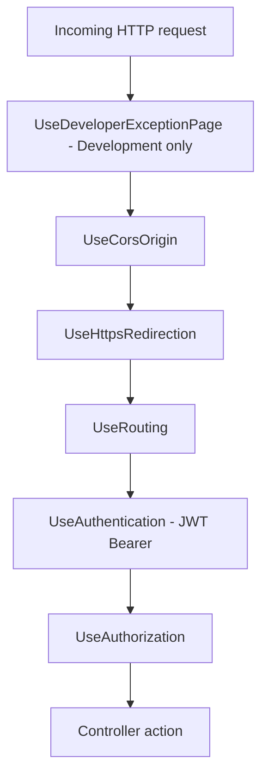
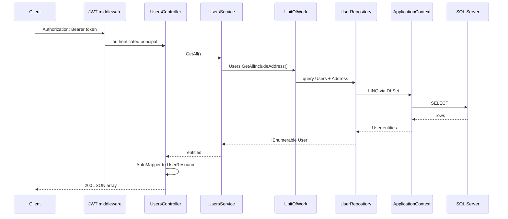
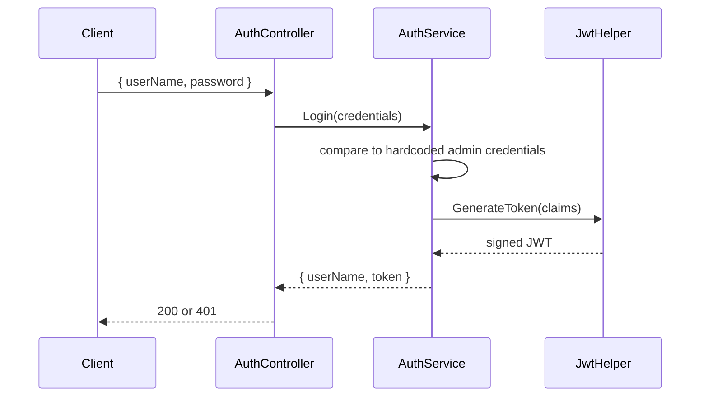

# API request flow

How an HTTP request moves through the ASP.NET Core API from the network to SQL Server and back. For endpoint shapes and example JSON, see [api-responses.md](api-responses.md). For where to edit code, see [code-map.md](code-map.md).

## HTTP pipeline

`Startup.Configure` wires middleware in this order:

| Middleware | Purpose |
|------------|---------|
| `UseCorsOrigin` | Allows the Angular dev server (`http://localhost:4200`) to call the API |
| `UseAuthentication` | Validates the `Authorization: Bearer` JWT on protected routes |
| `UseAuthorization` | Enforces `[Authorize]` on `UsersController` |

`AuthController` has no `[Authorize]` attribute, so `POST /api/v1/auth/login` is public. All `/api/v1/users` routes require a valid JWT.

JWT settings live in `appsettings.json` (`JwtSecret`) and `Helpers/JwtHelper.cs` (7-day lifetime). See [README — Configuration reference](../README.md#configuration-reference).

## Authenticated user request

Example: `GET /api/v1/users` with a bearer token.

### Layer responsibilities

| Layer | Project / path | Role in this request |
|-------|----------------|----------------------|
| Controller | `UserManagement.API/Controllers/V1/UsersController.cs` | HTTP routing, `[Authorize]`, maps entities to `UserResource` DTOs |
| Service | `UserManagement.API/Services/UsersService.cs` | Business orchestration; calls repositories through `IUnitOfWork` |
| Unit of work | `UserManagement.DataAccess.EFCore/UnitOfWorks/UnitOfWork.cs` | Groups repositories and calls `SaveChanges()` on writes |
| Repository | `UserManagement.DataAccess.EFCore/Repositories/UserRepository.cs` | EF queries (`GetAllIncludeAddress`, `GetIncludeAddress`, etc.) |
| Context | `UserManagement.DataAccess.EFCore/ApplicationContext.cs` | EF Core `DbContext` mapped to `Users` and `Addresses` tables |

Create, update, and delete follow the same path; writes additionally call `_unitOfWork.Complete()` to persist changes.

## Login request (no JWT required)

`POST /api/v1/auth/login` bypasses `[Authorize]`:

Login does **not** query SQL Server. User records in the database are separate from login accounts — see [README — Authentication vs user data](../README.md#authentication-vs-user-data).

## Dependency injection

`Startup.ConfigureServices` registers scoped services used per request:

| Registration | Type |
|--------------|------|
| `AddDbContext<ApplicationContext>` | EF Core context (SQL Server connection string) |
| `AddScoped<IUnitOfWork, UnitOfWork>` | Repository access + `SaveChanges` |
| `AddScoped<UsersService>`, `AddScoped<AuthService>` | Application services |
| `AddScoped<JwtHelper>` | Token signing |
| `AddAutoMapper` | `DomainToResourceMappingProfile` for entity ↔ DTO mapping |

Controllers receive services through constructor injection.

## Related docs

- [api-jwt-authentication.md](api-jwt-authentication.md) — login flow, token signing, and JWT bearer validation
- [front-end-auth.md](front-end-auth.md) — how the Angular app obtains and sends the JWT
- [api-responses.md](api-responses.md) — example response bodies
- [api-errors.md](api-errors.md) — `401`, constraint failures, and missing-user edge cases
- [database.md](database.md) — connection string, migrations, and inspection
- [code-map.md](code-map.md) — file locations when changing endpoints or persistence
