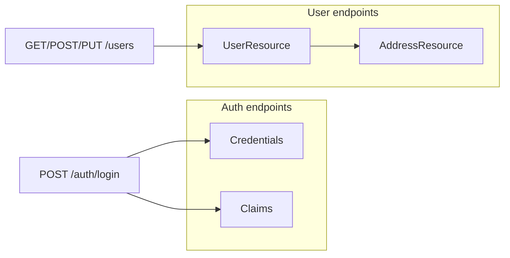

# API resources (DTO reference)

Request and response shapes for `/api/v1` endpoints. DTO classes live in `UserManagementAPI/UserManagement.API/Resources/` and are serialized with **Newtonsoft.Json** using explicit `[JsonProperty]` names (camelCase in JSON).

For example response bodies, see [api-responses.md](api-responses.md). For entity ↔ database mapping, see [domain-model.md](domain-model.md). For AutoMapper usage in controllers, see [automapper-mapping.md](automapper-mapping.md).

## Overview



| DTO | File | Used by |
|-----|------|---------|
| `Credentials` | `Resources/Credentials.cs` | `POST /api/v1/auth/login` request body |
| `Claims` | `Resources/Claim.cs` | `POST /api/v1/auth/login` response body |
| `UserResource` | `Resources/UserResource.cs` | All `/api/v1/users` endpoints (request and response) |
| `AddressResource` | `Resources/AddressResource.cs` | Nested `address` object on `UserResource` |

Controllers bind JSON to these types via ASP.NET Core model binding. Outbound serialization uses the same `[JsonProperty]` names, so JSON property names are stable regardless of C# property casing.

## Authentication DTOs

### `Credentials` — login request

| JSON property | C# property | Type | Notes |
|---------------|-------------|------|-------|
| `userName` | `UserName` | string | Hardcoded login is `admin`; not the same as user-record `loginName` |
| `password` | `Password` | string | Hardcoded development password |

ASP.NET Core binding is case-insensitive, so `username` from the Angular app also binds to `UserName`. Prefer `userName` to match the API contract. See [front-end-models.md](front-end-models.md).

**Example:**

```json
{
  "userName": "admin",
  "password": "123456789"
}
```

### `Claims` — login response

| JSON property | C# property | Type | Notes |
|---------------|-------------|------|-------|
| `userName` | `UserName` | string | Echoes the authenticated username |
| `token` | `Token` | string | JWT signed by `JwtHelper`; 7-day lifetime |

Invalid credentials return `401 Unauthorized` with an empty body (no `Claims` object). Token signing and validation are documented in [api-jwt-authentication.md](api-jwt-authentication.md).

## User DTOs

### `UserResource`

| JSON property | C# property | Type | Create (`POST`) | Update (`PUT`) | Response (`GET`) |
|---------------|-------------|------|-----------------|----------------|------------------|
| `id` | `Id` | int | Omit (server assigns) | Set in URL path; controller overwrites body `id` | Always present |
| `loginName` | `LoginName` | string | Required for meaningful create | Can change (unique constraint) | Present |
| `displayName` | `DisplayName` | string | Send explicitly | Send fields to update | Present |
| `dateOfBirth` | `DateOfBirth` | datetime (ISO 8601) | Send explicitly | Send fields to update | Present |
| `country` | `Country` | string | User-level country (separate from address) | Same | Present |
| `address` | `Address` | `AddressResource` | Optional nested object | Optional nested object | Present when linked |
| `isActive` | `IsActive` | bool | Send explicitly | Send fields to update | Present |
| `salary` | `Salary` | float | Send explicitly | Send fields to update | Present |
| `profilePictureUrl` | `ProfilePictureUrl` | string | Optional | Optional | Present (may be null) |

There is no `[Required]` validation on the API models today. Omitted properties bind to .NET defaults (`0`, `false`, `null`, `0001-01-01` for dates). See [improvement-ideas.md](improvement-ideas.md).

**Example create body:**

```json
{
  "loginName": "jdoe",
  "displayName": "Jane Doe",
  "dateOfBirth": "1990-05-15T00:00:00",
  "country": "US",
  "isActive": true,
  "salary": 75000,
  "profilePictureUrl": "https://example.com/avatar.png",
  "address": {
    "city": "Seattle",
    "country": "US",
    "postalCode": "98101",
    "state": "WA",
    "streetName": "Main St",
    "streetNumber": "100"
  }
}
```

### `AddressResource` (nested)

| JSON property | C# property | Type | Create | Update | Response |
|---------------|-------------|------|--------|--------|----------|
| `id` | `Id` | int | Omit on create | Include when updating existing address | Present when saved |
| `city` | `City` | string | — | — | — |
| `country` | `Country` | string | Address country (may differ from user `country`) | — | — |
| `postalCode` | `PostalCode` | string | — | — | — |
| `state` | `State` | string | — | — | — |
| `streetName` | `StreetName` | string | — | — | — |
| `streetNumber` | `StreetNumber` | string | — | — | — |

On create, EF Core inserts the nested `Address` and links it via `Users.AddressId`. See [repository-pattern.md](repository-pattern.md) and [domain-model.md](domain-model.md).

## Endpoint ↔ DTO matrix

| Method | Route | Auth | Request body | Response body |
|--------|-------|------|--------------|---------------|
| `POST` | `/api/v1/auth/login` | No | `Credentials` | `Claims` |
| `GET` | `/api/v1/users` | Yes | — | `UserResource[]` |
| `GET` | `/api/v1/users/{id}` | Yes | — | `UserResource` or `null` (see [api-errors.md](api-errors.md)) |
| `POST` | `/api/v1/users` | Yes | `UserResource` | Domain `User` entity (see quirk below) |
| `PUT` | `/api/v1/users/{id}` | Yes | `UserResource` | Empty `200 OK` body |
| `DELETE` | `/api/v1/users/{id}` | Yes | — | Empty `200 OK` body |

Per-endpoint controller and service flow: [api-users-crud.md](api-users-crud.md).

## Known quirks

### POST returns a domain entity, not `UserResource`

`UsersController.Add` returns `Ok(_user)` where `_user` is a `User` entity, not a mapped `UserResource`:

```csharp
var _user = _usersService.Add(_mapper.Map<User>(user));
return Ok(_user);
```

JSON output is usually similar because property names align, but the serializer uses entity types (no `[JsonProperty]` attributes on entities). For a consistent API contract, map the outbound response with `_mapper.Map<UserResource>(_user)`. See [automapper-mapping.md](automapper-mapping.md) and [improvement-ideas.md](improvement-ideas.md).

### `loginName` vs `userName`

| Field | DTO | Meaning |
|-------|-----|---------|
| `userName` | `Credentials`, `Claims` | Hardcoded **login** username (`admin`) |
| `loginName` | `UserResource` | Unique **user record** identifier in the database |

Creating a user with `loginName: "jdoe"` does not create a login account. See [README — Authentication vs user data](../README.md#authentication-vs-user-data).

### Front-end naming mismatches

The Angular register form uses legacy field names (`username`, `firstName`, `lastName`) that do not match `UserResource`. The user list/editor aligns with the API. See [front-end-models.md](front-end-models.md) and [account-service.md](account-service.md).

## Adding or changing a DTO

1. Add or edit a class under `UserManagement.API/Resources/` with `[JsonProperty("camelCaseName")]` on each public property.
2. Update `DomainToResourceMappingProfile` if the shape maps to a domain entity — see [automapper-mapping.md](automapper-mapping.md).
3. Wire the DTO in the relevant controller action under `Controllers/V1/`.
4. Update [api-responses.md](api-responses.md) and [`api-examples.http`](api-examples.http) with example JSON.
5. If the Angular app consumes the endpoint, align [front-end-models.md](front-end-models.md) and `AccountService` payloads.

## Related docs

- [api-jwt-authentication.md](api-jwt-authentication.md) — login flow, token signing, and `[Authorize]`
- [api-users-crud.md](api-users-crud.md) — per-endpoint Users CRUD walkthrough
- [api-responses.md](api-responses.md) — example JSON response bodies
- [api-errors.md](api-errors.md) — error statuses and edge cases
- [domain-model.md](domain-model.md) — entity ↔ DTO ↔ SQL column mapping
- [automapper-mapping.md](automapper-mapping.md) — mapping profile and controller usage
- [front-end-models.md](front-end-models.md) — Angular form fields vs API JSON
- [code-map.md](code-map.md) — where to change endpoints and DTOs
