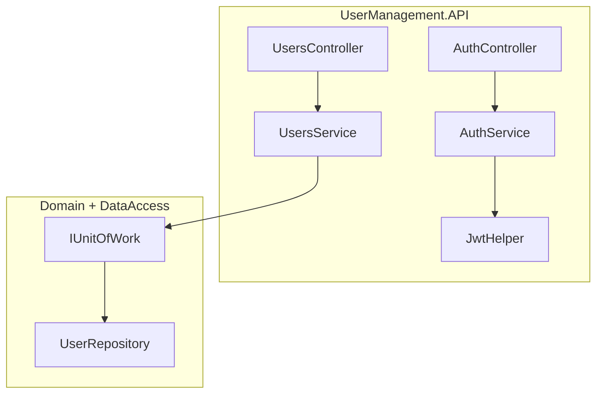

# API services layer

How `AuthService` and `UsersService` sit between controllers and persistence. For HTTP routing and controller conventions, see [api-controllers.md](api-controllers.md). For per-endpoint Users CRUD flows, see [api-users-crud.md](api-users-crud.md). For repository calls inside `UsersService`, see [repository-pattern.md](repository-pattern.md).

## Overview

Both services live in `UserManagementAPI/UserManagement.API/Services/` and are registered as **scoped** in `Startup.ConfigureServices`:

| Service | Injected into | Depends on | Returns |
|---------|---------------|------------|---------|
| `AuthService` | `AuthController` | `JwtHelper` | `Claims` DTO with JWT, or `null` |
| `UsersService` | `UsersController` | `IUnitOfWork` | Domain `User` entities |



Controllers stay thin: they map HTTP to service calls and translate results into status codes and JSON. AutoMapper runs at the **controller** boundary for user endpoints; `AuthService` works directly with `Credentials` and `Claims` DTOs.

## Dependency injection

Registrations in [`Startup.cs`](../UserManagementAPI/UserManagement.API/Startup.cs):

```csharp
services.AddScoped<IUnitOfWork, UnitOfWork>();
services.AddScoped<UsersService>();
services.AddScoped<AuthService>();
services.AddScoped<JwtHelper>();
```

| Registration | Lifetime | Notes |
|--------------|----------|-------|
| `UsersService` | Scoped | One instance per HTTP request; shares the same `ApplicationContext` as `UnitOfWork` |
| `AuthService` | Scoped | Stateless for login; scoped for consistency with other services |
| `JwtHelper` | Scoped | Reads `JwtSecret` from configuration when generating tokens |

For the full DI table and middleware order, see [solution-structure.md — Dependency injection](solution-structure.md#dependency-injection-startupcs) and [api-request-flow.md](api-request-flow.md).

## AuthService

**File:** `UserManagementAPI/UserManagement.API/Services/AuthService.cs`

**Purpose:** Validate login credentials and return a signed JWT. In this sample, validation is **hardcoded** — it does not query the database.

### `Login(Credentials user)`

| Input | Output |
|-------|--------|
| `Credentials` (`userName`, `password` from JSON) | `Claims` with `userName` and `token`, or `null` |

**Current behavior:**

1. Compares `user.UserName` to `"admin"` and `user.Password` to `"123456789"`.
2. On match, builds a `Claims` object and calls `JwtHelper.GenerateToken(claims)`.
3. Returns `null` for any other credentials.

**Controller mapping** (`AuthController.Login`):

- `Claims` returned → `200 OK` with JSON `{ "userName", "token" }`
- `null` returned → `401 Unauthorized`

See [api-jwt-authentication.md](api-jwt-authentication.md) for token signing, validation middleware, and `[Authorize]` on user routes.

### Extension points

| Goal | Where to change |
|------|-----------------|
| Validate against database users | Replace the hardcoded check with a repository query or ASP.NET Identity |
| Add refresh tokens or shorter TTL | Extend `JwtHelper` and return additional fields from `Login` |
| Rate-limit failed logins | Add middleware or logic before calling `AuthService` |

## UsersService

**File:** `UserManagementAPI/UserManagement.API/Services/UsersService.cs`

**Purpose:** Orchestrate user CRUD through `IUnitOfWork`. Returns domain `User` entities; the controller maps them to `UserResource` DTOs (except on `POST`, where the controller returns the raw entity — see [automapper-mapping.md](automapper-mapping.md)).

### Methods

| Method | Repository call | Persists? | Notes |
|--------|-----------------|-----------|-------|
| `GetAll()` | `Users.GetAllIncludeAddress()` | No | Eager-loads nested `Address` |
| `Get(int id)` | `Users.GetIncludeAddress(id)` | No | Returns `null` when ID missing |
| `Add(User user)` | `Users.Add(user)` then `Complete()` | Yes | No duplicate `loginName` check |
| `Update(User user)` | `GetById(id)` → `Update(user)` then `Complete()` | Yes | Returns `false` when ID missing |
| `Delete(int id)` | `GetById(id)` → `Remove(user)` → `Complete()` | Yes | Returns `false` when ID missing |

Every write calls `_unitOfWork.Complete()` to flush changes to SQL Server in one transaction.

### Known quirks

These behaviors are intentional simplifications for the sample. See [api-errors.md](api-errors.md) and [improvement-ideas.md](improvement-ideas.md) for fix suggestions.

| Quirk | What happens | Where to fix |
|-------|--------------|--------------|
| Duplicate `loginName` | Database unique constraint → `500` | Catch `DbUpdateException` or pre-check |
| No input validation | Partial JSON can persist defaults | Add validation on `UserResource` before mapping |

For endpoint-by-endpoint traces (controller → service → repository), see [api-users-crud.md](api-users-crud.md).

## Controller ↔ service mapping

| HTTP | Controller action | Service method |
|------|-------------------|----------------|
| `POST /api/v1/auth/login` | `AuthController.Login` | `AuthService.Login` |
| `GET /api/v1/users` | `UsersController.Get()` | `UsersService.GetAll()` |
| `GET /api/v1/users/{id}` | `UsersController.Get(id)` | `UsersService.Get(id)` |
| `POST /api/v1/users` | `UsersController.Add` | `UsersService.Add` |
| `PUT /api/v1/users/{id}` | `UsersController.Update` | `UsersService.Update` |
| `DELETE /api/v1/users/{id}` | `UsersController.Delete` | `UsersService.Delete` |

AutoMapper converts between `UserResource` and `User` in the controller; services work only with domain entities.

## Add a new service

1. Create a class under `UserManagement.API/Services/` (for example `ReportsService`).
2. Inject domain abstractions (`IUnitOfWork`, repository interfaces) — avoid referencing EF types directly.
3. Register in `Startup.ConfigureServices`: `services.AddScoped<ReportsService>();`
4. Inject the service into a controller in `Controllers/V1/`.
5. Add DTOs under `Resources/` if the endpoint needs a new JSON shape.
6. Document the endpoint in [api-controllers.md](api-controllers.md) and update [code-map.md](code-map.md).

Run `make ci` after changes. For API-only smoke tests, use `make verify-api` and [api-examples.http](api-examples.http).

## Related docs

- [api-controllers.md](api-controllers.md) — AuthController, UsersController, routing, and add-endpoint checklist
- [api-users-crud.md](api-users-crud.md) — per-endpoint Users CRUD walkthrough
- [api-jwt-authentication.md](api-jwt-authentication.md) — JWT login, signing, and bearer validation
- [api-resources.md](api-resources.md) — `Credentials`, `Claims`, and `UserResource` DTOs
- [api-request-flow.md](api-request-flow.md) — HTTP middleware pipeline and request sequence diagrams
- [repository-pattern.md](repository-pattern.md) — `IUnitOfWork`, repositories, and `Complete()`
- [automapper-mapping.md](automapper-mapping.md) — entity ↔ DTO mapping at the controller boundary
- [api-errors.md](api-errors.md) — error statuses and edge cases
- [improvement-ideas.md](improvement-ideas.md) — hardening login, validation, and not-found handling
- [code-map.md](code-map.md) — file locations by task
- [solution-structure.md](solution-structure.md) — project layout and DI registration
