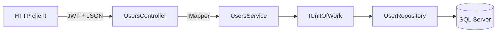

# Users API CRUD guide

Per-endpoint walkthrough for `/api/v1/users`: controller actions, service methods, repository calls, and known quirks. For example JSON bodies, see [api-responses.md](api-responses.md). For error edge cases, see [api-errors.md](api-errors.md).

All user routes require a valid JWT (`Authorization: Bearer <token>`). Obtain a token with `POST /api/v1/auth/login` — see [api-jwt-authentication.md](api-jwt-authentication.md).

## Overview

| Layer | File | Role |
|-------|------|------|
| Controller | `UserManagement.API/Controllers/V1/UsersController.cs` | Routing, `[Authorize]`, AutoMapper at the HTTP boundary |
| Service | `UserManagement.API/Services/UsersService.cs` | Orchestrates repository calls; returns domain `User` entities |
| DTO | `UserManagement.API/Resources/UserResource.cs` | JSON request/response shape (`loginName`, nested `address`, etc.) |
| Repository | `UserManagement.DataAccess.EFCore/Repositories/UserRepository.cs` | EF queries with `Include(u => u.Address)` |

## Endpoint summary

| Method | Route | Controller | Service | Response |
|--------|-------|------------|---------|----------|
| `GET` | `/api/v1/users` | `Get()` | `GetAll()` | `200` — JSON array of `UserResource` |
| `GET` | `/api/v1/users/{id}` | `Get(id)` | `Get(id)` | `200` — `UserResource` or `null` if missing |
| `POST` | `/api/v1/users` | `Add(user)` | `Add(entity)` | `200` — domain `User` entity (not mapped DTO) |
| `PUT` | `/api/v1/users/{id}` | `Update(id, user)` | `Update(entity)` | `200` — empty body |
| `DELETE` | `/api/v1/users/{id}` | `Delete(id)` | `Delete(id)` | `200` — empty body |

## `GET /users` — list all users

**Flow:**

1. `UsersController.Get()` calls `_usersService.GetAll()`.
2. `UsersService.GetAll()` delegates to `_unitOfWork.Users.GetAllIncludeAddress()`.
3. `UserRepository.GetAllIncludeAddress()` runs `Users.Include(u => u.Address).ToList()`.
4. The controller maps entities to DTOs: `_mapper.Map<List<UserResource>>(...)`.
5. Returns `200 OK` with a JSON array (empty database → `[]`).

**Try it:** `docs/api-examples.http` → `### List users`, or `curl` with a token from [README — Try it with curl](../README.md#try-it-with-curl).

## `GET /users/{id}` — get one user

**Flow:**

1. `UsersController.Get(int id)` calls `_usersService.Get(id)`.
2. `UserRepository.GetIncludeAddress(id)` uses `FirstOrDefault()` — returns `null` when the ID does not exist.
3. AutoMapper maps the result to `UserResource`.
4. Returns `Ok(users)` regardless of whether the entity was found.

**Quirk:** Missing IDs return `200 OK` with a `null` body instead of `404 Not Found`. See [api-errors.md](api-errors.md) and [improvement-ideas.md](improvement-ideas.md).

## `POST /users` — create a user

**Flow:**

1. ASP.NET Core binds the JSON body to `UserResource`.
2. `_mapper.Map<User>(user)` converts the DTO (including nested `address`) to a domain entity.
3. `UsersService.Add` calls `_unitOfWork.Users.Add(user)` then `_unitOfWork.Complete()` to persist.
4. EF Core assigns `id` and `address.id` via identity columns.
5. The controller returns `Ok(_user)` with the **domain entity**, not a mapped `UserResource`.

**Quirk:** The POST response bypasses AutoMapper outbound mapping. JSON shape usually matches expectations, but the response does not use `[JsonProperty]` attributes from `UserResource`. See [automapper-mapping.md — POST response quirk](automapper-mapping.md#post-response-quirk).

**Constraints:** `loginName` must be unique at the database level. Duplicates surface as `500` — see [api-errors.md](api-errors.md).

**Required fields:** No `[Required]` validation on `UserResource`. Partial bodies may persist default values (`0`, `false`, `null`). See [domain-model.md](domain-model.md) for the full field list.

## `PUT /users/{id}` — update a user

**Flow:**

1. Route `id` is copied onto the DTO: `user.Id = id` before mapping.
2. `_mapper.Map<User>(user)` builds the entity (including nested address when provided).
3. `UsersService.Update` calls `_unitOfWork.Users.Update(user)` then `Complete()`.
4. Returns `200 OK` with an empty body.

**Notes:**

- Send the fields you want to change plus any required nested `address` data the form expects.
- Updating a non-existent ID may succeed silently or fail at EF depending on state — see [api-errors.md](api-errors.md).
- Partial updates are not implemented; the Angular editor sends the full form payload.

## `DELETE /users/{id}` — delete a user

**Flow:**

1. `UsersService.Delete(id)` loads the user with `_unitOfWork.Users.GetById(id)`.
2. `_unitOfWork.Users.Remove(user)` then `Complete()`.
3. Returns `200 OK` with an empty body.

**Quirk:** Deleting a non-existent ID passes `null` to `Remove`, which throws and returns `500` in Development. Add an existence check and return `404` — see [improvement-ideas.md](improvement-ideas.md).

**Foreign key:** `Users.AddressId` uses `ON DELETE RESTRICT`. Deleting an address row directly while a user references it will fail; delete through the user endpoint or clear the relationship first.

## Nested address handling

Create and update requests may include an `address` object on `UserResource`. AutoMapper maps `AddressResource` ↔ `Address` in both directions. EF Core persists the address through the user's navigation property and sets `Users.AddressId`.

For column-level mapping, see [domain-model.md](domain-model.md). For repository insert/update details, see [repository-pattern.md](repository-pattern.md).

## Angular client mapping

The Angular app calls these endpoints through `AccountService`:

| UI action | `AccountService` method | API call |
|-----------|-------------------------|----------|
| User list | `getAll()` | `GET /api/v1/users` |
| Add/edit form load | `getById(id)` | `GET /api/v1/users/{id}` |
| Create user | `register(user)` | `POST /api/v1/users` |
| Update user | `update(id, params)` | `PUT /api/v1/users/{id}` |
| Delete from list | `delete(id)` | `DELETE /api/v1/users/{id}` |

Components live under `front-end/src/app/users/`. Form field names align with the API on the add/edit screen; see [front-end-models.md](front-end-models.md).

## Good first improvements

| Task | Start in | Doc |
|------|----------|-----|
| Return `404` for missing user on `GET` | `UsersController.Get(int id)` or `UsersService.Get` | [api-errors.md](api-errors.md) |
| Return `409` for duplicate `loginName` | `UsersService.Add` or controller | [improvement-ideas.md](improvement-ideas.md) |
| Map POST response to `UserResource` | `UsersController.Add` | [automapper-mapping.md](automapper-mapping.md) |
| Add `[Required]` or FluentValidation | `UserResource` | [improvement-ideas.md](improvement-ideas.md) |

## Related docs

- [api-responses.md](api-responses.md) — example JSON response bodies
- [api-resources.md](api-resources.md) — DTO classes, JSON properties, and endpoint matrix
- [api-errors.md](api-errors.md) — `401`, `500`, and missing-user edge cases
- [automapper-mapping.md](automapper-mapping.md) — entity ↔ DTO mapping and POST response quirk
- [repository-pattern.md](repository-pattern.md) — `IUnitOfWork`, `UserRepository`, and `Complete()`
- [api-request-flow.md](api-request-flow.md) — HTTP middleware and layered request flow
- [code-map.md](code-map.md) — file locations when changing endpoints or persistence
- [domain-model.md](domain-model.md) — entity ↔ API JSON ↔ SQL column mapping
