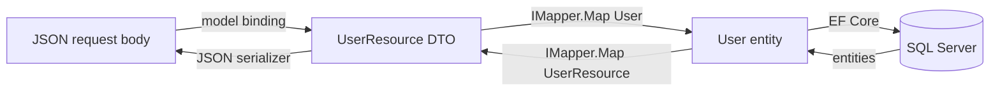

# AutoMapper mapping guide

How the API translates between domain entities (`User`, `Address`) and JSON DTOs (`UserResource`, `AddressResource`). For field-level mapping tables, see [domain-model.md](domain-model.md). For where mapping fits in the HTTP pipeline, see [api-request-flow.md](api-request-flow.md).

## Why AutoMapper is used

Controllers should stay thin and work with HTTP-friendly DTOs. Services and repositories work with domain entities. AutoMapper bridges the two layers so controllers do not hand-copy every property.



| Layer | Types | Where |
|-------|-------|-------|
| HTTP / JSON | `UserResource`, `AddressResource` | `UserManagement.API/Resources/` |
| Domain | `User`, `Address` | `UserManagement.Domain/Entities/` |
| Mapping profile | `DomainToResourceMappingProfile` | `UserManagement.API/Mapper/` |

## Mapping profile

All maps are defined in `UserManagementAPI/UserManagement.API/Mapper/DomainToResourceMappingProfile.cs`:

| Map | Direction | Used when |
|-----|-----------|-----------|
| `User` → `UserResource` | Outbound | `GET /users`, `GET /users/{id}` |
| `Address` → `AddressResource` | Outbound | Nested on user responses |
| `UserResource` → `User` | Inbound | `POST /users`, `PUT /users/{id}` |
| `AddressResource` → `Address` | Inbound | Nested address on create/update |

Property names align between entities and resources (for example `LoginName` ↔ `loginName` via JSON attributes), so the profile uses convention-based maps with no custom `ForMember` rules:

```csharp
CreateMap<User, UserResource>();
CreateMap<Address, AddressResource>();
CreateMap<AddressResource, Address>();
CreateMap<UserResource, User>();
```

## Registration and injection

AutoMapper is registered in `Startup.ConfigureServices`:

```csharp
services.AddAutoMapper(typeof(Startup));
```

The extension scans the assembly for `Profile` subclasses (including `DomainToResourceMappingProfile`) and registers `IMapper` for dependency injection. `UsersController` receives `IMapper` through its constructor alongside `UsersService`.

## Where mapping happens today

| Endpoint | Controller action | Mapping |
|----------|-------------------|---------|
| `GET /users` | `Get()` | `_mapper.Map<List<UserResource>>(entities)` |
| `GET /users/{id}` | `Get(id)` | `_mapper.Map<UserResource>(entity)` |
| `POST /users` | `Add(user)` | Inbound: `_mapper.Map<User>(user)`; outbound: returns the **entity** directly (see note below) |
| `PUT /users/{id}` | `Update(id, user)` | Inbound only; returns `200` with empty body |
| `DELETE /users/{id}` | `Delete(id)` | No mapping |

### POST response quirk

`UsersController.Add` returns `Ok(_user)` where `_user` is a domain `User` entity, not a mapped `UserResource`. ASP.NET Core serializes it with the same camelCase property names, so clients usually see the expected JSON shape—but the response bypasses AutoMapper and does not use `[JsonProperty]` attributes from `UserResource`.

For consistency, a small improvement would be:

```csharp
var created = _usersService.Add(_mapper.Map<User>(user));
return Ok(_mapper.Map<UserResource>(created));
```

That change is listed as a good first task in [improvement-ideas.md](improvement-ideas.md).

## Nested address mapping

When a `UserResource` includes an `address` object, AutoMapper maps the nested `AddressResource` to an `Address` entity on inbound requests and back on outbound `GET` responses. EF Core persists the address through the user’s navigation property and `AddressId` foreign key—see [repository-pattern.md](repository-pattern.md) for the create flow.

Partial updates (`PUT`) set `user.Id = id` in the controller before mapping so the entity carries the route ID into the service layer.

## Adding a new mapped type

When you introduce a new entity exposed through the API:

1. Add the domain entity under `UserManagement.Domain/Entities/`.
2. Add a matching resource DTO under `UserManagement.API/Resources/` with `[JsonProperty]` names matching your JSON contract.
3. Add `CreateMap` entries in `DomainToResourceMappingProfile` (both directions if the API accepts and returns the type).
4. Inject `IMapper` in the controller and map at the HTTP boundary—keep services working with entities only.
5. Document new JSON fields in [domain-model.md](domain-model.md) and [api-responses.md](api-responses.md).

Run `make ci` after changes to confirm the solution still builds.

## Related docs

- [domain-model.md](domain-model.md) — entity ↔ resource ↔ SQL column mapping
- [api-request-flow.md](api-request-flow.md) — where AutoMapper runs in the request pipeline
- [api-responses.md](api-responses.md) — example JSON response bodies
- [code-map.md](code-map.md) — file locations when changing DTOs or mapping
- [solution-structure.md](solution-structure.md) — project layout and DI registration
- [technology-stack.md](technology-stack.md) — pinned AutoMapper package versions
