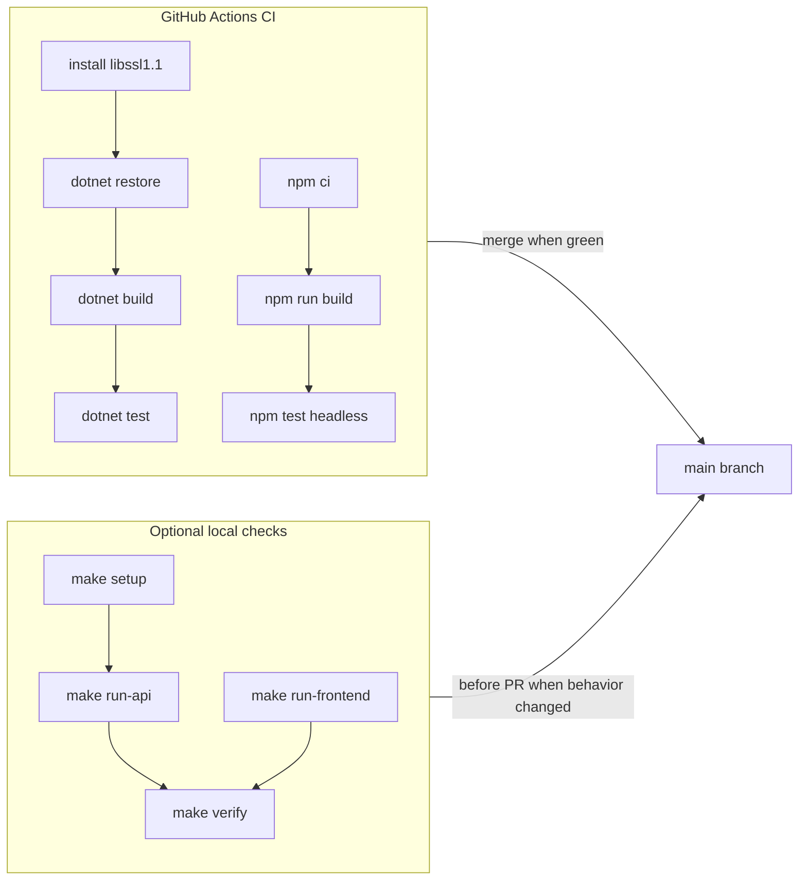

# CI and local builds

How GitHub Actions verifies changes and how to run the same checks on your machine. For day-to-day setup, see [quick-start.md](quick-start.md). For pull request expectations, see [CONTRIBUTING.md](../CONTRIBUTING.md).

## What CI runs

On every push and pull request to `main`, [`.github/workflows/ci.yml`](../.github/workflows/ci.yml) runs four build steps:

| Step | Command | Purpose |
|------|---------|---------|
| Build API | `dotnet restore` + `dotnet build --no-restore` | Compile the .NET solution |
| Test API | `dotnet test --no-build` | Run xUnit tests (`AuthController.Login`, `UsersController` CRUD/not-found/conflict mapping, `AuthService.Login`, `JwtHelper.GenerateToken`, `UsersService`, HTTP integration tests with in-memory EF Core) |
| Build front end | `npm ci` + `npm run build` | Production Angular build |
| Test front end | `npm test -- --watch=false --browsers=ChromeHeadless` | Run Karma/Jasmine unit tests (`extractHttpErrorMessage`, `JwtInterceptor`, `ErrorInterceptor`, `AuthGuard`, `AppComponent`, auth and users `LayoutComponent`, `HomeComponent`, `LoginComponent`, `RegisterComponent`, `AddEditComponent`, `ListComponent`, `AlertComponent`, `AlertService`, `AccountService.isLoggedIn`, `AccountService.login`, `AccountService.logout`, `AccountService.register`, `AccountService.update`, `AccountService.getById`, `AccountService.getAll`, and `AccountService.delete`) |

The workflow uses **.NET SDK 3.1.x** and **Node.js 16** (matching [`.nvmrc`](../.nvmrc)).

### .NET Core 3.1 and OpenSSL on Ubuntu

GitHub Actions runners use Ubuntu 22.04+, which ships OpenSSL 3.x. The .NET Core 3.1 test host still depends on **libssl1.1**, so CI installs it before `dotnet test`:

```yaml
# .github/workflows/ci.yml (excerpt)
- name: Install libssl1.1 for .NET Core 3.1 test host
  run: |
    sudo apt-get update
    sudo apt-get install -y wget
    wget -q http://archive.ubuntu.com/ubuntu/pool/main/o/openssl/libssl1.1_1.1.1f-1ubuntu2_amd64.deb
    sudo dpkg -i libssl1.1_1.1.1f-1ubuntu2_amd64.deb
```

If `make test-api` or `dotnet test` fails locally on Ubuntu 22.04+ with a missing `libssl.so.1.1` or similar OpenSSL error, install the same package (or run tests in a container/VM with libssl1.1 available). Upgrading the solution to a newer .NET target would remove this dependency long term.

## What CI does not run

CI does **not**:

- Start Docker or SQL Server
- Apply EF Core migrations
- Run `make verify` or other runtime smoke checks
- Run integration tests against a live SQL Server database (in-memory HTTP integration tests run via `dotnet test`)

A green CI badge means the solution builds; it does not prove the stack runs end-to-end.

## Local equivalents

| Goal | Command | Notes |
|------|---------|-------|
| Match CI exactly | `make ci` | Uses `npm ci` (clean install from lockfile) |
| Quick local build | `make build` | Uses existing `node_modules`; faster for iterative work |
| API compile only | `make build-api` | .NET solution only |
| Front-end production build | `make build-frontend` | Angular `dist/` output |
| All unit tests | `make test` | Runs `test-api` then `test-frontend` (run after `make build`) |
| API unit tests | `make test-api` | xUnit run; same command as CI (run after `make build-api`) |
| Front-end unit tests | `make test-frontend` | Headless Karma run; same command as CI |
| Remove build artifacts | `make clean` | Deletes `bin`/`obj` and `front-end/dist` |
| Full runtime smoke check | `make verify` | Requires Docker, running API, and Angular dev server |
| API-only smoke check | `make verify-api` | Skips the front-end check (`SKIP_FRONTEND=1`) |

```bash
# Minimum before opening a PR (same as CI)
make ci
```

When your change affects runtime behavior (API routes, auth, database, front-end API calls), also run:

```bash
make setup
make run-api       # terminal 1
make run-frontend  # terminal 2
make verify        # terminal 3
```

## CI vs local build differences

| | CI (`make ci`) | Local dev (`make build`) |
|--|----------------|--------------------------|
| npm install | `npm ci` (strict lockfile) | `npm install` assumed already done |
| Database | Not used | Optional for compile; required for `make verify` |
| Node version | 16 (workflow) | Should match `.nvmrc` (16 recommended) |

If CI passes locally with `make ci` but `make build` fails, run `npm ci` in `front-end/` to sync dependencies with the lockfile.

## Common CI failures

| Symptom | Likely cause | Fix |
|---------|--------------|-----|
| `dotnet build` errors | API compile or package issues | Run `make build-api` locally and fix reported errors |
| `dotnet test` fails with `libssl.so.1.1` / OpenSSL errors on Ubuntu 22.04+ | .NET Core 3.1 test host needs libssl1.1 | Install libssl1.1 as in [`.github/workflows/ci.yml`](../.github/workflows/ci.yml), or run tests on a machine with the library available |
| `npm ci` fails | `package-lock.json` out of sync with `package.json` | Run `npm install` in `front-end/` and commit the updated lockfile |
| `npm run build` fails with OpenSSL / `ERR_OSSL_EVP_UNSUPPORTED` | Node.js 17+ locally | Use Node 16 (`nvm use`) or `NODE_OPTIONS=--openssl-legacy-provider npm run build` |
| CI green but app broken at runtime | CI does not smoke-test | Run `make verify` after starting the stack |

## Workflow diagram



## Related docs

- [CONTRIBUTING.md](../CONTRIBUTING.md) — pull request checklist
- [README — Continuous integration](../README.md#continuous-integration)
- [quick-start.md](quick-start.md) — install, run, and verify the stack
- [README — Troubleshooting](../README.md#troubleshooting) — OpenSSL and migration issues
