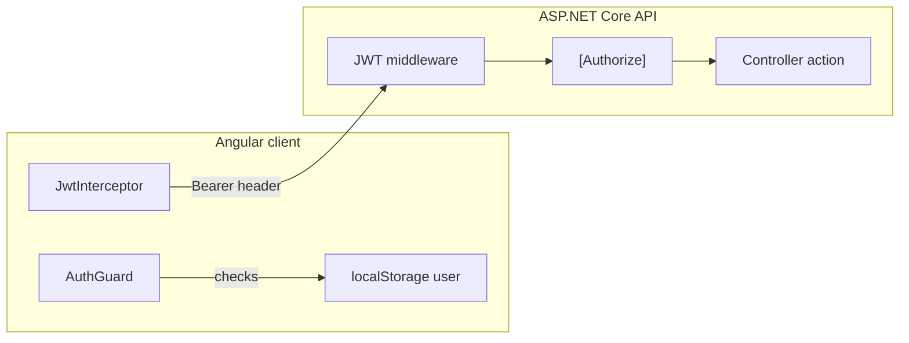
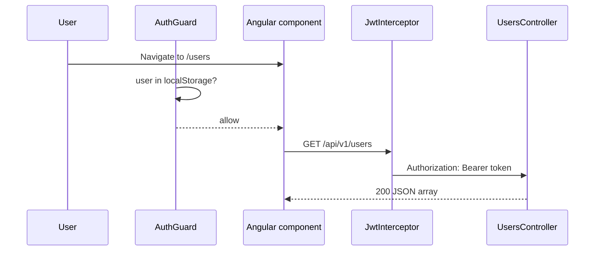
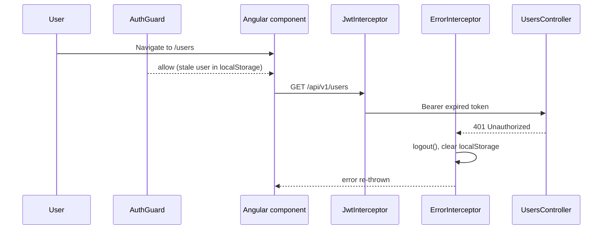

# Client and server authentication layers

How the Angular app and ASP.NET Core API each enforce authentication independently. For JWT signing and bearer validation on the API, see [api-jwt-authentication.md](api-jwt-authentication.md). For Angular session storage and interceptors, see [front-end-auth.md](front-end-auth.md).

## Why two layers exist

Full-stack apps typically check auth in **two places**:

| Layer | Location | Purpose |
|-------|----------|---------|
| **Client (browser)** | Angular `AuthGuard`, `localStorage`, interceptors | UX — hide protected pages and attach tokens to HTTP calls |
| **Server (API)** | JWT bearer middleware, `[Authorize]` | Security — reject requests without a valid token |

The client layer improves navigation and form flows. **Only the API layer is authoritative** — a user can bypass Angular entirely with curl or Postman. Never rely on `AuthGuard` alone for security.



## Client-side protection

### AuthGuard (route access)

`AuthGuard` (`front-end/src/app/helpers/auth.guard.ts`) runs before protected routes (`/` and `/users/*`):

```typescript
const user = this.accountService.userValue;
if (user?.token) {
    return true;
}
this.router.navigate(['/account/login'], { queryParams: { returnUrl: state.url }});
return false;
```

| Check | What it validates | What it does **not** validate |
|-------|-------------------|-------------------------------|
| Non-empty `token` on `userValue` | A JWT string is present in the stored session (same rule as `JwtInterceptor`) | JWT signature, expiry, or claim contents |

An expired or tampered token still passes the guard until an API call fails. See [front-end-login-register.md — AuthGuard interaction](front-end-login-register.md#authguard-interaction) and [angular-routing.md](angular-routing.md).

### Session storage

After login, `AccountService` stores:

```json
{ "userName": "admin", "token": "<jwt>" }
```

The guard and `JwtInterceptor` read this object. Logout removes it; `ErrorInterceptor` clears it on `401`/`403`.

### JwtInterceptor (outbound requests)

For URLs starting with `environment.apiUrl`, the interceptor adds:

```
Authorization: Bearer <token from localStorage>
```

Without a stored token, protected API calls go out **without** the header and the server returns `401`.

### ErrorInterceptor (inbound failures)

On `401` or `403` when a user object exists, the interceptor calls `AccountService.logout()` and re-throws the error. That redirects to login and clears stale sessions after token expiry or revocation.

## Server-side protection

### Login (token issuance)

`POST /api/v1/auth/login` is public. `AuthService.Login` validates hardcoded credentials and `JwtHelper.GenerateToken` returns a signed JWT (7-day lifetime). See [api-jwt-authentication.md](api-jwt-authentication.md).

### JWT middleware (token validation)

`Startup.ConfigureServices` registers JWT bearer authentication. On each request, middleware:

1. Reads `Authorization: Bearer <token>`
2. Validates the signature against `JwtSecret`
3. Builds a `ClaimsPrincipal` for the request

Invalid or missing tokens fail before controller code runs.

### `[Authorize]` (endpoint access)

`UsersController` has a class-level `[Authorize]` attribute. Every `/api/v1/users` action requires a valid bearer token. `AuthController` has no `[Authorize]`, so login stays public.

| Endpoint | Client guard | Server `[Authorize]` |
|----------|--------------|----------------------|
| `/account/login` | Public route | N/A (not a user CRUD route) |
| `/` (home) | `AuthGuard` | N/A (static Angular page) |
| `GET /api/v1/users` | No guard (HTTP call) | Required |
| `POST /api/v1/auth/login` | Public route | Not required |

## End-to-end scenarios

### Happy path: sign in and list users



### Expired token: guard passes, API rejects



The user sees the login page after the failed API call, not when first loading the route.

### Direct API access (no Angular)

```bash
# No token → 401
curl -s -o /dev/null -w "%{http_code}" http://localhost:5000/api/v1/users

# Valid token → 200
TOKEN=$(make token)
curl -s http://localhost:5000/api/v1/users -H "Authorization: Bearer $TOKEN"
```

The API enforces auth regardless of whether the Angular app is running.

## Comparison table

| Aspect | Client (Angular) | Server (API) |
|--------|------------------|--------------|
| Primary goal | Smooth UX, hide protected UI | Enforce access control |
| Mechanism | `AuthGuard` + `localStorage` | JWT middleware + `[Authorize]` |
| Validates JWT cryptographically | No | Yes |
| Checks token expiry | No (until API returns `401`) | Yes |
| Can be bypassed | Yes (devtools, direct HTTP) | No (for protected endpoints) |
| Login credentials checked | No (delegates to API) | Yes (`AuthService`) |
| Auto-logout on auth failure | `ErrorInterceptor` on `401`/`403` | N/A |

## Login vs user records (both layers)

Neither layer ties **login accounts** to **user CRUD records**:

| Concern | Client | Server |
|---------|--------|--------|
| Who can log in? | N/A | Hardcoded `admin` / `123456789` in `AuthService` |
| Who appears in user list? | Calls `GET /api/v1/users` after login | Rows in SQL Server `Users` table |
| Register page | Posts to protected `/api/v1/users` | Requires JWT; creates a profile, not a login |

See [README — Authentication vs user data](../README.md#authentication-vs-user-data).

## Hardening ideas

| Gap | Suggested improvement | See also |
|-----|----------------------|----------|
| Guard ignores JWT expiry | Decode `exp` in `AuthGuard` or check token before navigation | [improvement-ideas.md](improvement-ideas.md) |
| Hardcoded login | Validate credentials against database users | [api-services.md](api-services.md) |
| Long-lived tokens | Shorter TTL or refresh tokens | [api-jwt-authentication.md](api-jwt-authentication.md) |
| Client-only protection | Always enforce on API; treat guard as convenience only | This guide |

## Related docs

- [api-jwt-authentication.md](api-jwt-authentication.md) — API login, token signing, and bearer validation
- [front-end-auth.md](front-end-auth.md) — Angular session, interceptors, and route protection summary
- [front-end-interceptors.md](front-end-interceptors.md) — JwtInterceptor and ErrorInterceptor chain
- [front-end-login-register.md](front-end-login-register.md) — login flow, `returnUrl`, and guard/expiry notes
- [angular-routing.md](angular-routing.md) — route map and AuthGuard redirect behavior
- [account-service.md](account-service.md) — `AccountService` login, logout, and `localStorage`
- [api-controllers.md](api-controllers.md) — `[Authorize]` on `UsersController`
- [improvement-ideas.md](improvement-ideas.md) — auth hardening and fake-backend removal
- [glossary.md](glossary.md) — JWT, AuthGuard, and login vs user record terms
