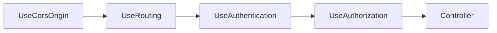

# CORS configuration

How cross-origin requests from the Angular dev server reach the API during local development, and what to change before deploying beyond `localhost`.

For the HTTP middleware order, see [api-request-flow.md](api-request-flow.md). For where CORS is registered in the solution, see [solution-structure.md](solution-structure.md).

## Why CORS matters here

Browsers block JavaScript from calling a different **origin** (scheme + host + port) unless the server explicitly allows it. During local development:

| App | Origin | Role |
|-----|--------|------|
| Angular dev server | `http://localhost:4200` | Serves the SPA |
| API | `http://localhost:5000` | REST endpoints |

Because the ports differ, login and user CRUD requests from the browser are **cross-origin**. Without CORS headers from the API, the browser would block the responses even when the API returns `200`.

Server-to-server tools (curl, REST Client, `verify-stack.sh`) are **not** subject to CORS — only browser-based clients are.

## Current policy

CORS is configured in `UserManagementAPI/UserManagement.API/MiddlewareConfiguration/CorsOriginConfiguration.cs` and wired from `Startup.cs`:

| Registration | Method | When it runs |
|--------------|--------|--------------|
| `services.AddCorsOrigin()` | `ConfigureServices` | Registers the `"AllowAny"` policy |
| `app.UseCorsOrigin()` | `Configure` | Applies the policy on each request |

The `"AllowAny"` policy is intentionally permissive for local learning:

```csharp
x.AllowAnyHeader()
    .AllowAnyMethod()
    .SetIsOriginAllowed(_ => true)
    .AllowCredentials();
```

| Setting | Effect |
|---------|--------|
| `AllowAnyHeader` | Accepts `Authorization`, `Content-Type`, and other request headers |
| `AllowAnyMethod` | Allows `GET`, `POST`, `PUT`, `DELETE`, and preflight `OPTIONS` |
| `SetIsOriginAllowed(_ => true)` | Reflects any request origin in `Access-Control-Allow-Origin` |
| `AllowCredentials` | Permits cookies and credential-bearing requests (the Angular app sends the JWT in a header, not cookies, but this stays enabled for flexibility) |

This policy is appropriate for **localhost development only**. Do not deploy it unchanged to a shared or production environment.

## Middleware order

CORS runs early in the pipeline, before routing and authentication:



Preflight `OPTIONS` requests must succeed before the browser sends the actual `POST` or `PUT` with a JWT. If CORS middleware were placed after authentication, preflight requests could fail with `401` before CORS headers are added.

See [api-request-flow.md](api-request-flow.md) for the full pipeline diagram.

## Tightening for non-local deployments

Before exposing the API on a real host:

1. **Replace `SetIsOriginAllowed(_ => true)`** with an explicit allow list, for example:

   ```csharp
   x.WithOrigins("https://your-app.example.com")
       .AllowAnyHeader()
       .AllowAnyMethod()
       .AllowCredentials();
   ```

2. **Match the Angular production URL** in `front-end/src/environments/environment.prod.ts` (`apiUrl`) and in the CORS allow list.

3. **Review `AllowCredentials`** — if the SPA only sends the JWT via the `Authorization` header (as this project does), you may not need credentials mode; simplifying can reduce CORS complexity.

4. **Enable HTTPS** on both the API and the front end, and set `RequireHttpsMetadata = true` on JWT bearer options when appropriate. See [api-jwt-authentication.md](api-jwt-authentication.md) and [SECURITY.md](../SECURITY.md).

Track this work under [improvement-ideas.md — Security and configuration](improvement-ideas.md#security-and-configuration).

## Troubleshooting

| Symptom | Likely cause | What to check |
|---------|--------------|---------------|
| Browser console: blocked by CORS policy | API not running, wrong `apiUrl`, or CORS middleware missing | Confirm `make run-api` is active; verify `environment.ts` → `apiUrl` is `http://localhost:5000` |
| Preflight `OPTIONS` fails | CORS not registered or middleware order wrong | Confirm `AddCorsOrigin()` in `ConfigureServices` and `UseCorsOrigin()` before `UseRouting` in `Configure` |
| curl works but the UI does not | CORS is browser-only | Use browser dev tools Network tab; compare request origin to API URL |
| `401` on API calls from the UI | Missing or expired JWT (not a CORS issue) | Log in again; see [front-end-auth.md](front-end-auth.md) |

## Related docs

- [api-request-flow.md](api-request-flow.md) — full HTTP middleware pipeline
- [front-end-auth.md](front-end-auth.md) — how the Angular app sends the JWT
- [environment-variables.md](environment-variables.md) — `apiUrl` and local port reference
- [code-map.md](code-map.md) — file location for CORS changes
- [SECURITY.md](../SECURITY.md) — deployment limitations and reporting
- [improvement-ideas.md](improvement-ideas.md) — tightening CORS before non-local use
