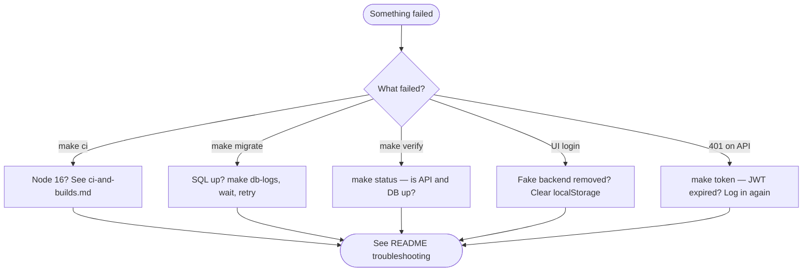

# Day-2 development workflows

Practical commands for everyday work after you have completed [first-time setup](quick-start.md). For architecture and API details, see the [repository README](../README.md).

## Daily development loop

Most days you only need three terminals:

```bash
# Terminal 1 — database (if not already running)
make db-up

# Terminal 2 — API
make run-api

# Terminal 3 — Angular dev server
make run-frontend
```

Quick checks:

```bash
make status    # informational snapshot; never fails
make token     # JWT for curl or REST Client (API must be running)
```

Sign in at `http://localhost:4200` with `admin` / `123456789`.

## After pulling latest changes

```bash
git pull origin main
make install          # refresh npm/dotnet packages when lockfiles change
make migrate          # apply new EF Core migrations when Migrations/ changed
make ci               # compile check before you start coding
```

| What changed upstream | What to run |
|-----------------------|-------------|
| `package-lock.json` | `make install` or `cd front-end && npm ci` |
| `*.csproj` / solution | `cd UserManagementAPI && dotnet restore` |
| `Migrations/` | `make migrate` (database container must be up) |
| `docker-compose.yml` | Review connection string alignment; `make db-down && make setup` if ports or passwords changed |
| Docs only | No runtime steps required |

If migrations fail with a connection error, wait 15–30 seconds after `make db-up`, or run `make db-logs` to watch SQL Server startup.

## API-only workflow

You can develop and test the back end without the Angular dev server:

```bash
make setup
make run-api
make verify-api       # SKIP_FRONTEND=1 smoke checks
make token            # JWT for curl or api-examples.http
```

Use [`api-examples.http`](api-examples.http) or the [curl examples](../README.md#try-it-with-curl) in the README. Endpoint source locations are in [code-map.md — API endpoints](code-map.md#api-endpoints-v1).

## Reset local state

| Goal | Command | Notes |
|------|---------|-------|
| Stop services | `make db-down` | Stops SQL Server container; API and front end stop when you close their terminals |
| Wipe database data | `make db-reset` | Removes the Docker volume and re-applies migrations |
| Clean build artifacts | `make clean` | Deletes .NET `bin`/`obj` and `front-end/dist` |
| Clear browser auth state | DevTools → Application → Local Storage → clear site data | Fixes stale JWT or fake-backend confusion |
| Full fresh compile | `make clean && make ci` | Matches a clean CI build locally |

## Before opening a pull request

```bash
make ci
```

When your change affects runtime behavior (API, auth, database, scripts, or front-end API calls), also run `make verify` or `make verify-api` and follow [manual-testing.md](manual-testing.md).

Documentation-only changes do not require `make verify`.

## When something is wrong



| Symptom | First step | Doc |
|---------|------------|-----|
| `make ci` — OpenSSL / Webpack error | Switch to Node.js 16 (`.nvmrc`) | [ci-and-builds.md](ci-and-builds.md) |
| Migration connection refused | `make db-logs`, wait, `make migrate` | [database.md](database.md) |
| `make verify` fails on front end | Confirm `make run-frontend` is running, or use `make verify-api` | [scripts.md](scripts.md) |
| Login works in curl but not browser | Clear `localStorage` for `http://localhost:4200`; confirm `environment.apiUrl` | [front-end-auth.md](front-end-auth.md) |
| `401` on `/users` | Re-login; token may have expired (7-day lifetime) | [faq.md](faq.md) |

Full troubleshooting table: [README — Troubleshooting](../README.md#troubleshooting).

## Related docs

- [quick-start.md](quick-start.md) — first-time install and verify
- [onboarding.md](onboarding.md) — reading order and first tasks
- [scripts.md](scripts.md) — when to use `status` vs `verify`
- [manual-testing.md](manual-testing.md) — pre-PR checklist
- [code-map.md](code-map.md) — where to change API, auth, schema, and UI
