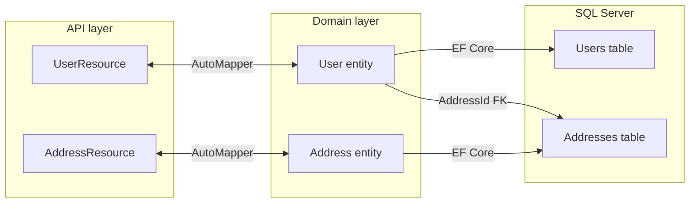

# Domain model reference

How user data flows between the C# domain entities, API JSON resources, and SQL Server tables. For DTO field reference and endpoint matrix, see [api-resources.md](api-resources.md). For endpoint examples, see [api-responses.md](api-responses.md). For schema operations, see [database.md](database.md).

## Overview

AutoMapper profiles in `UserManagementAPI/UserManagement.API/Mapper/DomainToResourceMappingProfile.cs` map (see [automapper-mapping.md](automapper-mapping.md) for controller usage and extension steps):

- `User` ↔ `UserResource`
- `Address` ↔ `AddressResource`

Controllers accept and return `UserResource` / `AddressResource` JSON. Services work with domain entities through repositories and `IUnitOfWork`.

## User fields

| JSON property | C# (`UserResource` / `User`) | SQL column (`Users`) | Notes |
|---------------|--------------------------------|----------------------|-------|
| `id` | `Id` | `Id` | Identity primary key; omitted on create |
| `loginName` | `LoginName` | `LoginName` | Unique index (`IX_Users_LoginName`); duplicate values return `500` (see [api-errors.md](api-errors.md)) |
| `displayName` | `DisplayName` | `DisplayName` | |
| `dateOfBirth` | `DateOfBirth` | `DateOfBirth` | ISO 8601 datetime in JSON |
| `country` | `Country` | `Country` | User's country (separate from address country) |
| `address` | `Address` (navigation) | via `AddressId` FK | Optional one-to-one; nested object in JSON |
| `isActive` | `IsActive` | `IsActive` | |
| `salary` | `Salary` | `Salary` | Stored as SQL `real` (float) |
| `profilePictureUrl` | `ProfilePictureUrl` | `ProfilePictureUrl` | Optional URL string |

The `User` entity does not expose `AddressId` as a property; EF Core creates the shadow foreign key from the `[ForeignKey("AddressId")]` attribute on the `Address` navigation property. The column exists in the database and links to `Addresses.Id`.

## Address fields

| JSON property | C# (`AddressResource` / `Address`) | SQL column (`Addresses`) | Notes |
|---------------|-------------------------------------|--------------------------|-------|
| `id` | `Id` | `Id` | Identity primary key; omitted on create |
| `city` | `City` | `City` | |
| `country` | `Country` | `Country` | Address country (may differ from user `country`) |
| `postalCode` | `PostalCode` | `PostalCode` | |
| `state` | `State` | `State` | |
| `streetName` | `StreetName` | `StreetName` | |
| `streetNumber` | `StreetNumber` | `StreetNumber` | |

## Relationship

| Aspect | Detail |
|--------|--------|
| Cardinality | One user may have zero or one address |
| Foreign key | `Users.AddressId` → `Addresses.Id` (nullable) |
| Delete behavior | `ON DELETE RESTRICT` — cannot delete an address while a user references it |
| Create flow | `UsersService.Add` saves the entity graph in one `SaveChanges` call; EF Core inserts the nested `Address` and sets `AddressId` on the new `User` |

Entity classes: `UserManagementAPI/UserManagement.Domain/Entities/User.cs` and `Address.cs`.

## Not part of the user model

Login credentials are **not** stored on `User` records:

| Concern | Where it lives |
|---------|----------------|
| Login username/password | Hardcoded in `AuthService` (`admin` / `123456789`) |
| JWT | Issued by `JwtHelper`; not persisted in the database |

See [README — Authentication vs user data](../README.md#authentication-vs-user-data) and [faq.md](faq.md).

## Source file map

| Layer | User | Address |
|-------|------|---------|
| Domain entity | `UserManagement.Domain/Entities/User.cs` | `UserManagement.Domain/Entities/Address.cs` |
| API resource | `UserManagement.API/Resources/UserResource.cs` | `UserManagement.API/Resources/AddressResource.cs` |
| AutoMapper | `UserManagement.API/Mapper/DomainToResourceMappingProfile.cs` | same |
| EF Core context | `UserManagement.DataAccess.EFCore/ApplicationContext.cs` | same |
| Initial migration | `UserManagement.DataAccess.EFCore/Migrations/20201129195226_init.cs` | same |

## Changing the model

1. Edit entities in `UserManagement.Domain/Entities/`.
2. Add or update API resources in `UserManagement.API/Resources/` if JSON shape changes.
3. Extend `DomainToResourceMappingProfile` when property names differ between entity and resource.
4. Add an EF Core migration and apply it — see [database.md](database.md) and [code-map.md](code-map.md).
5. Update Angular `models/user.ts` and user forms if the front end consumes new fields.

## Related docs

- [automapper-mapping.md](automapper-mapping.md) — AutoMapper profile, inbound/outbound mapping, and POST response note
- [api-responses.md](api-responses.md) — example JSON request and response bodies
- [database.md](database.md) — connection, migrations, and sqlcmd inspection
- [repository-pattern.md](repository-pattern.md) — GenericRepository, UnitOfWork, and CRUD persistence
- [code-map.md](code-map.md) — where to change schema, services, and UI
- [glossary.md](glossary.md) — `loginName` vs `userName`, entity vs resource
- [front-end-models.md](front-end-models.md) — Angular forms and TypeScript types vs API JSON
- [README — Database schema](../README.md#database-schema) — ER diagram and constraints
