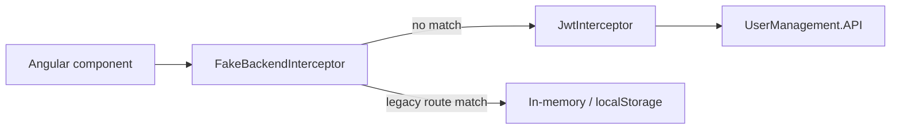

# Fake backend interceptor

The Angular app includes a **fake backend** — an HTTP interceptor left over from the original tutorial. It simulates a REST API in the browser so the UI could run without a real server. **This project no longer registers it by default** — `fakeBackendProvider` was removed from `app.module.ts` so all HTTP traffic goes to the ASP.NET Core API.

For the real JWT flow, see [front-end-auth.md](front-end-auth.md). For field-name mismatches between the tutorial UI and the API, see [front-end-models.md](front-end-models.md).

## What it does

`FakeBackendInterceptor` (`front-end/src/app/helpers/fake-backend.ts`) is **not registered** in current `app.module.ts`. The file remains for reference if you need to understand the original tutorial behavior or re-enable the mock locally.



Real API calls use paths under `environment.apiUrl` (for example `http://localhost:5000/api/v1/...`). The fake backend only handles **tutorial-style relative URLs** that do not include that base path.

## Intercepted routes

| Method | URL pattern | Behavior |
|--------|-------------|----------|
| `POST` | `*/users/authenticate` | Validates `username` / `password` against in-memory users; returns `fake-jwt-token` |
| `POST` | `*/users/register` | Appends user to in-memory list and `localStorage` |
| `GET` | `*/users` | Lists users (requires `Authorization: Bearer fake-jwt-token`) |
| `GET` | `*/users/{id}` | Returns one user by numeric ID |
| `PUT` | `*/users/{id}` | Updates in-memory user |
| `DELETE` | `*/users/{id}` | Removes user from in-memory list |

All other requests pass through to the next interceptor (`JwtInterceptor`) and then to the real API.

## Storage and token

The fake backend keeps its own user list in browser `localStorage` under:

```
angular-10-registration-login-example-users
```

This is **separate** from the real session key (`user`) that `AccountService` writes after `POST /api/v1/auth/login`.

| Concern | Fake backend | Real API |
|---------|--------------|----------|
| Auth token | `fake-jwt-token` (static string) | JWT signed by `JwtHelper` on the API |
| Session key | `angular-10-registration-login-example-users` | `user` in `localStorage` |
| Login endpoint | `/users/authenticate` | `/api/v1/auth/login` |
| User fields | `username`, `firstName`, `lastName` | `loginName`, `displayName`, nested `address` |
| Persistence | Browser `localStorage` only | SQL Server via EF Core |

## Interaction with the real API

With `fakeBackendProvider` still registered:

- **AccountService** already calls the real API (`${apiUrl}/api/v1/auth/login`, `/api/v1/users`, etc.), so login and user CRUD normally hit the back end.
- The fake backend only activates if a component still posts to legacy paths like `/users/authenticate` without the `apiUrl` prefix.
- Stale `localStorage` from earlier tutorial runs can confuse debugging (two different user stores).

Symptoms that often point to fake-backend or stale storage issues:

| Symptom | Likely cause | Fix |
|---------|--------------|-----|
| Login works in curl but not in the UI | Fake routes or stale `localStorage` | Remove `fakeBackendProvider`; clear site data in DevTools |
| Token is literally `fake-jwt-token` | Request hit the fake authenticate route | Confirm `AccountService` uses `apiUrl`; remove fake backend |
| User list differs from API / database | Viewing in-memory fake users | Use real API endpoints; clear `angular-10-registration-login-example-users` |

## When to remove it

Remove the fake backend when:

- You run against the real API exclusively (normal for this repo).
- You are debugging auth or CRUD and want to rule out client-side mocks.
- You are aligning the register form with API field names ([improvement-ideas.md](improvement-ideas.md)).

Keeping it does not break real API calls as long as components use `environment.apiUrl`, but it adds noise for new contributors and can mask misconfigured URLs.

## How to remove it

1. Open `front-end/src/app/app.module.ts`.
2. Delete the `fakeBackendProvider` import and remove it from the `providers` array.
3. Optionally delete `front-end/src/app/helpers/fake-backend.ts` and its export from `helpers/index.ts` if nothing else references it.
4. Clear browser local storage for `http://localhost:4200` (both `user` and `angular-10-registration-login-example-users`).
5. Log in again with the [default credentials](../README.md#default-login) and run `make verify`.

Minimal change (stop intercepting, keep the file):

```typescript
// app.module.ts — remove fakeBackendProvider from providers
providers: [
    { provide: HTTP_INTERCEPTORS, useClass: JwtInterceptor, multi: true },
    { provide: HTTP_INTERCEPTORS, useClass: ErrorInterceptor, multi: true },
],
```

## Related files

| File | Role |
|------|------|
| `front-end/src/app/helpers/fake-backend.ts` | `FakeBackendInterceptor` and `fakeBackendProvider` |
| `front-end/src/app/app.module.ts` | Registers the provider alongside JWT and error interceptors |
| `front-end/src/app/services/account.service.ts` | Real API client (uses `environment.apiUrl`) |
| `front-end/src/app/helpers/index.ts` | Re-exports helpers including `fakeBackendProvider` |

## Related docs

- [front-end-auth.md](front-end-auth.md) — real JWT storage, interceptors, and route guards
- [front-end-interceptors.md](front-end-interceptors.md) — full interceptor chain, registration order, and JWT attachment rules
- [account-service.md](account-service.md) — HTTP endpoints the app actually calls
- [front-end-models.md](front-end-models.md) — tutorial field names vs API JSON
- [improvement-ideas.md](improvement-ideas.md) — removing the fake backend as a good first task
- [faq.md](faq.md) — "Should I remove the fake backend?"
- [code-map.md](code-map.md) — file locations for auth and integration changes
- [README — Front-end and API integration](../README.md#front-end-and-api-integration) — integration checklist
