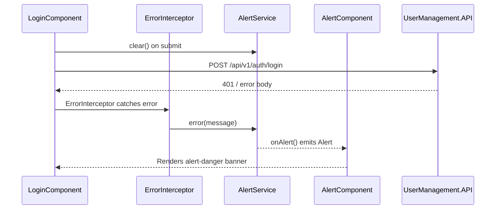

# Front-end alerts

How the Angular app shows success and error messages to the user. For login flow and HTTP error handling, see [front-end-auth.md](front-end-auth.md).

## Overview

The UI uses a small publish/subscribe pattern:

| Piece | File | Role |
|-------|------|------|
| `AlertService` | `front-end/src/app/services/alert.service.ts` | Emits alert events (`success`, `error`, `info`, `warn`) |
| `AlertComponent` | `front-end/src/app/components/alert.component.ts` | Subscribes and renders Bootstrap-styled banners |
| `<alert>` host | `front-end/src/app/app.component.html` | Single global alert region above the router outlet |



`ErrorInterceptor` calls `AlertService.error()` for all failed HTTP responses. Form components still call `clear()` before submit and `success()` after saves; their `subscribe({ error })` handlers only reset local state (for example `loading` or `isDeleting` flags).

## AlertService API

`AlertService` is provided in root (`providedIn: 'root'`). Convenience methods all delegate to `alert()`:

| Method | Alert type | Typical use |
|--------|------------|-------------|
| `success(message, options?)` | Success (green) | After create/update navigates away |
| `error(message, options?)` | Error (red) | Failed login, API `4xx`/`5xx` |
| `info(message, options?)` | Info (blue) | Informational messages |
| `warn(message, options?)` | Warning (yellow) | Validation or caution text |
| `clear(id?)` | — | Remove visible alerts (empty message event) |

### Alert options

The `Alert` model (`front-end/src/app/models/alert.ts`) supports optional flags:

| Property | Default | Effect |
|----------|---------|--------|
| `id` | `'default-alert'` | Target a specific `<alert id="...">` instance |
| `autoClose` | `false` | Remove the banner after 3 seconds |
| `keepAfterRouteChange` | `false` | Survive navigation (used for success toasts) |
| `fade` | inherited from component | CSS fade-out on dismiss |

**Example — success that persists after redirect:**

```typescript
this.alertService.success('User added successfully', { keepAfterRouteChange: true });
this.router.navigate(['../'], { relativeTo: this.route });
```

## AlertComponent behavior

`AlertComponent` subscribes to `alertService.onAlert(this.id)` and maintains an in-memory `alerts` array.

| Event | Behavior |
|-------|----------|
| New alert with `message` | Pushed to the array and rendered |
| `clear()` / empty message | Removes alerts unless `keepAfterRouteChange` is set |
| `NavigationStart` | Calls `alertService.clear()` — wipes banners on route change |
| `autoClose: true` | Removes the alert after 3 seconds |
| User dismiss | `removeAlert()` with optional fade animation |

The root template uses the default id:

```html
<alert></alert>
```

To scope alerts to a layout, add `<alert id="my-region"></alert>` and pass `{ id: 'my-region' }` in service calls.

## Where alerts are triggered

| Component | File | When |
|-----------|------|------|
| Login | `auth/login/login.component.ts` | `clear()` on submit |
| Register | `auth/register/register.component.ts` | `clear()` on submit; `success()` after create |
| Add / edit user | `users/add-edit/add-edit.component.ts` | `clear()` on submit; `success({ keepAfterRouteChange: true })` after save |
| ErrorInterceptor | `helpers/error.interceptor.ts` | `error()` on any failed HTTP response; session-expired message on `401`/`403` with an active session |

Login and register layouts do **not** embed their own `<alert>` tag. Messages render in the global `<alert>` in `app.component.html`, which sits above nested `router-outlet` content.

## Error message source

Failed HTTP calls flow through `ErrorInterceptor` (`helpers/error.interceptor.ts`) — see [front-end-interceptors.md](front-end-interceptors.md) for the full chain and status matrix:

1. On `401` or `403` while a user session exists, `AccountService.logout()` runs and a session-expired message is shown.
2. For all other failures, the interceptor shows the parsed message from `extractHttpErrorMessage()` in `error.interceptor.ts`.
3. The interceptor re-throws the message so components can reset local state in their `subscribe({ error })` handlers.

Validation failures (`400`) and duplicate `loginName` responses (`409`) surface field-level or conflict messages when the API returns JSON bodies. Empty bodies (typical for login `401`) fall back to `statusText` such as `Unauthorized`.

## Common patterns

**Clear stale messages before validating a form:**

```typescript
onSubmit() {
    this.alertService.clear();
    if (this.form.invalid) return;
    // ...
}
```

**Show feedback without losing it on navigation:**

```typescript
this.alertService.success('Update successful', { keepAfterRouteChange: true });
this.router.navigate(['../../'], { relativeTo: this.route });
```

**Auto-dismiss an informational banner:**

```typescript
this.alertService.info('Changes saved locally', { autoClose: true });
```

## Extension ideas

- ~~Wire `ErrorInterceptor` to `AlertService` for consistent global error toasts.~~ Fixed — the interceptor shows all HTTP error messages; components only reset local state in error handlers.
- ~~Map ASP.NET Core validation/problem-details JSON into readable `error()` messages.~~ Fixed — `extractHttpErrorMessage()` in `error.interceptor.ts` parses validation `errors` and `{ message }` bodies before re-throw.
- Replace Bootstrap classes in `AlertComponent.cssClass()` if you migrate to Angular Material snack bars.

## Related docs

- [front-end-auth.md](front-end-auth.md) — JWT session, interceptors, and logout on `401`
- [front-end-interceptors.md](front-end-interceptors.md) — ErrorInterceptor re-throw flow and status handling
- [front-end-shell.md](front-end-shell.md) — global `<alert>` placement in AppComponent
- [front-end-models.md](front-end-models.md) — form fields vs API JSON
- [angular-routing.md](angular-routing.md) — navigation and layout components
- [code-map.md](code-map.md) — where to change login, register, and user editor UI
- [improvement-ideas.md](improvement-ideas.md) — known gaps and good first contributions
