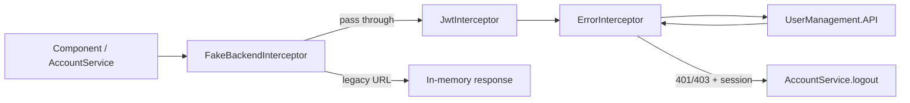
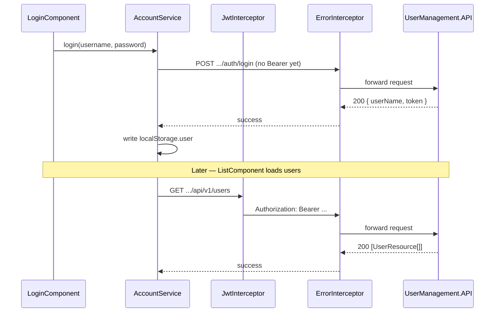
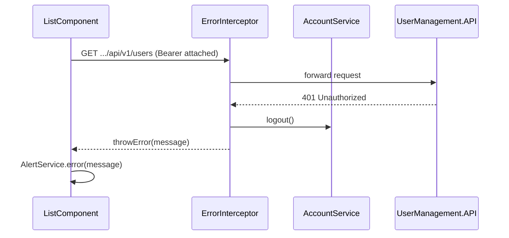

# Front-end HTTP interceptors

How Angular `HttpClient` requests pass through the app's interceptors before reaching the ASP.NET Core API. For session storage and route guards, see [front-end-auth.md](front-end-auth.md). For the tutorial fake backend, see [fake-backend.md](fake-backend.md).

## Registration order

All interceptors are registered in `front-end/src/app/app.module.ts`. Angular runs them in **registration order** for outgoing requests and in **reverse order** for the response stream.

```typescript
providers: [
    { provide: HTTP_INTERCEPTORS, useClass: JwtInterceptor, multi: true },
    { provide: HTTP_INTERCEPTORS, useClass: ErrorInterceptor, multi: true },
    fakeBackendProvider,  // also an HTTP_INTERCEPTORS provider
],
```

Because `fakeBackendProvider` is listed last, it runs **first** on outgoing requests. That lets legacy tutorial URLs short-circuit before JWT headers are attached.



| Interceptor | File | Runs when | Outgoing | Response |
|-------------|------|-----------|----------|----------|
| `FakeBackendInterceptor` | `helpers/fake-backend.ts` | Default (remove for production-style dev) | Matches legacy `/users/*` paths | Returns synthetic `HttpResponse` |
| `JwtInterceptor` | `helpers/jwt.interceptor.ts` | Always (real API path) | Adds `Authorization: Bearer <token>` when logged in and URL starts with `environment.apiUrl` | Pass-through |
| `ErrorInterceptor` | `helpers/error.interceptor.ts` | Always | Pass-through | Catches errors; auto-logout on `401`/`403`; re-throws a string message |

Real API calls use full URLs like `http://localhost:5000/api/v1/...` (built from `environment.apiUrl` in `AccountService`). The fake backend only handles relative tutorial paths — see [fake-backend.md](fake-backend.md).

## JwtInterceptor

Source: `front-end/src/app/helpers/jwt.interceptor.ts`

The interceptor reads the current session from `AccountService.userValue` (backed by `localStorage` key `user`). It clones the request when **both** conditions hold:

1. `user.token` is present (user is logged in).
2. `request.url.startsWith(environment.apiUrl)` (request targets this project's API).

```typescript
if (isLoggedIn && isApiUrl) {
    request = request.clone({
        setHeaders: { Authorization: `Bearer ${user.token}` }
    });
}
```

| Scenario | Header attached? |
|----------|------------------|
| Logged in, URL is `http://localhost:5000/api/v1/users` | Yes |
| Not logged in | No — protected routes return `401` from the API |
| Logged in, URL is a third-party host | No — avoids leaking the JWT |
| Login `POST /api/v1/auth/login` before session exists | No — login is intentionally unauthenticated |

**Debugging:** In DevTools → Network, inspect a `/api/v1/users` request. The `Authorization` header should appear only after a successful login. If it is missing, confirm `environment.apiUrl` matches the running API (`make status`) and that `localStorage.user` contains a `token` field.

## ErrorInterceptor

Source: `front-end/src/app/helpers/error.interceptor.ts`

The interceptor wraps `next.handle(request)` with RxJS `catchError`:

1. If the HTTP status is `401` or `403` **and** `AccountService.userValue` exists, call `logout()` (clears `localStorage` and navigates to `/account/login`).
2. Log the raw error to the console.
3. Re-throw `err.error?.message || err.statusText` as a plain string (not the full `HttpErrorResponse`).

Form components subscribe with `{ error: (message) => this.alertService.error(message) }` — see [front-end-alerts.md](front-end-alerts.md). The interceptor does **not** call `AlertService` itself; that is a documented improvement idea in [improvement-ideas.md](improvement-ideas.md).

| Status | Logged-in session | Interceptor action | Typical UI follow-up |
|--------|-------------------|--------------------|----------------------|
| `401` / `403` | Yes | `logout()` + re-throw message | Redirect to login; optional alert in form handler |
| `401` / `403` | No | Re-throw only | Login form shows error banner |
| `400` / `404` / `500` | Any | Re-throw only | Form handler calls `AlertService.error()` |
| Network failure (`status === 0`) | Any | Re-throw `statusText` | Alert or console only |

**Note:** `AuthGuard` checks only that a `user` object exists in `localStorage` — not JWT expiry. An expired token still passes the guard until an API call returns `401` and this interceptor logs the user out.

## End-to-end example

Login then list users:



If the token is invalid:



## Common pitfalls

| Symptom | Likely cause | Fix |
|---------|--------------|-----|
| API calls never include `Authorization` | `apiUrl` mismatch or not logged in | Align `environment.ts` with the API port; log in again |
| Immediate redirect to login on any error | Token rejected by API | Re-login; check `JwtSecret` and token expiry (7 days) |
| Login works but CRUD hits fake data | Component uses legacy relative URL | Use `AccountService` methods with `environment.apiUrl` |
| Error message is generic (`Unauthorized`) | API returns empty body on `401` | Expected today — `ErrorInterceptor` falls back to `statusText` |
| Double logout / flicker | Multiple parallel `401` responses | Harmless — `logout()` is idempotent |

## Related files

| File | Role |
|------|------|
| `front-end/src/app/app.module.ts` | Registers interceptor providers |
| `front-end/src/app/helpers/jwt.interceptor.ts` | Attach Bearer token to API requests |
| `front-end/src/app/helpers/error.interceptor.ts` | Auto-logout and error re-throw |
| `front-end/src/app/helpers/fake-backend.ts` | Optional tutorial interceptor |
| `front-end/src/app/helpers/index.ts` | Barrel exports for helpers |
| `front-end/src/app/services/account.service.ts` | Builds API URLs; owns session used by interceptors |
| `front-end/src/environments/environment.ts` | `apiUrl` gate for JWT attachment |

## Related docs

- [front-end-auth.md](front-end-auth.md) — session storage, JWT details, and AuthGuard
- [fake-backend.md](fake-backend.md) — legacy routes, storage keys, and removal steps
- [account-service.md](account-service.md) — HTTP methods that trigger interceptors
- [front-end-alerts.md](front-end-alerts.md) — how components display re-thrown error strings
- [front-end-login-register.md](front-end-login-register.md) — login flow before a token exists
- [api-jwt-authentication.md](api-jwt-authentication.md) — API-side token validation and `[Authorize]`
- [environment-variables.md](environment-variables.md) — `apiUrl` and script overrides
- [improvement-ideas.md](improvement-ideas.md) — wiring ErrorInterceptor to AlertService globally
- [code-map.md](code-map.md) — where to change auth and HTTP behavior
