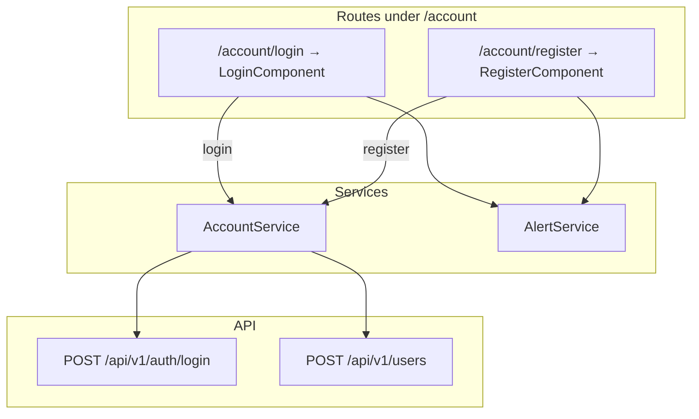

# Front-end login and register UI

How the Angular **Auth** module handles sign-in and the register form under `/account`. For JWT storage and interceptors, see [front-end-auth.md](front-end-auth.md). For field-name mapping to API JSON, see [front-end-models.md](front-end-models.md).

## Overview



| Property | Value |
|----------|-------|
| Module | `front-end/src/app/auth/auth.module.ts` |
| Lazy loaded | Yes — via `loadChildren` in `app-routing.module.ts` |
| Auth required | No — public routes; register still calls a **protected** API endpoint |
| API alignment | Login works with the real API; register keeps legacy form labels but maps to API fields on submit |

## Module layout

| File | Role |
|------|------|
| `auth.module.ts` | Declares `LayoutComponent`, `LoginComponent`, `RegisterComponent`; imports `ReactiveFormsModule` |
| `auth-routing.module.ts` | Child routes under `LayoutComponent` |
| `layout.component.html` | Centered Bootstrap column with `<router-outlet>` |
| `login/login.component.ts` | Reactive login form; navigates to `returnUrl` on success |
| `register/register.component.ts` | Legacy register form; posts to user CRUD endpoint |

### Routes

Defined in `auth-routing.module.ts`:

| URL | Component | Purpose |
|-----|-----------|---------|
| `/account/login` | `LoginComponent` | Sign in with dev credentials |
| `/account/register` | `RegisterComponent` | Create a user record (requires JWT) |

The parent `LayoutComponent` renders child routes inside a centered column (`col-md-6 offset-md-3`). Login and register link to each other with relative `routerLink` values (`../register`, `../login`).

## LoginComponent

**File:** `front-end/src/app/auth/login/login.component.ts`

### Form fields

| Control | Validators | Sent to API |
|---------|------------|-------------|
| `username` | `required` | ✓ — passed to `login()` as `{ userName, password }` |
| `password` | `required` | ✓ |

`AccountService.login()` posts to `POST /api/v1/auth/login` with `{ userName, password }`, matching the API `Credentials` model.

### Submit flow

1. Set `submitted = true` and `alertService.clear()`.
2. Return early if `form.invalid`.
3. Set `loading = true`.
4. Call `accountService.login(username, password)`.
5. On success, read `returnUrl` from query params (default `/`) and `navigateByUrl(returnUrl)`.
6. On error, reset `loading` (error toast is shown by `ErrorInterceptor`).

The default dev credentials are `admin` / `123456789` — see [README — Default login](../README.md#default-login).

### returnUrl behavior

When `AuthGuard` blocks an unauthenticated visit to `/` or `/users/*`, it redirects to:

```
/account/login?returnUrl=<attempted path>
```

After a successful login, the component restores that path so deep links work without manual navigation. See [angular-routing.md — Protected routes](angular-routing.md#protected-routes).

## RegisterComponent

**File:** `front-end/src/app/auth/register/register.component.ts`

### Form fields

| Control | Validators | Maps to API? |
|---------|------------|--------------|
| `firstName` | `required` | ✓ — combined into `displayName` on submit |
| `lastName` | `required` | ✓ — combined into `displayName` on submit |
| `username` | `required` | ✓ — mapped to `loginName` on submit |
| `password` | `required`, `minLength(6)` | ✗ — user records have no password column (legacy tutorial field) |

The form maps legacy tutorial field names to `UserResource` JSON in `onSubmit()` before calling `accountService.register()`, which posts to `POST /api/v1/users`. That endpoint requires a JWT — see [front-end-models.md](front-end-models.md).

### Submit flow

1. Same validation and alert clearing pattern as login.
2. If no session exists (`!accountService.userValue`), redirect to `../login`.
3. Map `{ username, firstName, lastName }` to `{ loginName, displayName, isActive: true }`.
4. Call `accountService.register(body)`.
5. On success, show `Registration successful` via `AlertService` with `{ keepAfterRouteChange: true }`, then navigate to `../login`.
6. On error, show the re-thrown message from `ErrorInterceptor` (often `401` if not logged in).

### Why register often fails

| Symptom | Cause |
|---------|-------|
| `401 Unauthorized` | User endpoints require JWT — log in first |
| `400 Bad Request` | Missing required API fields (should not occur after field mapping) |
| Password ignored | API does not store passwords on user records |

Register is **not** a public sign-up flow. It creates a SQL user record while you are already authenticated. See [README — Authentication vs user data](../README.md#authentication-vs-user-data).

For an API-aligned create flow, use **Users → Add** (`/users/add`) instead — documented in [front-end-users.md](front-end-users.md).

## AuthGuard interaction

Login and register routes are **public** (no `canActivate: [AuthGuard]`). Protected routes (`/`, `/users/*`) redirect here when `AccountService.userValue` is missing.

The guard checks only that a `user` object exists in `localStorage` — it does **not** decode or validate JWT expiry. An expired token still passes the guard until an API call returns `401` and `ErrorInterceptor` logs the user out.

## AccountService calls

| User action | AccountService method | HTTP | Auth header |
|-------------|----------------------|------|-------------|
| Login submit | `login(username, password)` | `POST /api/v1/auth/login` | No |
| Register submit | `register({ loginName, displayName, isActive })` | `POST /api/v1/users` | Yes (via `JwtInterceptor`) |

After login, `localStorage` stores `{ userName, token }`. See [account-service.md](account-service.md) for session details.

## Known quirks

| Quirk | Detail | Suggested fix |
|-------|--------|---------------|
| Register requires login | Protected `POST /users` from a public route | Document flow (this page) or redesign as admin-only |
| Guard ignores token expiry | Stale JWT in storage still unlocks routes | Optional client-side expiry check in `AuthGuard` |
| Login form control name | Template uses `username`; JSON body sends `userName` | Fixed — `AccountService.login()` posts `{ userName, password }`; see [account-service.md](account-service.md) |
| Fake backend | Legacy interceptor only runs if you re-add `fakeBackendProvider` to `app.module.ts` | Default `AppModule` uses the real API; clear tutorial keys from `localStorage` if needed — [fake-backend.md](fake-backend.md) |

See [improvement-ideas.md](improvement-ideas.md) for contribution starting points.

## Unit tests

`LoginComponent` has Karma/Jasmine coverage in `front-end/src/app/auth/login/login.component.spec.ts`:

- Invalid form does not call `AccountService.login`
- Valid submit calls `login(username, password)`
- Success navigates to `/` or the `returnUrl` query parameter
- Failed login resets the `loading` flag

`RegisterComponent` has Karma/Jasmine coverage in `front-end/src/app/auth/register/register.component.spec.ts`:

- Invalid form does not call `AccountService.register`
- Valid submit without a session redirects to login
- Valid submit with a session maps legacy fields to `{ loginName, displayName, isActive: true }`
- Success shows a registration alert and navigates to login
- Failed registration resets the `loading` flag

Run with `make test-frontend` or as part of `make ci`.

## Manual testing

1. Open `http://localhost:4200/account/login` — form loads without a JWT.
2. Log in with `admin` / `123456789` — redirect to `/` (or `returnUrl` if present).
3. Visit `/users` while logged out — redirect to login with `returnUrl=/users`.
4. Log in again — land on `/users`.
5. Open `/account/register` **without** logging in — submit fails with `401`.
6. Log in, then register — user record is created with mapped `loginName` and `displayName` (password field is ignored by the API).

Full checklist: [manual-testing.md — Manual UI walkthrough](manual-testing.md#3-manual-ui-walkthrough).

## Related files

| File | Role |
|------|------|
| `front-end/src/app/auth/auth.module.ts` | Module declaration |
| `front-end/src/app/auth/auth-routing.module.ts` | Child route table |
| `front-end/src/app/auth/login/login.component.ts` | Login form and `returnUrl` navigation |
| `front-end/src/app/auth/login/login.component.spec.ts` | LoginComponent unit tests |
| `front-end/src/app/auth/register/register.component.ts` | Legacy register form |
| `front-end/src/app/auth/register/register.component.spec.ts` | RegisterComponent unit tests |
| `front-end/src/app/services/account.service.ts` | `login()` and `register()` HTTP calls |
| `front-end/src/app/helpers/auth.guard.ts` | Redirects unauthenticated users to login |

## Related docs

- [front-end-auth.md](front-end-auth.md) — JWT storage, interceptors, and session lifecycle
- [front-end-models.md](front-end-models.md) — login/register field mapping vs API JSON
- [account-service.md](account-service.md) — HTTP methods and component usage table
- [angular-routing.md](angular-routing.md) — lazy-loaded `AuthModule`, `returnUrl`, and AuthGuard
- [front-end-shell.md](front-end-shell.md) — navbar visibility on auth vs app routes
- [front-end-alerts.md](front-end-alerts.md) — login/register success and error banners
- [fake-backend.md](fake-backend.md) — tutorial interceptor and removal steps
- [api-jwt-authentication.md](api-jwt-authentication.md) — API login endpoint and token signing
- [manual-testing.md](manual-testing.md) — pre-PR UI walkthrough checklist
- [code-map.md](code-map.md) — where to change login and register UI
- [improvement-ideas.md](improvement-ideas.md) — register alignment and auth hardening
