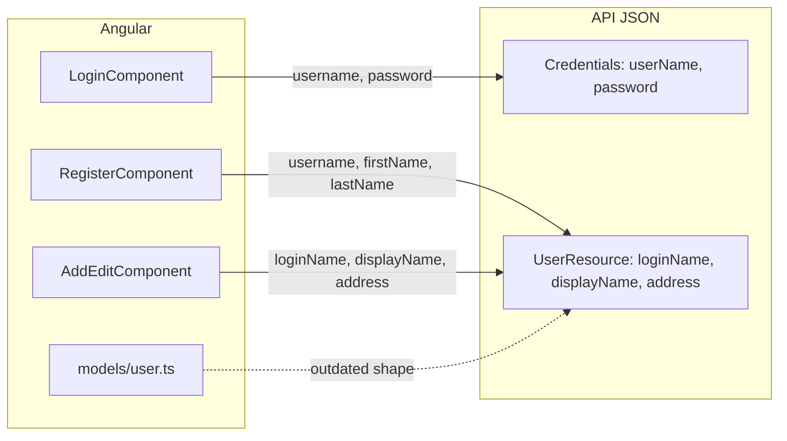

# Front-end models and API field mapping

How Angular forms and TypeScript types relate to the API JSON shape. For entity ↔ SQL mapping on the back end, see [domain-model.md](domain-model.md). For JWT and interceptors, see [front-end-auth.md](front-end-auth.md).

## Overview

The Angular app mixes two naming styles:

| Style | Where it appears | Example fields |
|-------|------------------|------------------|
| **API-aligned** | User list/editor (`users/add-edit/`) | `loginName`, `displayName`, nested `address` |
| **Legacy tutorial** | Register form, `models/user.ts` | `username`, `firstName`, `lastName`, `password` |

Login uses a third name (`username` in the request body) that maps to the API's `userName` through case-insensitive model binding.

## Field mapping reference

### Login (`POST /api/v1/auth/login`)

| Angular (`account.service.ts`) | API (`Credentials.cs`) | Notes |
|--------------------------------|------------------------|-------|
| `username` | `userName` | ASP.NET Core binding is case-insensitive; login works with either spelling |
| `password` | `password` | Compared to hardcoded dev credentials in `AuthService` |

Stored session in `localStorage` uses the API response shape: `{ userName, token }`.

### User CRUD (`/api/v1/users`)

| API field (`UserResource`) | User editor (`add-edit.component`) | Register form | `models/user.ts` |
|----------------------------|------------------------------------|---------------|------------------|
| `loginName` | ✓ form control | `username` (wrong name) | `username` |
| `displayName` | ✓ form control | — | `firstName` / `lastName` (wrong shape) |
| `dateOfBirth` | optional | — | — |
| `country` | via `address.country` | — | — |
| `isActive` | ✓ form control | — | — |
| `salary` | ✓ form control | — | — |
| `profilePictureUrl` | ✓ form control | — | — |
| `address` | ✓ nested form group | — | — |
| `password` | not sent | ✓ (ignored by API) | ✓ |

The **user list and editor** already post the correct JSON shape. The **register page** and **`User` TypeScript class** still reflect the original tutorial and do not match the API.

## Source file map

| Concern | File |
|---------|------|
| Legacy TypeScript model | `front-end/src/app/models/user.ts` |
| HTTP client (login, CRUD) | `front-end/src/app/services/account.service.ts` |
| Login form | `front-end/src/app/auth/login/login.component.ts` |
| Register form (legacy fields) | `front-end/src/app/auth/register/register.component.ts` |
| User create/edit (API-aligned) | `front-end/src/app/users/add-edit/add-edit.component.ts` |
| User list | `front-end/src/app/users/list/list.component.ts` |

## Aligning the register form

To make registration post valid user records:

1. Log in first — `POST /users` requires a JWT (see [Authentication vs user data](../README.md#authentication-vs-user-data)).
2. Replace register form fields with API names (`loginName`, `displayName`, nested `address`, etc.) or map values in `onSubmit()` before calling `accountService.register()`.
3. Update `models/user.ts` to match `UserResource`, or introduce separate types for login session vs user records.
4. Remove unused `password` from the register payload — the API does not store passwords on user records.

See [improvement-ideas.md](improvement-ideas.md) for a suggested first contribution.

## Related docs

- [domain-model.md](domain-model.md) — entity, resource, and SQL column mapping
- [api-resources.md](api-resources.md) — API DTO reference and endpoint matrix
- [account-service.md](account-service.md) — HTTP methods, session, and which components call the API
- [front-end-login-register.md](front-end-login-register.md) — AuthModule login/register forms and legacy field quirks
- [front-end-users.md](front-end-users.md) — Users module list/editor components and form fields
- [front-end-auth.md](front-end-auth.md) — JWT storage, interceptors, and route guards
- [fake-backend.md](fake-backend.md) — tutorial fake-backend routes, storage, and removal
- [api-responses.md](api-responses.md) — example JSON bodies
- [README — Front-end and API integration](../README.md#front-end-and-api-integration) — fake backend and integration checklist
- [code-map.md](code-map.md) — where to change login, register, and user editor UI
