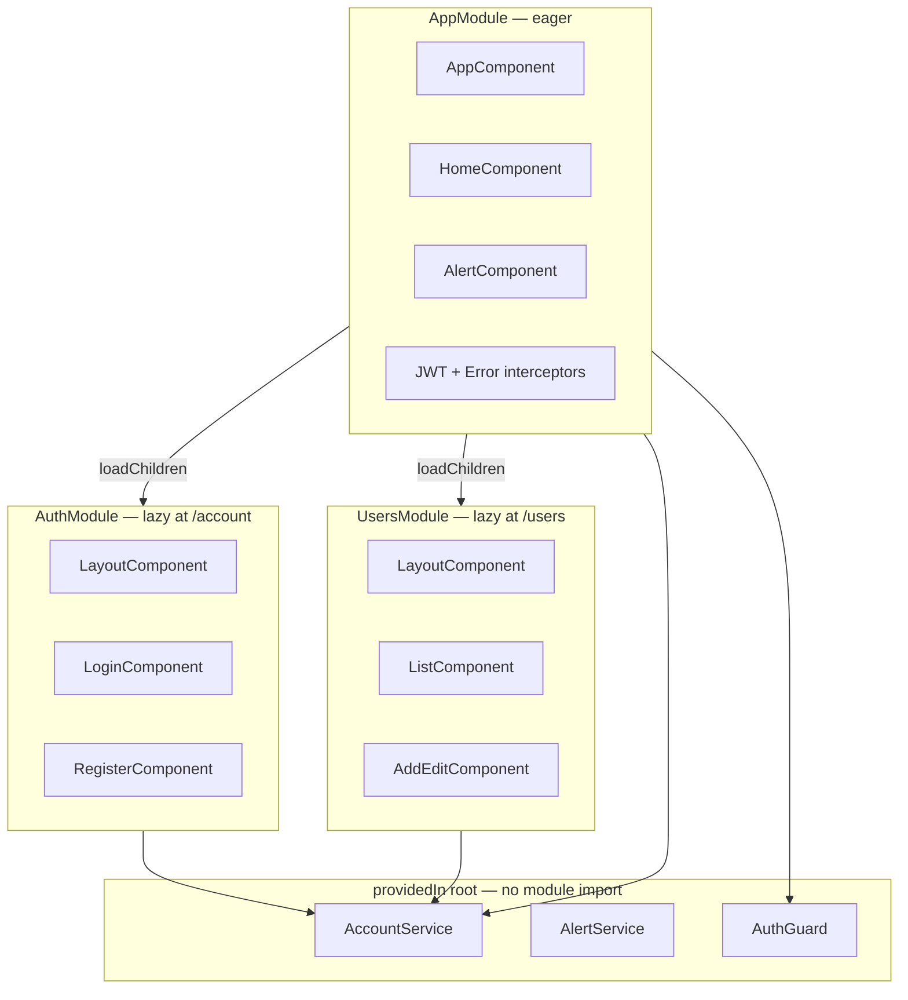

# Angular modules

How the SPA splits code across `AppModule` and lazy-loaded feature modules. For route URLs and `AuthGuard`, see [angular-routing.md](angular-routing.md). For the root navbar and nested layouts, see [front-end-shell.md](front-end-shell.md).

## Module map



| Module | File | Loaded | Declares |
|--------|------|--------|----------|
| **AppModule** | [`app.module.ts`](../front-end/src/app/app.module.ts) | At bootstrap | `AppComponent`, `HomeComponent`, `AlertComponent` |
| **AuthModule** | [`auth/auth.module.ts`](../front-end/src/app/auth/auth.module.ts) | On first visit to `/account/*` | `LayoutComponent`, `LoginComponent`, `RegisterComponent` |
| **UsersModule** | [`users/users.module.ts`](../front-end/src/app/users/users.module.ts) | On first visit to `/users/*` | `LayoutComponent`, `ListComponent`, `AddEditComponent` |

Routing modules (`AppRoutingModule`, `AuthRoutingModule`, `UsersRoutingModule`) are imported by their parent module but do not declare components.

## AppModule (root)

`AppModule` is the only module bootstrapped in [`main.ts`](../front-end/src/main.ts). It owns:

| Concern | Location | Notes |
|---------|----------|-------|
| Browser bootstrap | `bootstrap: [AppComponent]` | Root shell with navbar and global `<alert>` |
| HTTP client | `HttpClientModule` | Required for all API calls |
| Global interceptors | `providers` in `app.module.ts` | `JwtInterceptor`, `ErrorInterceptor` — see [front-end-interceptors.md](front-end-interceptors.md) |
| Top-level routes | `AppRoutingModule` | `/`, lazy `/users`, lazy `/account`, wildcard redirect |
| Shared UI | `AlertComponent` | Rendered once in `app.component.html` — see [front-end-alerts.md](front-end-alerts.md) |

Interceptors are registered **only** in `AppModule`. Lazy feature modules do not re-register them; Angular applies the root `HTTP_INTERCEPTORS` to every `HttpClient` request.

## Lazy feature modules

`AuthModule` and `UsersModule` follow the same pattern:

1. Import `CommonModule`, `ReactiveFormsModule`, and a feature `*RoutingModule`.
2. Declare a local `LayoutComponent` with a nested `<router-outlet>`.
3. Declare page components under that layout.

Each feature module has its **own** `LayoutComponent` class (separate files under `auth/` and `users/`). They are not shared modules — the names collide by design because lazy modules are isolated bundles.

Lazy loading is configured in [`app-routing.module.ts`](../front-end/src/app/app-routing.module.ts):

```typescript
const accountModule = () => import('./auth/auth.module').then(x => x.AuthModule);
const usersModule = () => import('./users/users.module').then(x => x.UsersModule);
```

| Route prefix | Guard | Module | Child routes file |
|--------------|-------|--------|-------------------|
| `/account` | None | `AuthModule` | [`auth-routing.module.ts`](../front-end/src/app/auth/auth-routing.module.ts) |
| `/users` | `AuthGuard` on parent | `UsersModule` | [`users-routing.module.ts`](../front-end/src/app/users/users-routing.module.ts) |

`AuthGuard` is applied on `/` and `/users` in the root router, not inside feature routing modules.

## Shared services and guards

These types are **not** declared in any `NgModule`. They use `@Injectable({ providedIn: 'root' })` and are imported wherever needed:

| Type | File | Used by |
|------|------|---------|
| `AccountService` | [`services/account.service.ts`](../front-end/src/app/services/account.service.ts) | Login, logout, user CRUD — see [account-service.md](account-service.md) |
| `AlertService` | [`services/alert.service.ts`](../front-end/src/app/services/alert.service.ts) | Form success/error banners — see [front-end-alerts.md](front-end-alerts.md) |
| `AuthGuard` | [`helpers/auth.guard.ts`](../front-end/src/app/helpers/auth.guard.ts) | Root routes in `app-routing.module.ts` |

Barrel re-exports keep imports short:

| Barrel | Exports |
|--------|---------|
| [`services/index.ts`](../front-end/src/app/services/index.ts) | `AccountService`, `AlertService` |
| [`helpers/index.ts`](../front-end/src/app/helpers/index.ts) | `AuthGuard`, JWT/error interceptors, `extractHttpErrorMessage` |
| [`models/index.ts`](../front-end/src/app/models/index.ts) | `User`, `Alert`, `AlertType` |
| [`components/index.ts`](../front-end/src/app/components/index.ts) | `AlertComponent` |
| [`home/index.ts`](../front-end/src/app/home/index.ts) | `HomeComponent` |

Feature modules import services from `'../services'` (or `'../../services'` from nested folders) without adding them to `providers`.

## What each module does not import

| Module | Intentionally omitted | Why |
|--------|----------------------|-----|
| `AuthModule` | `AuthModule` ↔ `UsersModule` cross-import | Feature areas stay independent; shared state lives in root services |
| Feature modules | `HttpClientModule` | Already imported once in `AppModule` |
| Feature modules | Interceptor providers | Registered globally in `AppModule` |
| `AppModule` | `AuthModule` / `UsersModule` direct imports | Lazy `loadChildren` keeps initial bundle smaller |

## Adding a new feature module

Example: a read-only `/reports` area.

1. Create `front-end/src/app/reports/` with `reports.module.ts`, `reports-routing.module.ts`, and components.
2. Add a lazy route in `app-routing.module.ts`:

   ```typescript
   const reportsModule = () => import('./reports/reports.module').then(x => x.ReportsModule);

   { path: 'reports', loadChildren: reportsModule, canActivate: [AuthGuard] }
   ```

3. Use `RouterModule.forChild(routes)` inside `ReportsRoutingModule`.
4. Reuse root services (`AccountService`, `AlertService`) via `providedIn: 'root'` — do not duplicate them in `providers`.
5. Update [angular-routing.md](angular-routing.md), [code-map.md](code-map.md), and this page.

## Common pitfalls

| Symptom | Likely cause | Fix |
|---------|--------------|-----|
| Interceptor not running in a lazy module | Interceptor registered in feature module instead of `AppModule` | Move `HTTP_INTERCEPTORS` providers to `app.module.ts` only |
| `NullInjectorError: No provider for HttpClient` | Feature module used without `AppModule` importing `HttpClientModule` | Keep `HttpClientModule` in `AppModule` imports |
| Duplicate component name errors | Two `LayoutComponent` classes in the same module | Keep one layout per feature module; names can repeat across modules |
| Route loads but template is blank | Missing `<router-outlet>` in feature `LayoutComponent` | Follow `auth/layout.component.html` or `users/layout.component.html` |
| API calls hit fake routes | `fakeBackendProvider` re-enabled locally or stale tutorial `localStorage` | Confirm `app.module.ts` registers only JWT/error interceptors; clear site data — [fake-backend.md](fake-backend.md) |

## Source files (JSDoc)

Module and routing entry points include JSDoc comments that link back to this page and related routing docs:

| File | JSDoc summary |
|------|---------------|
| [`main.ts`](../front-end/src/main.ts) | Browser bootstrap; destroys prior platform ref on hot reload |
| [`app.module.ts`](../front-end/src/app/app.module.ts) | Root module: interceptors, shell components, lazy imports |
| [`app-routing.module.ts`](../front-end/src/app/app-routing.module.ts) | Top-level routes and lazy `loadChildren` factories |
| [`auth/auth.module.ts`](../front-end/src/app/auth/auth.module.ts) | Lazy auth feature module (`/account/*`) |
| [`auth/auth-routing.module.ts`](../front-end/src/app/auth/auth-routing.module.ts) | Login and register child routes |
| [`users/users.module.ts`](../front-end/src/app/users/users.module.ts) | Lazy users feature module (`/users/*`) |
| [`users/users-routing.module.ts`](../front-end/src/app/users/users-routing.module.ts) | List, add, and edit child routes |
| [`services/index.ts`](../front-end/src/app/services/index.ts) | Barrel: root-scoped `AccountService`, `AlertService` |
| [`helpers/index.ts`](../front-end/src/app/helpers/index.ts) | Barrel: guards, interceptors, `extractHttpErrorMessage` |
| [`models/index.ts`](../front-end/src/app/models/index.ts) | Barrel: `User`, `Alert`, `AlertType` |
| [`components/index.ts`](../front-end/src/app/components/index.ts) | Barrel: global `AlertComponent` |
| [`home/index.ts`](../front-end/src/app/home/index.ts) | Barrel: authenticated `HomeComponent` |

## Related docs

- [angular-routing.md](angular-routing.md) — route map, lazy loading, and `AuthGuard` flow
- [front-end-shell.md](front-end-shell.md) — AppComponent navbar, nested layouts, and home page
- [front-end-interceptors.md](front-end-interceptors.md) — interceptor registration order in `AppModule`
- [front-end-login-register.md](front-end-login-register.md) — `AuthModule` login and register components
- [front-end-users.md](front-end-users.md) — `UsersModule` list and add/edit components
- [solution-structure.md](solution-structure.md) — .NET + Angular folder overview
- [code-map.md](code-map.md) — where to change UI, auth, and interceptors
