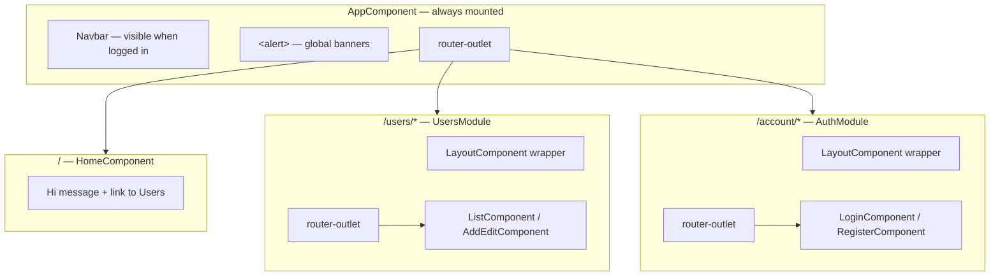

# Front-end app shell

How the root Angular layout wraps every route: navigation bar, global alerts, nested `router-outlet`s, and the post-login home page. For route definitions and guards, see [angular-routing.md](angular-routing.md). For JWT session state that drives the navbar, see [front-end-auth.md](front-end-auth.md).

## Layout overview



The SPA has **one root shell** (`AppComponent`) and **two feature layouts** (`auth/layout`, `users/layout`) that each add their own nested `router-outlet`.

## AppComponent (root shell)

Files:

| File | Role |
|------|------|
| [`index.html`](../front-end/src/index.html) | Browser tab title (`Basic User Management`), `lang="en"`, and Bootstrap CSS CDN |
| [`app.component.ts`](../front-end/src/app/app.component.ts) | Subscribes to `AccountService.user` for navbar visibility; exposes `logout()` |
| [`app.component.html`](../front-end/src/app/app.component.html) | Navbar, global `<alert>`, root `router-outlet`, attribution link to the original tutorial |
| [`app.module.ts`](../front-end/src/app/app.module.ts) | Declares `AppComponent`, `HomeComponent`, `AlertComponent`; registers JWT and error interceptors — see [front-end-modules.md](front-end-modules.md) |

### Navbar

The dark Bootstrap navbar renders only when a user session exists (`*ngIf="user"`):

| Link | Target | Notes |
|------|--------|-------|
| Home | `/` | `routerLinkActive` with `exact: true` |
| Users | `/users` | Lazy-loaded `UsersModule` |
| Logout | click handler | Calls `AccountService.logout()` — clears `localStorage` and navigates to `/account/login` |

Login and register pages **do not** show the navbar because `user` is null until after sign-in.

### Global alert region

`<alert></alert>` sits above the root `router-outlet`. All `AlertService` messages render here, including login/register feedback from nested routes. See [front-end-alerts.md](front-end-alerts.md).

### Session subscription

`AppComponent` mirrors the logged-in user for template binding:

```typescript
this.accountService.user.subscribe(x => this.user = x);
```

The same `BehaviorSubject` backs `AuthGuard`, interceptors, and form components via `AccountService`.

## Feature module layouts

Lazy-loaded modules wrap their routes in a layout component with a nested outlet.

### Auth layout (`/account/*`)

| File | Behavior |
|------|----------|
| [`auth/layout.component.ts`](../front-end/src/app/auth/layout.component.ts) | Redirects to `/` if `userValue` already exists (prevents login page while signed in) |
| [`auth/layout.component.html`](../front-end/src/app/auth/layout.component.html) | Centered column (`col-md-6 offset-md-3`) around nested `router-outlet` |

Routes: `/account/login`, `/account/register`. No navbar until login succeeds and the root shell re-renders with a session.

### Users layout (`/users/*`)

| File | Behavior |
|------|----------|
| [`users/layout.component.ts`](../front-end/src/app/users/layout.component.ts) | Empty wrapper — no redirect logic |
| [`users/layout.component.html`](../front-end/src/app/users/layout.component.html) | Padded container around nested `router-outlet` |

Routes: `/users` (list), `/users/add`, `/users/edit/:id`. The navbar from `AppComponent` stays visible because these routes require `AuthGuard`.

## HomeComponent (`/`)

Post-login landing page declared in `AppModule` (not lazy-loaded).

| File | Role |
|------|------|
| [`home/home.component.ts`](../front-end/src/app/home/home.component.ts) | Reads `accountService.userValue` once in the constructor |
| [`home/home.component.html`](../front-end/src/app/home/home.component.html) | Greeting and link to `/users` |
| [`home/home.component.spec.ts`](../front-end/src/app/home/home.component.spec.ts) | Unit tests: session greeting, null session, and manage-users link |

### Home greeting

The template greets with `{{ user.userName }}`, matching the API login response:

```json
{ "userName": "admin", "token": "..." }
```

The legacy TypeScript `User` model in [`models/user.ts`](../front-end/src/app/models/user.ts) still defines tutorial fields (`firstName`, `lastName`, `username`) used by the register form and fake backend. The session object after login only includes `userName` and `token` — see [front-end-models.md](front-end-models.md).

## AppModule bootstrap

`AppModule` wires the shell and global HTTP behavior:

| Registration | Purpose |
|--------------|---------|
| `JwtInterceptor` | Attach Bearer token to `environment.apiUrl` requests — [front-end-auth.md](front-end-auth.md) |
| `ErrorInterceptor` | Auto-logout on `401`/`403` — [front-end-auth.md](front-end-auth.md) |
| `HomeComponent`, `AlertComponent` | Eager-loaded in root module |
| `AuthModule`, `UsersModule` | Lazy-loaded via `AppRoutingModule` |

## Common tasks

| Goal | Start here |
|------|------------|
| Add a top-level nav link | `app.component.html` — add `<a routerLink="...">` inside the navbar |
| Change logout behavior | `app.component.ts` → `logout()` or `AccountService.logout()` |
| Hide navbar on additional routes | Ensure `AccountService.user` is null on those routes, or adjust `*ngIf` |
| Fix home greeting | Already uses `userName` from the login response — see [Home greeting](#home-greeting) |
| Add a global footer or header | `app.component.html` — outside nested feature layouts |

## Related docs

- [angular-routing.md](angular-routing.md) — route map, lazy modules, AuthGuard, and `returnUrl`
- [front-end-auth.md](front-end-auth.md) — JWT storage, interceptors, and session lifecycle
- [front-end-alerts.md](front-end-alerts.md) — AlertService and the global `<alert>` component
- [account-service.md](account-service.md) — login/logout and `user` BehaviorSubject
- [front-end-models.md](front-end-models.md) — TypeScript `User` vs API JSON shapes
- [front-end-login-register.md](front-end-login-register.md) — AuthModule login/register forms and returnUrl flow
- [front-end-users.md](front-end-users.md) — Users module list and editor screens
- [fake-backend.md](fake-backend.md) — legacy tutorial fake backend (not registered by default)
- [solution-structure.md](solution-structure.md) — Angular folder layout and module overview
- [code-map.md](code-map.md) — where to change UI shell and navigation
