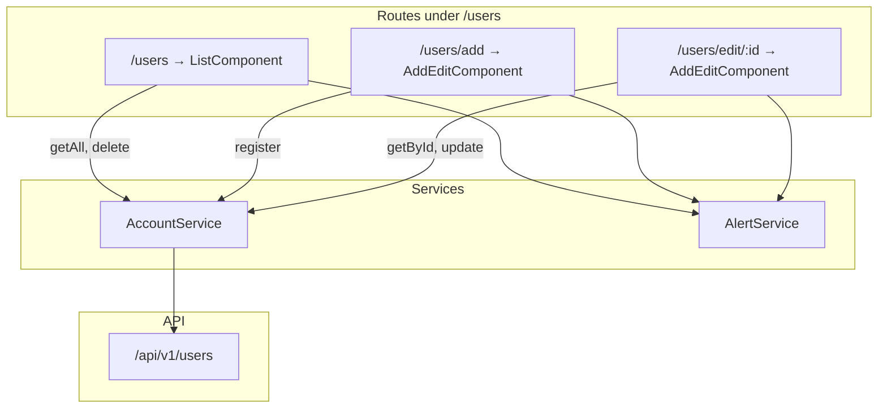

# Front-end user management UI

How the Angular **Users** module lists, creates, edits, and deletes user records. For HTTP calls and session storage, see [account-service.md](account-service.md). For route URLs and lazy loading, see [angular-routing.md](angular-routing.md).

## Overview



| Property | Value |
|----------|-------|
| Module | `front-end/src/app/users/users.module.ts` |
| Lazy loaded | Yes — via `loadChildren` in `app-routing.module.ts` |
| Auth required | All routes protected by `AuthGuard` on the parent `/users` path |
| API alignment | List and editor use API field names (`loginName`, `displayName`, nested `address`) |

## Module layout

| File | Role |
|------|------|
| `users.module.ts` | Declares `LayoutComponent`, `ListComponent`, `AddEditComponent`; imports `ReactiveFormsModule` |
| `users-routing.module.ts` | Child routes under `LayoutComponent` |
| `layout.component.ts` | Wrapper with `<router-outlet>` and Bootstrap container padding |
| `list/list.component.ts` | Loads all users into a table; inline delete with spinner |
| `add-edit/add-edit.component.ts` | Shared create/edit reactive form |

### Routes

Defined in `users-routing.module.ts`:

| URL | Component | Mode |
|-----|-----------|------|
| `/users` | `ListComponent` | List all users |
| `/users/add` | `AddEditComponent` | `isAddMode = true` (no `:id` param) |
| `/users/edit/:id` | `AddEditComponent` | `isAddMode = false`; loads user via `getById(id)` |

The parent `LayoutComponent` renders child routes inside a padded container. Navigation links use relative `routerLink` values (`add`, `edit/{{user.id}}`).

## ListComponent

**File:** `front-end/src/app/users/list/list.component.ts`

On init, calls `accountService.getAll()` and binds the result to `users`. While loading, the template shows a centered spinner (`users` is `null`). When the API returns an empty array, a single row shows *No users yet* with a hint to use **Add User**.

| Column | Source field | Notes |
|--------|--------------|-------|
| Display Name | `user.displayName` | |
| Username | `user.loginName` | Label says "Username"; API field is `loginName` |
| Date Of Birth | `user.dateOfBirth \| date` | Angular `DatePipe`; empty if API returns default/null |
| Actions | Edit / Delete buttons | Edit links to `edit/:id` |

### Delete flow

`deleteUser(id)` no-ops when the list is still loading (`users` is `null`) or the id is not found. When the row exists, the browser shows a native `window.confirm` dialog before any API call. If the user cancels, the row is unchanged. On confirm, the component sets `user.isDeleting = true` (spinner on the button), calls `accountService.delete(id)`, and removes the row from the local array on success.

`rowLabel(user)` picks the name shown in the delete confirmation and on each row's Edit/Delete `aria-label`s:

| Priority | Field | Example confirm text |
|----------|-------|----------------------|
| 1 | `displayName` | `Delete "Jane Doe"? This cannot be undone.` |
| 2 | `loginName` | `Delete "jdoe"? This cannot be undone.` |
| 3 | fallback | `Delete "this user"? This cannot be undone.` |

Edit and Delete controls expose `aria-label="Edit {label}"` and `aria-label="Delete {label}"` so screen readers distinguish rows when multiple action buttons appear in the table.

| Behavior | Detail |
|----------|--------|
| Optimistic UI | Row stays until delete succeeds |
| Error handling | Failed load or delete shows a global alert via `ErrorInterceptor`; delete failures reset `isDeleting` on the row |
| Confirmation | Native `window.confirm` before delete; cancel leaves the row intact |
| Accessibility | Edit link and Delete button `aria-label`s use the same `rowLabel(user)` helper as the confirm dialog; table has a screen-reader caption, `scope="col"` headers, and a loading row with `role="status"` |

For API delete behavior and missing-ID quirks, see [api-users-crud.md](api-users-crud.md) and [api-errors.md](api-errors.md).

## AddEditComponent

**File:** `front-end/src/app/users/add-edit/add-edit.component.ts`

A single component handles both create and edit. Mode is determined from the route param:

```typescript
this.id = this.route.snapshot.params['id'];
this.isAddMode = !this.id;
```

### Form fields

Built with `FormBuilder` in `ngOnInit()`:

| Control | Validators | Sent to API |
|---------|------------|-------------|
| `displayName` | `required` | ✓ |
| `loginName` | `required` | ✓ |
| `dateOfBirth` | `required` | ✓ (`type="date"`; ISO date sent to API) |
| `country` | `required` | ✓ (user-level `UserResource.country`, separate from `address.country`) |
| `isActive` | `required` | ✓ (boolean select) |
| `salary` | `required` | ✓ |
| `profilePictureUrl` | — (optional) | ✓ when provided |
| `address.city` | `required` | ✓ (nested) |
| `address.state` | `required` | ✓ |
| `address.country` | `required` | ✓ |
| `address.postalCode` | `required` | ✓ |
| `address.streetName` | `required` | ✓ |
| `address.streetNumber` | `required` | ✓ |

See [front-end-models.md](front-end-models.md) for the full field mapping table.

### Submit flow

1. Set `submitted = true` and `alertService.clear()`.
2. Return early if `form.invalid`.
3. Set `loading = true`.
4. **Add mode:** `accountService.register(form.value)` → success alert → navigate to `../` (user list).
5. **Edit mode:** `accountService.update(id, form.value)` → success alert → navigate to `../../` (user list).

Errors reset `loading` in the component; the error message is shown globally by `ErrorInterceptor`. Success messages use `{ keepAfterRouteChange: true }` so the banner survives navigation — see [front-end-alerts.md](front-end-alerts.md).

### Edit mode preload

When `!isAddMode`, `getById(id)` runs on init and `patchValue(user)` fills the form. While loading, the Save button shows a spinner (`loading = true`). If the request fails (for example `404` for a missing ID), `ErrorInterceptor` shows the error and the component redirects to the user list.

## AccountService calls

| User action | AccountService method | HTTP |
|-------------|----------------------|------|
| Page load (list) | `getAll()` | `GET /api/v1/users` |
| Delete row | `delete(id)` | `DELETE /api/v1/users/{id}` |
| Add user | `register(form.value)` | `POST /api/v1/users` |
| Edit — load | `getById(id)` | `GET /api/v1/users/{id}` |
| Edit — save | `update(id, form.value)` | `PUT /api/v1/users/{id}` |

Despite the method name, `register()` creates a **user record**, not a login account. See [account-service.md — register() naming](account-service.md#register-naming).

## Known quirks

| Quirk | Detail | Suggested fix |
|-------|--------|---------------|
| ~~Dead password validators~~ | ~~`passwordValidators` are defined in `ngOnInit()` but no password control exists~~ | Fixed — unused validator setup removed from `add-edit.component.ts` |
| ~~Country field invalid styling~~ | ~~`address.country` input used `city.errors` for `is-invalid` class~~ | Fixed — template now checks `country.errors` in `add-edit.component.html` |
| ~~Missing `dateOfBirth`~~ | ~~Form omits API field the list displays~~ | Fixed — `dateOfBirth` date input added to add/edit form; edit mode normalizes ISO values for the picker |
| ~~Missing user `country`~~ | ~~Only `address.country` is collected; top-level `country` on `UserResource` is not set~~ | Fixed — user-level `country` input added to add/edit form |
| `register()` for create | Method name suggests auth registration | Rename to `createUser()` when refactoring callers |
| ~~Delete errors silent~~ | ~~No `error` callback on delete `subscribe`~~ | Fixed — global error alert via `ErrorInterceptor`; reset `isDeleting` on failure |
| ~~Edit load errors silent~~ | ~~`getById` has no error handler~~ | Fixed — global error alert via `ErrorInterceptor`; redirect to list on failure |
| ~~Wrong validation message~~ | ~~`profilePictureUrl` invalid feedback says "Salary is required"~~ | Fixed — template copy corrected in `add-edit.component.html` |
| ~~Required profile picture URL~~ | ~~Form required `profilePictureUrl` though API treats it as optional~~ | Fixed — optional field in add/edit form; label notes "(optional)" |
| ~~`console.log` calls~~ | ~~Debug logging left in `onSubmit` and `getById`~~ | Fixed — removed from `add-edit.component.ts` |

These are documented starting points in [improvement-ideas.md](improvement-ideas.md).

## Manual testing

Follow the user-management steps in [manual-testing.md — Manual UI walkthrough](manual-testing.md#3-manual-ui-walkthrough):

1. Log in with `admin` / `123456789`.
2. Open **Users** — list loads (may be empty).
3. Create a user with a unique `loginName`.
4. Edit and delete the user.
5. Confirm unauthenticated access redirects to login.

## Related files

| File | Role |
|------|------|
| `front-end/src/app/users/users.module.ts` | Module declaration |
| `front-end/src/app/users/users-routing.module.ts` | Child route table |
| `front-end/src/app/users/list/list.component.ts` | User table and delete |
| `front-end/src/app/users/add-edit/add-edit.component.ts` | Create/edit form logic |
| `front-end/src/app/services/account.service.ts` | HTTP client for CRUD |
| `front-end/src/app/services/alert.service.ts` | Success/error banners |
| `front-end/src/app/helpers/auth.guard.ts` | Blocks unauthenticated access |

## Related docs

- [account-service.md](account-service.md) — HTTP methods, session, and component usage table
- [front-end-models.md](front-end-models.md) — form fields vs API JSON shapes
- [front-end-alerts.md](front-end-alerts.md) — AlertService and form feedback patterns
- [angular-routing.md](angular-routing.md) — lazy-loaded `UsersModule` and AuthGuard flow
- [api-users-crud.md](api-users-crud.md) — back-end CRUD behavior and quirks
- [api-responses.md](api-responses.md) — example JSON for list, get, create, update
- [manual-testing.md](manual-testing.md) — pre-PR UI walkthrough checklist
- [code-map.md](code-map.md) — where to change user list and editor UI
- [improvement-ideas.md](improvement-ideas.md) — suggested fixes for quirks above
