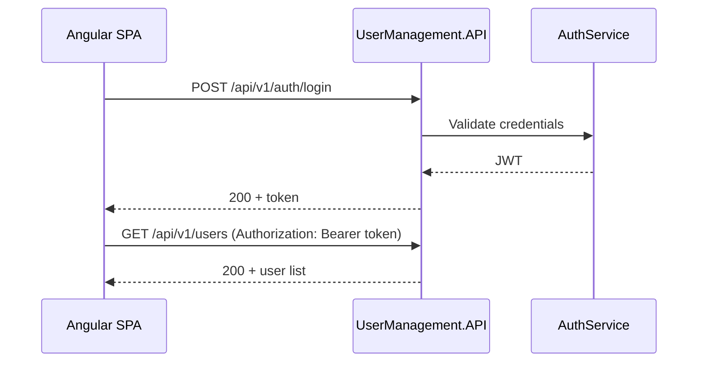

# Quick start

A one-page checklist to run the stack locally. For architecture, API details, and troubleshooting, see the [repository README](../README.md).

## Prerequisites

Install [.NET SDK 3.1+](https://dotnet.microsoft.com/download), [Node.js 16](https://nodejs.org/) (see `.nvmrc`), [Docker](https://www.docker.com/), and [curl](https://curl.se/). Then verify:

```bash
make check-deps
```

## First-time setup

From the repository root:

```bash
make install   # npm install, dotnet restore, dotnet-ef tool
make setup     # start SQL Server and apply migrations
```

## Run the application

Use two terminals:

```bash
# Terminal 1 — API at http://localhost:5000
make run-api

# Terminal 2 — Angular at http://localhost:4200
make run-frontend
```

Open `http://localhost:4200` and sign in with:

| Field | Value |
|-------|-------|
| Username | `admin` |
| Password | `123456789` |

## Verify everything works

With the API running (and the front end, unless you skip that check):

```bash
make status          # quick report: what is running right now
make verify          # full stack (database + API + front end)
make verify-api      # API only (SKIP_FRONTEND=1)
```

## Everyday commands

| Command | Purpose |
|---------|---------|
| `make help` | List all Makefile targets |
| `make status` | Show whether database, API, and front end are running |
| `make token` | Print a JWT for curl or REST Client |
| `make build` | Build API and front end |
| `make ci` | Same build steps as GitHub Actions |
| `make db-down` | Stop the SQL Server container |
| `make db-logs` | Follow SQL Server container logs |
| `make db-reset` | Wipe data and re-apply migrations |

## Test the API

- **REST Client:** Open [`api-examples.http`](api-examples.http) in VS Code or a JetBrains IDE. Send **Log in** first to capture the JWT.
- **curl:** `TOKEN=$(make token)` then `curl -H "Authorization: Bearer $TOKEN" http://localhost:5000/api/v1/users`

## Authentication flow



Login uses hardcoded development credentials. User CRUD records live in SQL Server and are separate from login accounts. See [Authentication vs user data](../README.md#authentication-vs-user-data) in the README.

## When something fails

| Symptom | Quick fix |
|---------|-----------|
| Migration connection error | Wait 15–30s after `make setup`, then `make migrate` |
| API unreachable | Confirm `make run-api` is running on port 5000 |
| Front end cannot reach API | Check `front-end/src/environments/environment.ts` → `apiUrl` |
| `401` on user endpoints | Log in again; JWT may have expired |

Full troubleshooting: [README — Troubleshooting](../README.md#troubleshooting).
