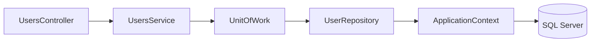
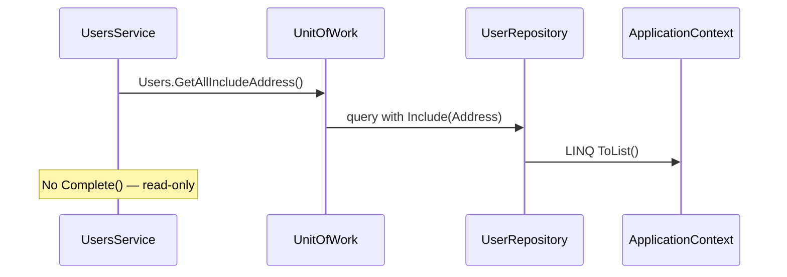

# Repository and unit-of-work pattern

How data access is structured in the API layer. For entity and JSON field mapping, see [domain-model.md](domain-model.md). For the full HTTP path, see [api-request-flow.md](api-request-flow.md).

## Overview

The API keeps EF Core types out of controllers and services by routing persistence through **repository interfaces** in the domain layer and a **unit of work** that coordinates `SaveChanges`:



| Layer | Type | Location |
|-------|------|----------|
| Interface | `IUnitOfWork`, `IUserRepository`, `IGenericRepository<T>` | `UserManagement.Domain/Interfaces/` |
| Implementation | `UnitOfWork`, `UserRepository`, `GenericRepository<T>` | `UserManagement.DataAccess.EFCore/` |
| Consumer | `UsersService` | `UserManagement.API/Services/` |

`UsersService` depends on `IUnitOfWork` only — it never references `ApplicationContext` or EF types directly. That keeps the domain/data boundary testable and matches the dependency rule in [solution-structure.md](solution-structure.md).

## Dependency injection

Registered in `Startup.ConfigureServices`:

| Registration | Lifetime | Notes |
|--------------|----------|-------|
| `ApplicationContext` | Scoped | One context per HTTP request (EF default for `AddDbContext`) |
| `IUnitOfWork` → `UnitOfWork` | Scoped | Shares the same scoped `ApplicationContext` instance |
| `UsersService` | Scoped | Injected into `UsersController` |

See [solution-structure.md — Dependency injection](solution-structure.md#dependency-injection-startupcs) for the full DI table including auth services.

## GenericRepository

`GenericRepository<T>` (`DataAccess.EFCore/Repositories/GenericRepository.cs`) implements common CRUD operations against any entity type:

| Method | EF Core call | Typical use |
|--------|--------------|-------------|
| `Add(T entity)` | `DbSet.Add` | Insert (persisted on `Complete()`) |
| `AddRange(IEnumerable<T>)` | `DbSet.AddRange` | Bulk insert |
| `Update(T entity)` | `DbSet.Update` | Mark entity as modified |
| `Remove(T entity)` | `DbSet.Remove` | Delete |
| `RemoveRange(IEnumerable<T>)` | `DbSet.RemoveRange` | Bulk delete |
| `GetById(int id)` | `DbSet.Find` | Primary-key lookup (no includes) |
| `GetAll()` | `DbSet.ToList()` | All rows (no includes) |
| `Find(Expression<...>)` | `DbSet.Where(...)` | Filtered query |

`UserRepository` and `AddressRepository` inherit these methods through `IGenericRepository<T>`.

## UserRepository extensions

User queries that need the nested address use explicit `Include` calls — lazy loading is disabled in `ApplicationContext`:

```csharp
// UserRepository.cs
public IEnumerable<User> GetAllIncludeAddress()
    => _context.Users.Include(u => u.Address).ToList();

public User GetIncludeAddress(int id)
    => _context.Users.Where(u => u.Id == id).Include(u => u.Address).FirstOrDefault();
```

| Method | Used by | Returns |
|--------|---------|---------|
| `GetAllIncludeAddress()` | `UsersService.GetAll()` | All users with `Address` navigation loaded |
| `GetIncludeAddress(id)` | `UsersService.Get(id)` | One user or `null` if ID missing |
| `GetById(id)` | `UsersService.Delete(id)` | User without address include |

List and detail endpoints need the address for JSON serialization; delete only needs the entity key.

## UnitOfWork

`UnitOfWork` constructs repository instances that share one `ApplicationContext`:

```csharp
public UnitOfWork(ApplicationContext context)
{
    _context = context;
    Users = new UserRepository(_context);
    Addresses = new AddressRepository(_context);
}
```

| Member | Purpose |
|--------|---------|
| `Users` | `IUserRepository` for user CRUD and address includes |
| `Addresses` | `IAddressRepository` (available; user flows go through `Users` today) |
| `Complete()` | Calls `_context.SaveChanges()` — persists pending inserts/updates/deletes |
| `Dispose()` | Disposes the EF context |

**Important:** `Add`, `Update`, and `Remove` on a repository only stage changes in the EF change tracker. Nothing is written to SQL Server until `Complete()` runs.

## CRUD flow through UsersService

### List users



### Create user

1. Controller maps `UserResource` → `User` entity (including nested `Address`).
2. `UsersService.Add` calls `_unitOfWork.Users.Add(user)` then `_unitOfWork.Complete()`.
3. EF Core inserts the address row (if present), then the user row with `AddressId` set.

One `SaveChanges` call persists the full graph. See [domain-model.md — Create flow](domain-model.md#relationship).

### Update user

1. Controller sets `user.Id` from the route and maps to a `User` entity.
2. `UsersService.Update` loads the user with `GetById(id)`. When the entity is missing, the service returns `false` and the controller responds with `404 Not Found`.
3. When the user exists, the service calls `Update` then `Complete()`.
4. EF marks the entity (and nested address, if supplied) as modified.

Duplicate `loginName` values are checked in the controller before update; conflicts return `409 Conflict`. See [api-errors.md](api-errors.md).

### Delete user

1. `UsersService.Delete` loads the user with `GetById(id)`.
2. When the ID does not exist, the controller returns `404 Not Found`.
3. Otherwise `Remove(user)` then `Complete()` deletes the row.

## ApplicationContext settings

| Setting | Value | Effect |
|---------|-------|--------|
| `ChangeTracker.LazyLoadingEnabled` | `false` | Navigation properties are not loaded implicitly — use `Include` |
| Unique index | `Users.LoginName` | Enforced in SQL; the controller also checks duplicates and returns `409 Conflict` before insert/update |
| Unique index | `Users.Id`, `Addresses.Id` | Primary keys |

DbSets: `Users`, `Addresses`. Schema is created by the initial migration in `Migrations/20201129195226_init.cs`.

## Extending the pattern

Common tasks when adding features:

| Task | Steps |
|------|-------|
| New query on users | Add method to `IUserRepository`, implement in `UserRepository`, call from `UsersService` |
| New entity/table | Add entity + interface in Domain, repository in DataAccess, register on `IUnitOfWork`, add migration |
| New write operation | Stage with repository `Add`/`Update`/`Remove`, then call `_unitOfWork.Complete()` once per logical transaction |

Keep repository interfaces in `UserManagement.Domain` free of EF types so tests can mock `IUnitOfWork` without referencing SQL Server.

## Related docs

- [domain-model.md](domain-model.md) — entity ↔ JSON ↔ SQL field mapping
- [api-request-flow.md](api-request-flow.md) — middleware pipeline and controller → SQL sequence
- [database.md](database.md) — connection string, migrations, and reset
- [code-map.md](code-map.md) — file locations for repositories, services, and schema changes
- [solution-structure.md](solution-structure.md) — project references and DI registration
- [api-errors.md](api-errors.md) — missing-user and constraint failure behavior
- [improvement-ideas.md](improvement-ideas.md) — known gaps and good first contribution ideas
