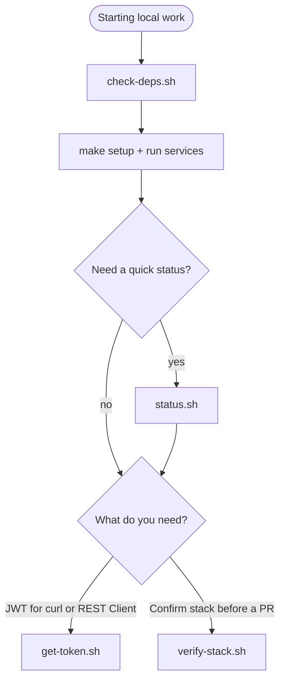

# Shell scripts reference

Helper scripts under `scripts/` wrap common local development tasks. Each script supports `--help` (or `-h`). Most have a matching Makefile target — run `make help` for the full list.

## At a glance

| Script | Makefile target | Purpose | Exit code |
|--------|-----------------|---------|-----------|
| [`check-deps.sh`](../scripts/check-deps.sh) | `make check-deps` | Verify Docker, .NET, Node.js, npm, and curl are on PATH | `0` when all required tools are present; `1` if any are missing |
| [`status.sh`](../scripts/status.sh) | `make status` | Report whether the database container, API, and front end appear to be running | Always `0` (informational) |
| [`get-token.sh`](../scripts/get-token.sh) | `make token` | Print a JWT from `POST /api/v1/auth/login` | `0` with token on stdout; `1` if the API is unreachable or login fails |
| [`verify-stack.sh`](../scripts/verify-stack.sh) | `make verify`, `make verify-api` | Smoke-check database, JWT protection, login, authenticated users, and optionally the front end | `0` when all checks pass; `1` on the first failure |

Environment variable overrides (`API_URL`, `AUTH_USER`, `AUTH_PASSWORD`, `FRONTEND_URL`, `SKIP_FRONTEND`) are documented in [environment-variables.md](environment-variables.md).

## When to use which script



| Situation | Use |
|-----------|-----|
| First clone or new machine | `./scripts/check-deps.sh` then `make install` |
| Wondering if services are up | `./scripts/status.sh` — never fails; use before starting long smoke checks |
| Need a JWT for manual API calls | `./scripts/get-token.sh` or `TOKEN=$(make token)` |
| Pre-PR or after auth/API changes | `./scripts/verify-stack.sh` — fails fast when something is wrong |
| API-only work (no Angular dev server) | `SKIP_FRONTEND=1 ./scripts/verify-stack.sh` or `make verify-api` |

`status.sh` and `verify-stack.sh` overlap on API and front-end probes, but they serve different goals: **status** is a non-blocking snapshot; **verify** runs authenticated checks and exits non-zero on failure.

## check-deps.sh

Verifies prerequisites listed in the [README](../README.md#prerequisites). Also reports whether the optional `dotnet-ef` global tool is installed (warns if missing; run `make install-ef`).

```bash
./scripts/check-deps.sh
make check-deps   # equivalent
```

**Required tools:** Docker, .NET SDK, Node.js, npm, curl.

## status.sh

Prints whether the SQL Server container, API, and Angular dev server respond. Does not log in or validate JWT behavior.

```bash
./scripts/status.sh
make status

# Custom ports
API_URL=http://localhost:5050 FRONTEND_URL=http://localhost:4300 ./scripts/status.sh
```

**API interpretation:** HTTP `401` on `GET /api/v1/users` without a token is treated as "up" (JWT protection is active). HTTP `000` means the API is not reachable.

## get-token.sh

Calls `POST /api/v1/auth/login` and prints the JWT to stdout (suitable for shell capture). Requires the API to be running.

```bash
TOKEN=$(./scripts/get-token.sh)
curl -s http://localhost:5000/api/v1/users -H "Authorization: Bearer $TOKEN"

# Makefile shortcut
TOKEN=$(make token)
```

Default credentials match the [default login](../README.md#default-login): `admin` / `123456789`. Override with `AUTH_USER` and `AUTH_PASSWORD` when testing different accounts.

## verify-stack.sh

Runs an ordered smoke test:

1. SQL Server container is running (`docker compose`)
2. `GET /api/v1/users` returns `401` without a token
3. Login returns `200` with a JWT
4. `GET /api/v1/users` returns `200` with the JWT
5. Angular dev server returns `200` (unless `SKIP_FRONTEND=1`)

```bash
./scripts/verify-stack.sh
make verify

# API-only (no front-end dev server)
SKIP_FRONTEND=1 ./scripts/verify-stack.sh
make verify-api
```

Use this after starting `make run-api` (and `make run-frontend` for full-stack checks). See [manual-testing.md](manual-testing.md) for the pre-PR checklist.

## Related docs

- [environment-variables.md](environment-variables.md) — script and application configuration
- [manual-testing.md](manual-testing.md) — pre-PR smoke and UI checklist
- [quick-start.md](quick-start.md) — install, run, and everyday commands
- [README — Verify the stack](../README.md#verify-the-stack) — overview and override examples
