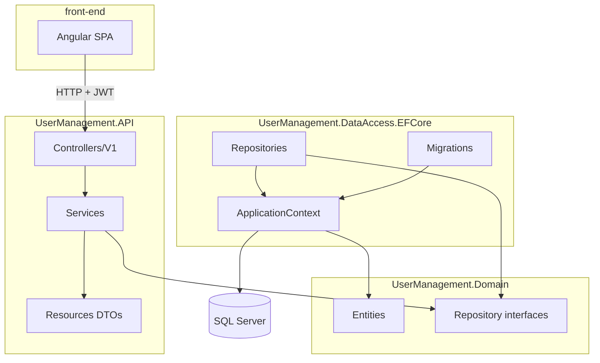

# Solution structure

How the .NET solution and Angular app are organized. For where to change behavior, see [code-map.md](code-map.md). For pinned versions, see [technology-stack.md](technology-stack.md).

## Overview

The repository contains two runnable applications and one shared database:

| Part | Location | Role |
|------|----------|------|
| API | `UserManagementAPI/` | ASP.NET Core 3.1 REST API with JWT auth |
| Front end | `front-end/` | Angular 11 SPA |
| Database | Docker (`docker-compose.yml`) | SQL Server for user records |

## .NET solution projects

Solution file: `UserManagementAPI/UserManagementAPI.sln`

| Project | Folder | References | Depends on |
|---------|--------|------------|------------|
| `UserManagement.API` | `UserManagement.API/` | Domain, DataAccess.EFCore | ASP.NET Core, EF Core (via DataAccess), JWT, AutoMapper |
| `UserManagement.Domain` | `UserManagement.Domain/` | *(none)* | .NET SDK only — no EF, no HTTP |
| `UserManagement.DataAccess.EFCore` | `UserManagement.DataAccess.EFCore/` | Domain | EF Core 5, SQL Server provider |

**Dependency rule:** Domain has no infrastructure references. The API references both Domain and DataAccess; services depend on `IUnitOfWork` and repository interfaces from Domain, not on EF types directly.

### UserManagement.API

HTTP entry point and application services.

| Folder / file | Purpose |
|---------------|---------|
| `Controllers/V1/` | REST endpoints (`AuthController`, `UsersController`) — see [api-controllers.md](api-controllers.md) |
| `Services/` | `AuthService`, `UsersService` — business logic — see [api-services.md](api-services.md) |
| `Resources/` | Request/response DTOs (`UserResource`, `Credentials`, `AddressResource`) |
| `Mapper/` | AutoMapper profiles (entity ↔ resource) |
| `Helpers/` | `JwtHelper` — token creation |
| `MiddlewareConfiguration/` | CORS setup for local Angular dev — see [cors-configuration.md](cors-configuration.md) |
| `Startup.cs` | DI registration, JWT middleware, EF `DbContext` |
| `appsettings.json` | Connection string, `JwtSecret` |

### UserManagement.Domain

Core model and abstractions — safe to reference from tests without pulling in SQL or ASP.NET.

| Folder | Purpose |
|--------|---------|
| `Entities/` | `User`, `Address` |
| `Interfaces/` | `IUnitOfWork`, `IUserRepository`, `IAddressRepository`, `IGenericRepository<T>` |

### UserManagement.DataAccess.EFCore

Persistence implementation and schema migrations.

| Folder | Purpose |
|--------|---------|
| `ApplicationContext.cs` | EF Core `DbContext` and entity configuration |
| `Repositories/` | Concrete repository classes |
| `UnitOfWorks/` | `UnitOfWork` — coordinates repositories and `SaveChanges` (see [repository-pattern.md](repository-pattern.md)) |
| `Migrations/` | EF Core migration history (apply with `make migrate`) |

## Namespaces vs project names

Project folder names use the `UserManagement.*` prefix, but several projects set a shorter `RootNamespace` in their `.csproj` files. Imports in source code use the namespace, not the folder name:

| Project folder | `RootNamespace` | Example type |
|----------------|-----------------|--------------|
| `UserManagement.API` | `UserManagementAPI` | `UserManagementAPI.Startup` |
| `UserManagement.Domain` | `Domain` | `Domain.Entities.User` |
| `UserManagement.DataAccess.EFCore` | `DataAccess.EFCore` | `DataAccess.EFCore.ApplicationContext` |

When searching the codebase, try both the folder name and the namespace (for example `using Domain.Interfaces` vs path `UserManagement.Domain/Interfaces/`).

## Dependency injection (Startup.cs)

Services registered in `ConfigureServices`:

| Registration | Lifetime | Used by |
|--------------|----------|---------|
| `ApplicationContext` | Scoped (EF default) | Repositories via `UnitOfWork` |
| `IUnitOfWork` → `UnitOfWork` | Scoped | `UsersService` |
| `UsersService` | Scoped | `UsersController` |
| `AuthService` | Scoped | `AuthController` |
| `JwtHelper` | Scoped | `AuthService` |
| AutoMapper | Singleton (via extension) | Services and mapping profiles |
| JWT Bearer authentication | Per request | `[Authorize]` on user endpoints |

The HTTP pipeline order (simplified): CORS → HTTPS redirection → routing → authentication → authorization → controllers. See [api-request-flow.md](api-request-flow.md) for the full request path.

## Angular app structure

Root: `front-end/src/app/`

| Path | Purpose |
|------|---------|
| `auth/` | Login and register (`AuthModule`, lazy-loaded at `/account`) |
| `users/` | User list and add/edit (`UsersModule`, lazy-loaded at `/users`) — see [front-end-users.md](front-end-users.md) |
| `home/` | Post-login landing page (`/`) |
| `services/` | `AccountService` (login, session), `AlertService` (UI messages) |
| `helpers/` | `AuthGuard`, JWT/error interceptors, optional `fake-backend` |
| `components/` | Shared UI (e.g. `AlertComponent`) |
| `models/` | TypeScript interfaces (`User`, `Alert`) |
| `environments/` | `apiUrl` and build-time configuration |

Top-level routing is in `app-routing.module.ts`. Feature modules define their own routes under `auth/auth-routing.module.ts` and `users/users-routing.module.ts`. Module boundaries, lazy loading, and shared services: [front-end-modules.md](front-end-modules.md). Root shell (navbar, global alert, home page): [front-end-shell.md](front-end-shell.md). Login/register UI: [front-end-login-register.md](front-end-login-register.md). JWT flow details: [front-end-auth.md](front-end-auth.md). User list/editor UI: [front-end-users.md](front-end-users.md). Alert banners: [front-end-alerts.md](front-end-alerts.md).

## Related docs

- [cors-configuration.md](cors-configuration.md) — cross-origin policy for Angular ↔ API
- [code-map.md](code-map.md) — where to change endpoints, auth, schema, and UI
- [api-request-flow.md](api-request-flow.md) — HTTP pipeline and controller → SQL flow
- [technology-stack.md](technology-stack.md) — pinned package and toolchain versions
- [glossary.md](glossary.md) — terms for layers, JWT, and local commands
- [database.md](database.md) — connection string, migrations, and reset
- [repository-pattern.md](repository-pattern.md) — repository interfaces, UnitOfWork, and CRUD flow
